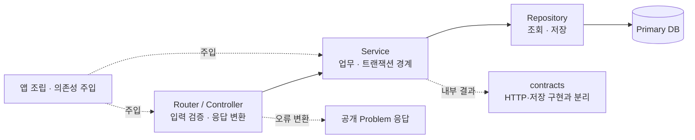

# Backend Template

백엔드 서비스를 만들고 동시성·멱등성까지 실험하는 시작점입니다.
FastAPI·SQLite, NestJS·SQLite, Spring Boot·H2 구현을 제공합니다.
공통 응답·DI·트랜잭션·관측 계약을 각 프레임워크의 방식으로 구현합니다.

## 저장소 한눈에 보기

세 구현은 **같은 설계를 비교하고 하나를 선택해 가져가는 독립 앱**입니다.
서로 호출하는 마이크로서비스 구성이 아닙니다.

| 위치 | 구성과 역할 |
| --- | --- |
| [`python/fastapi/`](python/fastapi/README.md) | FastAPI · uv · SQLAlchemy Core/SQLite · Alembic |
| [`ts/nestjs/`](ts/nestjs/README.md) | NestJS · pnpm · Drizzle/SQLite · worker에서 DB 실행 |
| [`java/spring-boot/`](java/spring-boot/README.md) | Spring Boot · Gradle · JPA/Hibernate/H2 · Flyway |
| [`design/`](design/README.md) | 공통 설계와 구현별 상세·검증의 정본 |
| `compose.yaml` · `scripts/compose.sh` | 구현을 선택해 로컬 컨테이너 실행 |
| `infra/monitoring/` · `docs/` | Prometheus·Grafana 설정과 MkDocs 도구 환경 |

## 로컬 앱 실행

Docker가 실행된 환경에서 **저장소 루트**에서 사용할 구현의 명령을 선택합니다.
세 명령은 같은 `compose.yaml`을 사용하고 구현별로 다른 Compose 프로젝트·포트·데이터 volume을 사용합니다.

```sh
./scripts/compose.sh fastapi up --build --wait api
./scripts/compose.sh nestjs up --build --wait api
./scripts/compose.sh spring-boot up --build --wait api
```

| 구현 | Docker Swagger | 네이티브 기본 포트 |
| --- | --- | --- |
| FastAPI | [18081/docs](http://127.0.0.1:18081/docs) | 18080 |
| NestJS | [18084/docs](http://127.0.0.1:18084/docs) | 18083 |
| Spring Boot | [18086/docs](http://127.0.0.1:18086/docs) | 18085 |

DB URL을 설정하지 않으면 인사·health·docs·metrics만 활성화합니다.
예약을 사용하려면 구현별 가이드의 DB 설정·migration·seed 순서를 따릅니다.
종료는 같은 구현 이름으로 `./scripts/compose.sh fastapi stop api`처럼 실행하며 데이터는 유지합니다.
모니터링은 선택 사항이며 [공유 수집기 실행 안내](design/implementations/local-monitoring.md)를 따릅니다.

### Compose와 스크립트의 역할

| 파일 | 책임 |
| --- | --- |
| 루트 `compose.yaml` | API·선택 모니터링 서비스, 포트·볼륨·자원 설정 |
| 루트 `scripts/compose.sh` | 구현 선택, 버전 파일·빌드 경로·포트·환경 파일을 Compose에 전달 |
| 각 구현의 `Dockerfile` | 해당 언어로 이미지 빌드와 컨테이너 진입점 정의 |
| FastAPI·NestJS의 `scripts/start.sh` | DB 활성 시 migration을 적용한 뒤 앱 실행 |
| Spring Boot의 `scripts/start.sh` | 네이티브 JAR 실행. 컨테이너는 Dockerfile에서 JAR를 직접 실행하며 Flyway는 앱 시작 시 적용 |

Compose의 기본 환경 파일은 각 구현의 `.env.example`이며 별도 파일은 `BACKEND_ENV_FILE`로 지정합니다.
네이티브 설치·빌드·실행은 각 구현의 uv·pnpm·Gradle 명령을 사용합니다.
구체적인 명령은 [FastAPI](python/fastapi/README.md) · [NestJS](ts/nestjs/README.md) ·
[Spring Boot](java/spring-boot/README.md)에 있습니다.

## 구조와 패턴

역할별 폴더 안에서 기능별 파일을 맞춥니다. 아래는 세 구현이 공유하는 책임 흐름이며,
실제 조립과 트랜잭션 API는 각 프레임워크에 맞춥니다.



| 패턴 | 이 템플릿의 기준 |
| --- | --- |
| 명시적 DI | FastAPI는 `Depends` provider와 함수 인자, Nest·Spring은 생성자 주입으로 연결합니다. |
| 계약 분리 | 외부 schema/DTO, 내부 contract, DB 모델을 구분하고 업무가 HTTP 표현에 의존하지 않게 합니다. |
| 업무 트랜잭션 | Service 경계에서 같은 연결로 처리하고 commit 성공 뒤 응답합니다. Repository는 commit하지 않습니다. |
| 동시성·멱등성 | 예약 예제에서 DB unique 제약·조건부 재고 차감·저장한 결과 재생으로 중복과 초과 예약을 제어합니다. |
| 응답·오류 | 성공은 `data`, 오류는 Problem Details 형식입니다. health·metrics는 각 전용 형식을 유지합니다. |
| 관측·수명 | JSON 로그, HTTP·DB metrics, readiness와 시작·종료 시 자원 정리를 제공합니다. |
| 작은 구성 | 빈 Base·Builder·Facade를 미리 만들지 않습니다. 여러 업무를 조합할 때만 조합 책임을 추가합니다. |

기본 DB는 단일 Primary입니다. Replica·샤딩은 구현하지 않았으며 PostgreSQL 전환은 별도 검증이 필요합니다.
폴더별 책임은 [FastAPI](design/implementations/fastapi-structure.md) ·
[NestJS](design/implementations/nestjs-structure.md) · [Spring Boot](design/implementations/spring-boot-structure.md)를 봅니다.

## 내 서비스로 가져가기


1. 처음에는 저장소 구조를 유지하고 사용할 구현만 실행합니다. 앱만 추출한다면 테스트·migration·도구 버전·lockfile·실행 파일도 함께 가져갑니다.
2. 구현별 가이드로 기준 동작을 확인한 뒤 `.env.example`을 참고해 서비스 이름·포트·DB를 설정합니다. 실제 `.env`와 DB 데이터는 복사·커밋하지 않습니다.
3. 패키지명이나 폴더를 바꾸면 import·빌드·Compose·문서 경로도 함께 맞춥니다. 포트·Compose 프로젝트·volume은 기존 서비스와 구분합니다.
4. 인사·예약 예제를 참고해 자신의 업무를 연결하고 정상·실패·경합·재생을 검증합니다. 인증·권한·운영 배포와 경보는 서비스 요구에 맞게 추가합니다.

구체적인 변경 대상과 완료 체크리스트는 [템플릿 적용 Runbook](RUNBOOK.md)에 있습니다.

## 가이드 읽기

| 영역 | 읽는 목적 | 시작 문서 |
| --- | --- | --- |
| 사용 가이드 | 실행하고 기능을 붙입니다. | [FastAPI](design/implementations/quickstart.md) · [NestJS](ts/nestjs/README.md) · [Spring Boot](java/spring-boot/README.md) · [모니터링](design/implementations/local-monitoring.md) |
| 상세 설명 | 구조·설정·설계 이유를 찾아봅니다. | [프로젝트 개요](design/overview.md) · [구현별 설계](design/implementations/README.md) |
| 작업·검증 기록 | 완료 범위와 시험 결과를 확인합니다. | [FastAPI](design/implementations/fastapi-verification.md) · [NestJS](design/implementations/nestjs-verification.md) · [Spring Boot](design/implementations/spring-boot-verification.md) |

## 로컬 가이드 실행

저장소 루트에서 실행한 뒤 [가이드](http://127.0.0.1:18090)를 엽니다.

```sh
uv tool run --from uv==0.12.10 uv run --project docs --locked mkdocs serve
```

종료는 Ctrl+C입니다. 설계 정본과 문서 관리 기준은 [설계 안내](design/README.md)에 있습니다.
