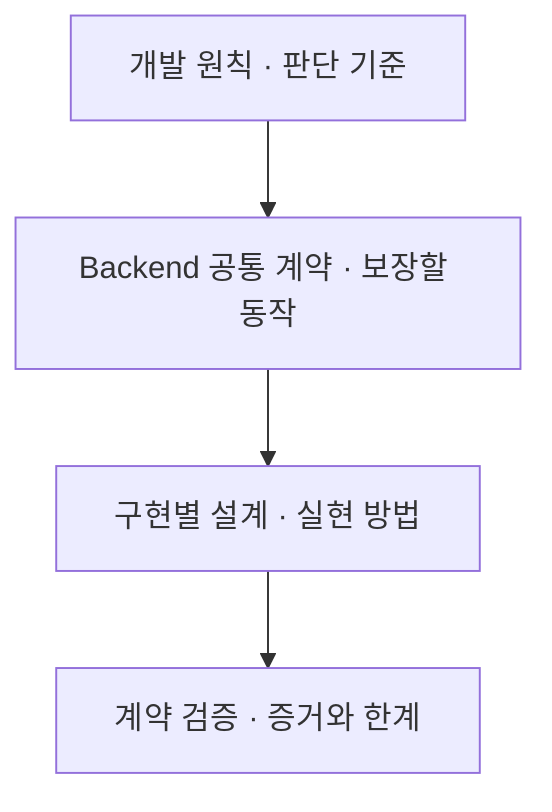

# Backend Template

백엔드 서비스를 시작할 때 반복해서 필요한 설정·의존성 주입·자원 수명·오류 처리·로깅·계측의 기준을 정리하고, 언어와 프레임워크에 맞는 시작점을 만드는 프로젝트입니다.

**현재는 설계 문서만 제공합니다. 실행 가능한 템플릿과 자동 검증은 아직 없습니다.**

## 설계 구조

공통 설계는 무엇을 보장할지 정의합니다. 구현 설계는 해당 언어의 실행 모델과 프레임워크로 그 계약을 어떻게 충족할지 정의합니다. 클래스·폴더·DI 도구를 언어 간 동일하게 강제하지 않습니다.

| 문서 | 역할 |
| --- | --- |
| [설계 안내](design/README.md) | 상태·읽는 순서·문서 소유권입니다. |
| [개발 원칙](design/engineering.md) | 업무·DB·외부 연계·타입·검증의 기준입니다. |
| [Runtime Review](design/runtime-review.md) | 성능·런타임·용량·비용 판단 기준입니다. |
| [Backend 공통 설계](design/backend.md) | 책임 경계·설정·초기화·종료·검증 계약입니다. |
| [로깅과 관측](design/observability.md) | 공통 필드·수집 경계·기능별 확장·설계 선택입니다. |
| [구현별 설계 안내](design/implementations/README.md) | 선택한 기술의 설계·검증·진행 상태로 연결합니다. |

## 제공 범위

공통 설계는 책임 경계, 설정과 의존성, 자원 수명, 작업의 성공·실패·취소, 관측과 검증을 다룹니다.
어떤 기능과 도구를 실제로 제공할지는 구현별 설계에서 정합니다. 공통 책임이 있다는 이유로 모든 계층이나 외부 시스템을 미리 만들지는 않습니다.

`design/`는 설계 정본입니다. 다른 저장소의 아이디어를 추가로 찾아야 이해할 수 있는 구조로 만들지 않습니다.

언어·프레임워크·패키지·실행 명령은 구현별 문서가 소유합니다. 루트 설명은 특정 구현을 전체 Backend의 기준으로 삼지 않습니다.

## 사용할 방식

소비 저장소에서 이 저장소를 Git submodule로 연결해 특정 커밋을 고정하고, 구현된 템플릿을 서비스 경로로 복사하는 방식을 계획합니다. submodule 연결과 런타임 패키지 import는 다릅니다. 템플릿 원본 업데이트가 복사한 서비스에 자동 적용되지는 않습니다.

실제 코드가 없으므로 설치·실행 명령은 아직 제공하지 않습니다. 구현을 검증한 뒤 해당 구현의 사용 안내에 추가합니다.
공개 여부와 별개로 재사용 라이선스는 아직 선택하지 않았습니다.
