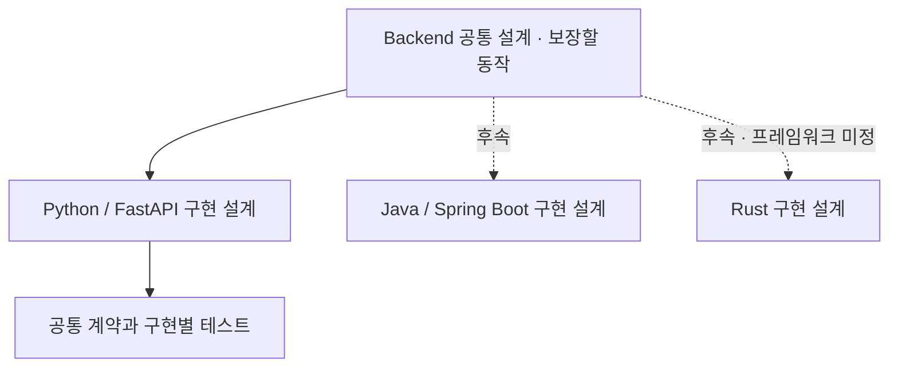

# Backend Template

백엔드 서비스를 시작할 때 반복해서 필요한 설정·의존성 주입·자원 수명·오류 처리·로깅·계측의 기준을 정리하고, 언어와 프레임워크에 맞는 시작점을 만드는 프로젝트입니다.

**현재는 설계 문서만 제공합니다. 실행 가능한 템플릿·패키지·Docker 이미지·CI는 아직 없습니다.**

## 설계 구조

공통 설계는 무엇을 보장할지 정의합니다. 구현 설계는 해당 언어의 실행 모델과 프레임워크로 그 계약을 어떻게 충족할지 정의합니다. 클래스·폴더·DI 도구를 언어 간 동일하게 강제하지 않습니다.

| 문서 | 역할 |
| --- | --- |
| [설계 안내](design/README.md) | 상태·읽는 순서·문서 소유권입니다. |
| [Backend 공통 설계](design/backend.md) | 책임 경계·설정·초기화·종료·검증 계약입니다. |
| [로깅과 관측](design/observability.md) | 공통 필드·수집 경계·기능별 확장·설계 선택입니다. |
| [FastAPI 구현 설계](design/implementations/fastapi.md) | Python 구성·수명주기·DI·ASGI 처리·Compose 후보입니다. |
| [FastAPI 검증 케이스](design/implementations/fastapi-verification.md) | 초기화·요청 종료·취소의 통과 조건입니다. |

## 제공 범위

첫 구현은 FastAPI 예제 API, 환경 설정, DI, health, JSON 로깅, 기본 metrics, 테스트, Docker Compose를 대상으로 합니다. DB·인증·채팅·외부 API·모니터링 서버는 기본으로 포함하지 않습니다.

Java·Rust는 후속 후보입니다. 해당 구현을 시작할 때 프레임워크와 구체적인 구조를 결정합니다.

## 사용할 방식

소비 저장소에서 이 저장소를 Git submodule로 연결해 특정 커밋을 고정하고, 구현된 템플릿을 서비스 경로로 복사하는 방식을 계획합니다. submodule 연결과 런타임 패키지 import는 다릅니다. 템플릿 원본 업데이트가 복사한 서비스에 자동 적용되지는 않습니다.

실제 코드가 없으므로 설치·실행 명령은 아직 제공하지 않습니다. 구현을 검증한 뒤 이 문서에 추가합니다.
공개 여부와 별개로 재사용 라이선스는 아직 선택하지 않았습니다.
