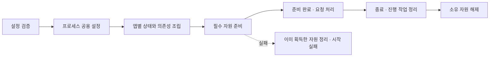

# Backend 공통 설계

Status: 설계 방향 합의 · 세부 구현 전 검토 · 2026-09-07

## 목표와 범위

작은 서비스에서 시작해 필요한 기능을 추가할 수 있는 백엔드 시작점을 제공합니다.
공통 기준은 책임·계약·검증이며 클래스 수나 모든 언어에 동일한 구조를 요구하지 않습니다.
기능 코드와 배포·수집 도구를 분리하고, 처음부터 빈 계층·플러그인 프레임워크·범용 CRUD 생성기를 만들지 않습니다.

## 책임

| 책임 | 계약 |
| --- | --- |
| 실행 조립 | 설정을 검증하고 프로세스 공용 기능을 한 번 구성한 뒤 앱을 조립합니다. |
| 입력 경계 | 입력 형식·프로토콜 문맥을 해석하고 업무를 호출하며 응답을 표현합니다. |
| 업무 | 검증·상태 변경·영속화 순서를 소유하며 필요한 의존성을 명시적으로 받습니다. |
| Domain | 순수 정책·상태 불변조건을 소유하며 HTTP·DB·SDK를 알지 못합니다. |
| 출력 연계 | DB 쿼리·외부 API 변환과 통신을 소유하고 제공자 정보를 업무 안으로 누출하지 않습니다. |
| 관측 | 작업 결과를 기록하며 업무의 성공 기준을 대신 결정하지 않습니다. |

책임이 작으면 함수나 모듈로 표현합니다. 여러 동작과 상태가 응집될 때 객체를 사용합니다.
의존성 교체 경계는 실제 필요한 행위로 제한하며 container를 업무 코드에서 이름으로 조회하지 않습니다.

## 설정·초기화·서버 종료

- secret·환경값은 configuration으로 전달하고 저장소·이미지·로그에 포함하지 않습니다.
- 설정 오류는 시작 실패로 처리하며 오류 출력에 입력 원문을 포함하지 않습니다.
- 앱 조립만으로 외부 접속·migration·scheduler를 시작하지 않습니다.
- 프로세스 공용 설정과 앱별 설정·관측 상태·테스트 대역을 구분합니다.
- 자원 획득 이후에는 정리 책임을 즉시 등록하고 부분 초기화 실패에도 정리합니다.
- liveness는 생존, readiness는 정의한 필수 준비 상태를 뜻합니다. 자원이 없는 예제가 DB 건강을 보장하지 않습니다.
- 서버 종료 시 진행 작업 정리와 자원 해제의 순서를 정합니다. readiness만으로 drain·무중단 배포를 보장하지 않습니다.

## 작업 완료·실패·취소

업무 결과, 응답 상태, 전달 완료, 실행 종료는 다른 개념입니다.
응답을 보내기 시작한 뒤 실패하면 이미 보낸 응답을 새로운 오류 응답으로 덮지 않습니다.
클라이언트 연결 종료가 작업 취소·업무 rollback과 동일하다고 가정하지 않습니다.

작업이 끝나면 결과 기록을 시도하고 소유 자원·문맥을 정리합니다. 오류와 취소는 성공으로 숨기지 않습니다.
관측 실패가 원래 오류를 덮지 않도록 처리하며 강제 종료에서 cleanup이나 로그 보존을 보장하지 않습니다.
재시도는 원래 효과의 중복 가능성을 확인한 뒤 수행하며 일반 진단 로그를 감사 원장으로 사용하지 않습니다.

DB를 추가할 때는 업무 경계가 원자적 범위를 정하고 같은 작업의 변경은 같은 트랜잭션을 사용합니다.
요청 종료 hook에 숨은 commit을 두지 않습니다. 외부 통신·장시간 연결 동안 트랜잭션을 유지하지 않습니다.
이 계약은 향후 DB 구현에 적용하며 초기 템플릿에 DB를 요구하지 않습니다.

## 공통 검증 기준

| 대상 | 증거 |
| --- | --- |
| 조립 | 외부 I/O 없이 앱을 만들고 설정·대역·계측 상태가 앱 간 섞이지 않습니다. |
| 자원 | 초기화 실패·정상 종료·취소에서 획득한 자원을 정리합니다. |
| 입력·결과 | 정상·거절·실패·취소·전송 오류의 의미가 구분됩니다. |
| 관측 | 필드·문맥·건수·단위·민감정보·출력 실패를 시험합니다. |
| 격리 | 기본 시험은 외부 서비스·개인 환경·운영 DB에 의존하지 않습니다. |
| 재현성 | 구현 시 의존성·실행·lint·테스트 명령을 고정하고 실제 실행 결과를 남깁니다. |

프로토콜별 계측과 관측 확장은 [관측 설계](observability.md), 기술별 실현 방법은 [구현별 설계](implementations/README.md)를 참고합니다.
