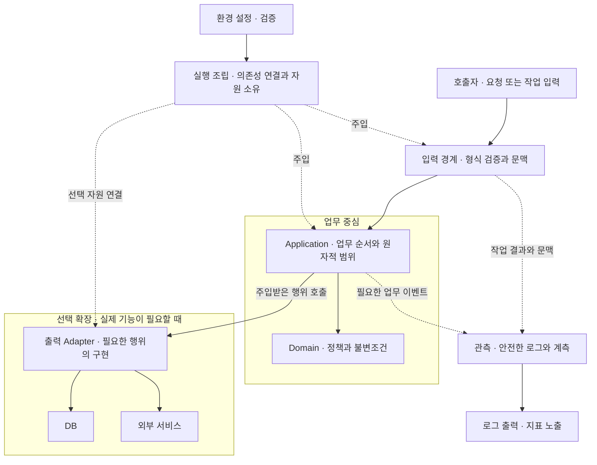
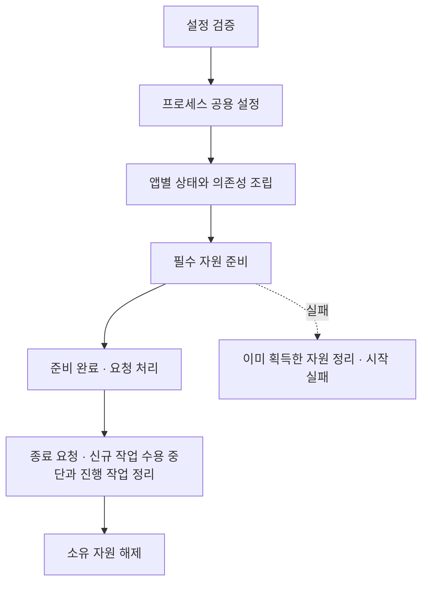
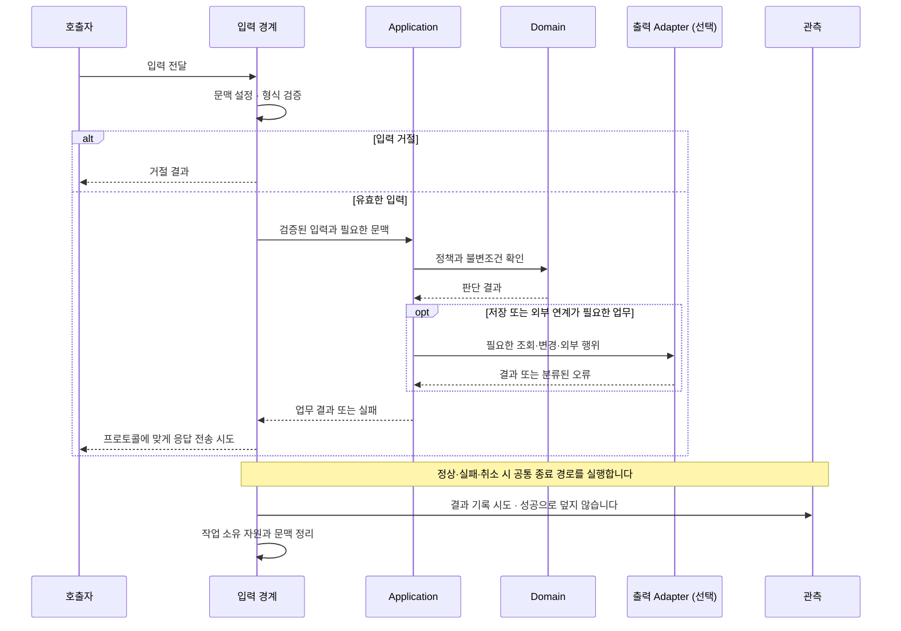
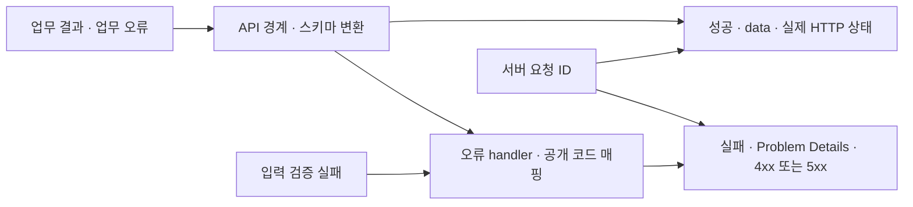

# Backend 공통 설계

Status: 설계 방향 합의 · 세부 구현 전 검토 · 2026-09-07

## 목표와 범위

작은 서비스에서 시작해 필요한 기능을 추가할 수 있는 백엔드 시작점을 제공합니다.
공통 기준은 책임·계약·검증이며 클래스 수나 모든 언어에 동일한 구조를 요구하지 않습니다.
기능 코드와 배포·수집 도구를 분리하고, 처음부터 빈 계층·플러그인 프레임워크·범용 CRUD 생성기를 만들지 않습니다.

## 전체 아키텍처

아래는 구현할 책임과 연결 방식입니다. 실행 가능한 코드나 배포 구성이 이미 존재한다는 뜻은 아닙니다.
실선은 작업 중 호출·데이터 전달, 점선은 조립 시 주입 또는 관측 정보 전달입니다. 응답 반환은 생략합니다.



Application은 필요한 행위를 명시적으로 받고 실행 조립이 실제 구현이나 테스트 대역을 연결합니다. 그림의 호출 방향이 구체적인 SDK에 대한 소스 코드 의존을 뜻하지 않습니다.
Domain은 입력 프로토콜·DB·외부 SDK를 알지 못합니다. DB와 외부 서비스는 서로 독립적으로 선택하며 단순 기능에 빈 Adapter나 Domain 계층을 만들지 않습니다.
관측 정보는 업무 판단의 반환값이 아니며 수집 서버·대시보드는 이 구조 밖에서 나중에 연결합니다.

## 책임

| 책임 | 계약 |
| --- | --- |
| 실행 조립 | 설정을 검증하고 프로세스 공용 기능을 한 번 구성한 뒤 앱을 조립합니다. |
| 입력 경계 | 입력 형식·프로토콜 문맥을 해석하고 업무를 호출하며 응답을 표현합니다. |
| 업무 | 검증·상태 변경·영속화 순서를 소유하며 필요한 의존성을 명시적으로 받습니다. |
| Domain | 순수 정책·상태 불변조건을 소유하며 HTTP·DB·SDK를 알지 못합니다. |
| 출력 연계 | DB 쿼리·외부 API 변환과 통신을 소유하고 제공자 정보를 업무 안으로 누출하지 않습니다. |
| 관측 | 작업 결과를 기록하며 업무의 성공 기준을 대신 결정하지 않습니다. |

책임이 작으면 함수나 모듈로 표현합니다. 여러 동작과 상태가 응집될 때 객체를 사용합니다.
의존성 교체 경계는 실제 필요한 행위로 제한하며 container를 업무 코드에서 이름으로 조회하지 않습니다.

## 설정·초기화·서버 종료



- secret·환경값은 configuration으로 전달하고 저장소·이미지·로그에 포함하지 않습니다.
- 설정 오류는 시작 실패로 처리하며 오류 출력에 입력 원문을 포함하지 않습니다.
- 앱 조립만으로 외부 접속·migration·scheduler를 시작하지 않습니다.
- 프로세스 공용 설정과 앱별 설정·관측 상태·테스트 대역을 구분합니다.
- 자원 획득 이후에는 정리 책임을 즉시 등록하고 부분 초기화 실패에도 정리합니다.
- liveness는 생존, readiness는 정의한 필수 준비 상태를 뜻합니다. 자원이 없는 예제가 DB 건강을 보장하지 않습니다.
- 서버 종료 시 진행 작업 정리와 자원 해제의 순서를 정합니다. readiness만으로 drain·무중단 배포를 보장하지 않습니다.

## 작업 완료·실패·취소

다음은 응답을 반환하는 한 작업의 대표 흐름입니다. 장시간 연결에서는 연결 전체와 개별 메시지의 작업 단위를 구현 설계에서 나눕니다.



Domain 판단과 Adapter 호출의 실제 순서는 업무에 따라 달라집니다. 데이터 조회 후 정책을 판단할 수도 있으며, DB 원자적 범위는 아래 계약을 따릅니다.
전송 중 오류나 취소가 발생하면 남은 정상 경로를 계속 실행하지 않고 종료 처리로 이동합니다. 그림의 응답 화살표는 클라이언트 수신 보장을 뜻하지 않습니다.

업무 결과, 응답 상태, 전달 완료, 실행 종료는 다른 개념입니다.
응답을 보내기 시작한 뒤 실패하면 이미 보낸 응답을 새로운 오류 응답으로 덮지 않습니다.
클라이언트 연결 종료가 작업 취소·업무 rollback과 동일하다고 가정하지 않습니다.

작업이 끝나면 결과 기록을 시도하고 소유 자원·문맥을 정리합니다. 오류와 취소는 성공으로 숨기지 않습니다.
관측 실패가 원래 오류를 덮지 않도록 처리하며 강제 종료에서 cleanup이나 로그 보존을 보장하지 않습니다.
재시도는 원래 효과의 중복 가능성을 확인한 뒤 수행하며 일반 진단 로그를 감사 원장으로 사용하지 않습니다.

DB를 추가할 때는 업무 경계가 원자적 범위를 정하고 같은 작업의 변경은 같은 트랜잭션을 사용합니다.
요청 종료 hook에 숨은 commit을 두지 않습니다. 외부 통신·장시간 연결 동안 트랜잭션을 유지하지 않습니다.
이 계약은 향후 DB 구현에 적용하며 초기 템플릿에 DB를 요구하지 않습니다.

## 서버·DB 확장 전략

Status: 확장을 위한 설계 기준입니다. 복제·샤딩·자동 장애 조치의 구축 승인을 뜻하지 않습니다.

앱 서버와 DB의 용량은 별도로 판단합니다. 요청·프로세스·공유 상태의 소유 범위를 구분하고, 여러 인스턴스에서 중복 처리 방지가 필요할 때 프로세스 메모리만으로 보장하지 않습니다.
LB·API Gateway·프록시는 배포 영역에서 선택하며 이 템플릿의 필수 구성으로 설치하지 않습니다.

DB 통합의 기본은 단일 Primary입니다. Replica는 선택 확장이며, 업무는 DB 주소 대신 읽기의 정합성 요구를 표현하고 연결 계층이 이를 충족하는 연결을 제공합니다.
SQL이 조회문이라는 이유만으로 Replica에 자동 분배하지 않습니다.

```mermaid
flowchart TB
    WORK["업무 · 읽기 정합성과 원자적 범위"] --> CHOICE{"연결 선택"}
    CHOICE -->|"쓰기 · 저장 직후 조회 · 변경 판단 · 요구 미정"| PRIMARY["Primary · 기본 연결"]
    CHOICE -->|"지연 허용을 명시한 독립 조회"| READ{"읽기 복제본 도입 여부"}
    READ -->|"미도입"| PRIMARY
    READ -->|"도입 · 허용 지연 기준 충족"| REPLICA["Replica · 선택 연결"]
    PRIMARY -. "복제 · 지연 가능" .-> REPLICA
```



- 하나의 원자적 DB 작업은 같은 Primary 트랜잭션에서 처리하며 중간 조회를 Replica로 보내지 않습니다. Primary 사용만으로 모든 동시성 문제가 해결되지는 않으며 격리 수준·제약·잠금은 [개발 원칙](engineering.md)을 따릅니다.
- 지연 허용 조회는 허용 범위를 정의합니다. Replica 도입 시 지연·장애·관측 불명 상태에서 Primary로 전환할지, 제한하거나 실패시킬지 결정합니다. 무조건 전환하여 Primary의 부하를 키우지 않습니다.
- 연결 한도는 전체 앱 인스턴스·프로세스의 풀 최대치와 임시 초과 연결을 합산하고 배포 중 추가 인스턴스·운영용 연결의 여유를 포함합니다. 읽기·쓰기 풀이 같은 DB를 가리키면 두 풀을 함께 계산합니다.
- 자동 확장 전에는 CPU뿐 아니라 풀 대기·쿼리 지연·잠금·오류를 함께 확인합니다. DB가 병목이면 앱 증설이 오히려 부하를 키울 수 있습니다. 측정·용량 판단은 [Runtime Review](runtime-review.md)가 소유합니다.
- Replica 선택은 쓰기 장애 조치가 아닙니다. 승격·쓰기 대상 전환·허용 데이터 손실·복구 시간·백업 복구는 실제 복제 구성 도입 시 별도로 결정하고 시험합니다.

DB 구현 시 단일 연결 동작, 트랜잭션 연결 고정, 지연 허용 조회의 선택, 풀 고갈·timeout 처리를 검증합니다. 대역으로 라우팅을 확인한 결과와 실제 복제 지연·장애 복구 검증은 구분합니다.
샤딩 키·분산 트랜잭션·범용 라우터는 선행 구현하지 않습니다. 언어별 설정명·DI 방식·풀 도구는 해당 구현 설계에서 정합니다.

참고: Primary/Standby 복제와 비동기 복제의 지연·장애 전환 시 손실 가능성은 [PostgreSQL 공식 문서](https://www.postgresql.org/docs/current/high-availability.html)를 참고합니다. 확인일: 2026-09-07. 위 연결 선택 정책은 이 프로젝트의 설계 결정입니다.

## HTTP 응답 계약

Status: 사용자 합의 · 가벼운 자체 계약 · 2026-09-07

성공 envelope는 프로젝트 선택이고 실패는 RFC 9457을 기반으로 합니다. JSON:API 전체 채택을 뜻하지 않습니다.

기본 계약은 **업무 JSON 성공 응답은 `data`, 실패는 Problem Details**입니다.
성공 데이터 위치를 일정하게 하고, 실패는 HTTP 상태와 기계 판독용 오류 코드를 함께 제공합니다.
모든 결과를 HTTP 200으로 보내거나 본문에 `success`·HTTP status를 반복하지 않습니다.

```json
{
  "data": {
    "message": "Hello, Marin!",
    "generated_at": "2026-09-07T00:00:00Z"
  }
}
```

실패는 HTTP 422와 `Content-Type: application/problem+json`으로 표현하는 예시입니다.
`code`·`request_id`·`errors`는 이 템플릿의 확장 필드이며 RFC 필수 필드가 아닙니다.

```json
{
  "type": "about:blank",
  "title": "Unprocessable Content",
  "status": 422,
  "code": "INVALID_INPUT",
  "request_id": "서버가 생성한 요청 ID",
  "errors": [{"location": ["query", "name"], "code": "REQUIRED"}]
}
```

| 구분 | 계약 |
| --- | --- |
| 정상 | 200 조회·처리, 201 생성, 204 본문 없음. 실제 기능에 맞는 상태를 사용합니다. |
| 입력 거절 | 422와 안정적인 필드 위치·오류 코드만 공개합니다. Pydantic 오류 원문·입력값·context를 그대로 반환하지 않습니다. |
| 라우트·메서드 | 404·405도 동일 오류 스키마를 사용하고 `Allow` 등 의미 있는 프로토콜 헤더를 보존합니다. |
| 업무 충돌 | 409 후보입니다. 품절·멱등 키 충돌 등의 코드와 HTTP 매핑은 실제 업무 계약에서 확정합니다. |
| 예상 밖 오류 | 500·고정 `INTERNAL_ERROR`와 요청 ID만 공개하며 예외 메시지·traceback은 제외합니다. |
| 추적 | 모든 대상 응답의 `X-Request-ID`를 유지하며 오류 본문의 `request_id`와 로그 ID가 일치합니다. |
| 특별한 응답 | health·metrics·OpenAPI·문서·파일·stream에는 업무 JSON envelope를 씌우지 않습니다. |

`about:blank`는 일반 HTTP 오류 유형입니다. 세분화된 문제 유형이 필요하면 소유한 안정적인 type URI와 문서를 정의합니다.
클라이언트는 사람이 읽는 title 대신 HTTP 상태·약속한 code로 분기합니다.
페이지네이션은 실제 목록 API가 생길 때 `meta`와 cursor 계약을 추가하며 현재 빈 필드는 만들지 않습니다.



참고: [RFC 9457 Problem Details](https://www.rfc-editor.org/rfc/rfc9457.html). 확인일: 2026-09-07.
언어별 스키마·오류 매핑·검증 상태는 [구현별 설계](implementations/README.md)가 소유합니다.

## 공통 검증 기준

| 대상 | 증거 |
| --- | --- |
| 조립 | 외부 I/O 없이 앱을 만들고 설정·대역·계측 상태가 앱 간 섞이지 않습니다. |
| 자원 | 초기화 실패·정상 종료·취소에서 획득한 자원을 정리합니다. |
| 입력·결과 | 정상·거절·실패·취소·전송 오류의 의미가 구분됩니다. |
| 관측 | 필드·문맥·건수·단위·민감정보·출력 실패를 시험합니다. |
| 격리 | 기본 시험은 외부 서비스·개인 환경·운영 DB에 의존하지 않습니다. |
| 재현성 | 구현 시 의존성·실행·lint·테스트 명령을 고정하고 실제 실행 결과를 남깁니다. |

프로토콜별 계측과 관측 확장은 [관측 설계](observability.md), 기술별 실현 방법은 [구현별 설계](implementations/README.md)를 참고합니다.
