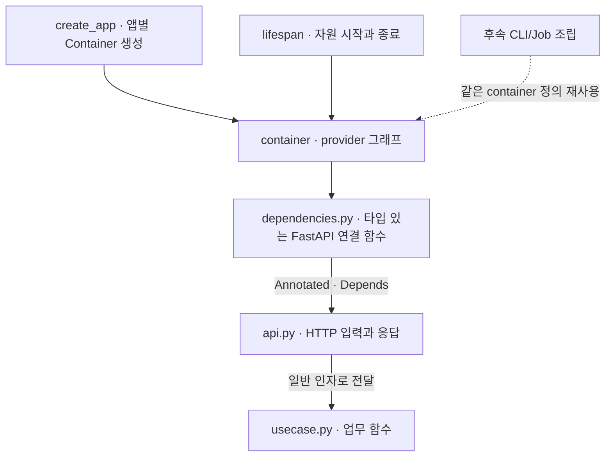
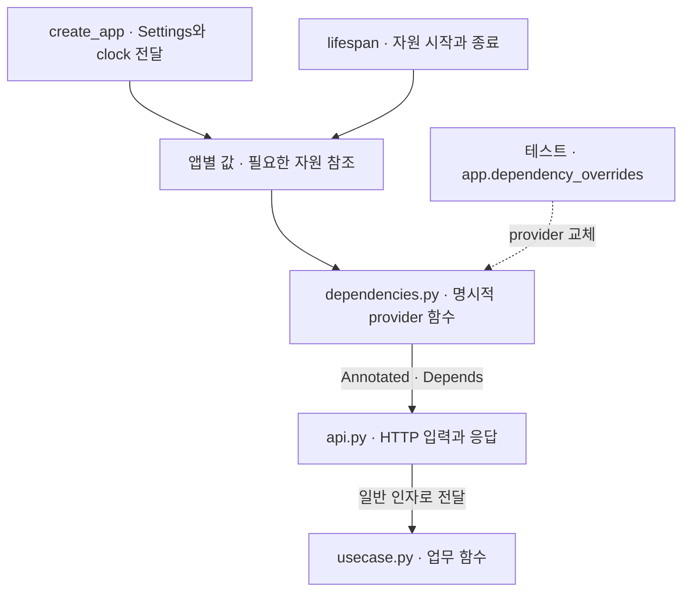

# FastAPI DI 선택안

Status: B안 선택·clock 및 Primary Session DI 구현 검증 · A안 미설치·미실행 · 2026-09-08

이 문서는 FastAPI 구현의 DI 선택만 소유합니다. 공통 경계는 [Backend](../backend.md),
현재 구현 방향은 [FastAPI 설계](fastapi.md)가 소유합니다. 아래 권장은 공식 API를 바탕으로 한 프로젝트 판단이며
FastAPI가 특정 외부 DI 라이브러리나 폴더 구조를 공식 표준으로 지정했다는 뜻이 아닙니다.

## 두 안이 함께 지킬 계약

- 업무 함수는 의존성을 일반 인자로 받습니다. `Depends`, `Request`, `Provide`, container 조회를 업무 코드에 넣지 않습니다.
- 단일 행위는 typed callable, 여러 행위가 응집되면 필요한 Protocol로 표현합니다. DI를 위해 Service 클래스를 만들지 않습니다.
- `run.py`가 Settings를 한 번 읽고 `create_app(settings)`에 전달합니다. import 시 Settings·외부 자원을 생성하지 않습니다.
- 공용 자원은 앱 lifespan이 시작·종료를 소유합니다. 앱 두 개의 자원·override는 분리합니다.
- 의존성의 수명과 트랜잭션의 원자적 범위는 별개입니다. provider의 종료에 숨은 commit을 두지 않습니다.

## A안. Dependency Injector로 조립하고 FastAPI에 연결

외부 후보는 `dependency-injector`입니다. `containers.DeclarativeContainer`와
`Object`·`Factory`·`Resource` provider로 필요한 조립과 자원 수명을 선언합니다.
업무 함수나 작은 객체를 provider의 생성 대상으로 쓸 수 있으며 클래스 계층을 강제하지 않습니다.



라이브러리 공식 FastAPI 예제는 `@inject`와 `Depends(Provide[Container.provider])`를 사용해 모듈을 wiring합니다.
우리 A안에서는 앱별 격리를 명확히 하기 위해 **앱에 연결된 container를 읽는 provider bridge**를 우선합니다.
container 접근은 이 연결 모듈과 실행 조립에서만 허용합니다. 같은 모듈을 여러 container로 wiring할 때의
연결·해제·override 간섭은 자동으로 안전하다고 가정하지 않습니다.

개념 예시입니다. 아래는 완성된 실행 파일이 아닙니다.

```python
# container.py: system_clock은 별도 일반 함수이며 Clock은 Callable[[], datetime]입니다.
class Container(containers.DeclarativeContainer):
    clock = providers.Object(system_clock)

# dependencies.py: app.state 접근·cast는 이 경계 안에 둡니다.
def get_clock(request: Request) -> Clock:
    container = cast(Container, request.app.state.container)
    return container.clock()
```

`Object(system_clock)`은 시각 값 대신 시간 공급 함수를 제공합니다.
Factory는 provider를 호출할 때 생성하는 정책이며 그 자체가 요청 scope는 아닙니다.
HTTP 한 요청 내 재사용은 FastAPI 의존성 캐시와 함께 정합니다.
Singleton도 프로세스 전체의 보장이 아니라 container별 인스턴스 정책이며 기본 Singleton은 thread-safe하지 않습니다.
DB session을 Singleton이나 앱 공용 Resource로 공유하지 않습니다.

| 이점 | 비용·확인할 사항 |
| --- | --- |
| 생성 관계를 provider 그래프로 모아 볼 수 있습니다. | container 선언과 HTTP 연결 코드가 추가됩니다. |
| HTTP 외 CLI·Job에서도 조립 정의를 재사용할 수 있습니다. | 각 진입점이 자원 시작·종료를 책임져야 합니다. |
| provider override와 자원 provider를 제공합니다. | FastAPI override와 container override 중 시험별 교체 지점을 정해야 합니다. |

현재 Python 3.14.7·ty·비동기 자원과의 호환성은 미검증입니다. 선택 시 uv로 설치하고
앱 두 개·동시 요청·초기화 실패·취소에서 provider와 자원 격리를 먼저 시험합니다.

## B안. dependencies 모듈과 FastAPI Depends로 조립

별도 DI 라이브러리 없이 일반 provider 함수와 `Annotated[T, Depends(provider)]`를 사용합니다.
`dependencies`는 새 업무 계층이 아니라 **객체와 함수를 연결하는 조립 모듈**입니다.
처음에는 작은 파일 하나로 시작하며 기능별로 커질 때만 나눕니다.



인사 API부터 아래 형태로 검증합니다. 개념 예시이며 입력·응답 schema는 생략했습니다.

```python
# dependencies.py
def get_clock(request: Request) -> Clock:
    return cast(Clock, request.app.state.clock)

ClockDep = Annotated[Clock, Depends(get_clock)]

# api.py
def greeting(name: str, clock: ClockDep) -> Greeting:
    return make_greeting(name=name, clock=clock)

# usecase.py: FastAPI를 import하지 않습니다.
def make_greeting(*, name: str, clock: Clock) -> Greeting:
    return Greeting(message=f"Hello, {name}!", generated_at=clock())
```

`create_app(settings, *, clock=system_clock)`가 앱별 clock 참조를 저장하도록 합니다.
cast는 타입 검사기의 도움이며 런타임 검증이 아니므로 factory에서 저장하는 타입·누락을 시험합니다.
HTTP 시험은 `app.dependency_overrides[get_clock]`를, 업무 단위 시험은 일반 인자 전달을 사용합니다.
lifespan 자원 factory 교체는 요청 provider override와 별도로 앱 조립 인자에서 처리합니다.

| 이점 | 비용·확인할 사항 |
| --- | --- |
| 함수 시그니처와 provider 호출을 따라 조립을 확인할 수 있습니다. | 그래프가 커지면 기능별 provider 분리가 필요합니다. |
| FastAPI의 요청 캐시·yield·override를 그대로 사용합니다. | CLI·Job에서는 일반 조립 함수와 context manager를 직접 호출합니다. |
| 추가 라이브러리 없이 현재 일반 함수 중심 코드와 이어집니다. | app.state의 동적 접근을 provider 경계로 제한해야 합니다. |

## 수명·동시성·멱등성 판단

| 대상 | 두 안의 수명·책임 |
| --- | --- |
| Settings·clock | 앱 조립 시 주입한 값·함수; 요청마다 설정을 다시 읽지 않습니다. |
| DB pool·후속 HTTP client | 앱/worker별 lifespan 자원; DB 설정이 있을 때 Engine을 생성합니다. HTTP client는 후속입니다. |
| DB session | 요청 또는 업무 작업별 생성·정리; 동시 task끼리 공유하지 않습니다. |
| 트랜잭션 | 업무가 commit/rollback 시점을 명시합니다. 응답 전 저장 성공이 확정되어야 합니다. |
| background·stream | 요청 session을 계속 빌려 쓰지 않고 필요한 작업의 자원 범위를 별도로 정합니다. |
| 멱등 기록·수량 차감 | 실제 DB의 제약·트랜잭션이 보호합니다. DI cache나 Singleton으로 중복 처리를 보장하지 않습니다. |

FastAPI는 같은 의존성을 요청 안에서 기본적으로 재사용합니다. 이는 요청 간 공유나 동시성 제어가 아닙니다.
`yield` 의존성은 기본 request scope에서 응답 뒤 정리하고, `scope="function"`은 핸들러 반환 뒤·응답 전 정리합니다.
현재 예약 JSON API의 PrimarySessionDep는 `scope="function"`으로 제공합니다.
streaming은 해당 기능을 도입할 때 자원 요구를 구분하며 commit은 어느 scope에서도 teardown에 숨기지 않습니다.

## 권장과 첫 검증

사용자가 **B안**을 선택했고 인사 API의 clock DI를 구현했습니다. HTTP API 하나에서 명시적 의존성과 수명을 이해하고 검증한다는 목적에 맞습니다.
A안은 HTTP·CLI·Job에서 반복되는 복잡한 조립이 실제로 생길 때 이점이 커집니다.
두 안 모두 동시성·멱등성 목표를 충족할 수 있으며 성능 우열은 실측 전 주장하지 않습니다.

선택 후 첫 작업은 인사 API의 clock 주입입니다. 고정 시각 교체, 입력 거절 시 업무 호출 없음,
앱별 override 분리, 업무 코드의 FastAPI 비의존을 검증합니다.
자원 도입 단계에서는 요청별 자원 분리·요청 내 재사용·실패/취소 정리·명시적 commit을 추가 검증합니다.

## 근거

확인일: 2026-09-07. 라이브러리의 제공 기능과 위 프로젝트 선택을 구분합니다.

- [FastAPI Dependencies](https://fastapi.tiangolo.com/tutorial/dependencies/): Annotated와 의존성 그래프
- [FastAPI Sub-dependencies](https://fastapi.tiangolo.com/tutorial/dependencies/sub-dependencies/): 요청 내 캐시
- [FastAPI yield dependencies](https://fastapi.tiangolo.com/tutorial/dependencies/dependencies-with-yield/): scope와 정리 시점
- [FastAPI lifespan](https://fastapi.tiangolo.com/advanced/events/): 앱 자원 수명
- [FastAPI overrides](https://fastapi.tiangolo.com/advanced/testing-dependencies/): 시험 대역 교체
- [Dependency Injector FastAPI 예제](https://python-dependency-injector.ets-labs.org/examples/fastapi.html): wiring과 provider override
- [Dependency Injector Resource](https://python-dependency-injector.ets-labs.org/providers/resource.html): 자원 초기화·종료
- [Dependency Injector Singleton](https://python-dependency-injector.ets-labs.org/providers/singleton.html): container scope·thread safety
