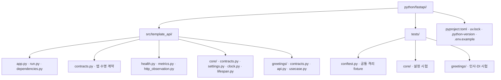
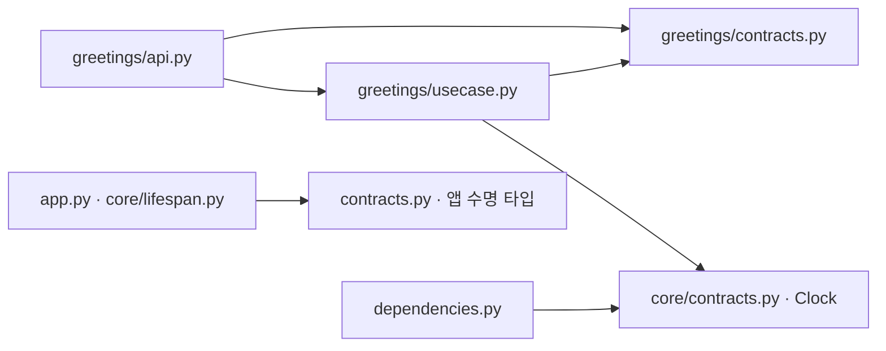

# FastAPI 폴더 구조와 활용 기준

Status: 현재 기본 배치와 소비 프로젝트의 변경 기준 · 2026-09-07

이 문서는 FastAPI 구현의 폴더·파일 역할과 배치 선택을 소유합니다.
공통 책임 계약은 [Backend](../backend.md), 개발 판단은 [개발 원칙](../engineering.md),
DI 조립은 [DI 설계](fastapi-di-options.md)가 소유합니다.
이 배치는 템플릿의 기본 선택이며 모든 사용자·언어에 같은 폴더 구조를 강제하지 않습니다.

## 기본 선택과 특징

**기능·도메인별로 먼저 묶고, 그 안에서 역할을 구분합니다.**
`greetings/`는 작은 기능 단위이며 모든 기능 폴더가 독립된 도메인 경계라는 뜻은 아닙니다.
업무 용어·규칙·변경 이유가 함께 움직이는 코드를 모으고 기능이 자라면 경계를 다시 검토합니다.

| 선택 | 특징·주의할 점 |
| --- | --- |
| 기능별 묶음: 현재 기본 | 한 기능의 API·업무·저장 변경을 가까이서 확인할 수 있습니다. 기능 간 호출 계약과 순환 의존을 관리해야 합니다. |
| 역할별 묶음: 소비 프로젝트의 대안 | 전체 `api/`·`services/`·`repositories/`로 나눕니다. 같은 역할을 모아 보기 쉽지만 한 기능의 변경이 여러 디렉터리에 걸칩니다. |
| 혼합 배치 | 공통 기반만 공유하고 업무는 기능별로 둡니다. `core/`가 업무 코드와 잡다한 유틸의 집합이 되지 않게 합니다. |

현재 기본은 기능별 묶음에 공통 기반을 분리한 혼합 배치입니다.
파일 수나 클래스 수를 맞추기 위해 빈 계층을 생성하지 않습니다.

## 현재 실제 구조

아래 경로는 `python/fastapi/` 기준입니다. `src/`와 `tests/`는 같은 레벨입니다.

| 경로 | 역할 |
| --- | --- |
| `src/template_api/run.py` | 설정 검증과 서버 실행 진입점입니다. |
| `src/template_api/app.py` | 앱을 생성하고 설정·의존성·라우터를 조립합니다. |
| `src/template_api/dependencies.py` | 공통 HTTP provider와 Depends 타입을 연결합니다. 업무 계층이 아닙니다. |
| `src/template_api/schemas.py` | 공통 성공 envelope·Problem Details·공개 오류 코드 등 HTTP 응답 계약입니다. |
| `src/template_api/errors.py` | 예외의 공개 응답 매핑·필드 위치 정제·OpenAPI 오류 media type 연결입니다. |
| `src/template_api/core/settings.py` | 환경 설정의 타입·기본값·검증을 소유합니다. |
| `src/template_api/contracts.py` | FastAPI 앱 수명 조립용 `PrepareResources`·`Lifespan` 계약입니다. 업무에서는 import하지 않습니다. |
| `src/template_api/core/contracts.py` | 프레임워크 독립 공통 계약 `Clock`, HTTP 관측 결과·상태 enum과 불변 `LogContext`를 소유합니다. |
| `src/template_api/core/logging.py` | 표준 logging 설정·허용 이벤트·JSON formatter·출력 실패 격리·ContextVar를 소유합니다. |
| `src/template_api/core/clock.py` | UTC 시간 공급 구현을 제공합니다. |
| `src/template_api/core/lifespan.py` | 준비 함수 주입·앱별 readiness·실패/취소 시 자원 정리를 소유합니다. |
| `src/template_api/health.py` | liveness/readiness HTTP 경계입니다. |
| `src/template_api/core/metrics.py` | 앱별 Prometheus registry·지표와 그 구현 상태를 소유합니다. 업무 공개 계약이 아닙니다. |
| `src/template_api/metrics.py` | `/metrics` 직렬화·실패 응답 HTTP 경계입니다. |
| `src/template_api/http_observation.py` | ASGI 전송·실행 결과를 관측하고 주입받은 지표에 기록합니다. |
| `src/template_api/greetings/api.py` | 이름 입력 검증·라우팅·HTTP 응답 직렬화를 연결합니다. |
| `src/template_api/greetings/contracts.py` | 기능의 불변 `Greeting` 결과 계약을 소유합니다. |
| `src/template_api/greetings/schemas.py` | 인사 API의 외부 성공 데이터 `GreetingData`를 소유합니다. |
| `src/template_api/greetings/usecase.py` | 계약을 받아 수행하는 일반 업무 함수를 소유합니다. |
| `tests/conftest.py` | 개인 환경변수·dotenv가 테스트에 유입되지 않게 격리합니다. |
| `tests/test_server.py` | 격리된 실제 Uvicorn 프로세스의 SIGTERM 요청 drain·자원 정리 순서를 검증합니다. |
| `tests/test_metrics.py` | 실제 HTTP 계측과 제어된 ASGI 실패·취소·앱별 지표 분리를 검증합니다. |
| `tests/test_logging.py` | JSON·개인정보 제외·요청 ID·문맥 격리·취소·전송 오류·출력 실패를 검증합니다. |
| `tests/test_responses.py` | 성공·오류 응답, 헤더·ID·OpenAPI 일치와 전송 시작 후 오류를 검증합니다. |
| `tests/core/`, `tests/greetings/` | 책임별 검증을 묶습니다. 소스의 모든 파일·폴더와 일대일 대응을 강제하지 않습니다. |
| `pyproject.toml`, `uv.lock`, `.python-version` | 패키지·개발 검사 기준·의존성 해석 결과·실행 Python 버전을 관리합니다. |
| `.env.example` | 사용자가 복사할 환경 설정 예시입니다. 실제 `.env`는 Git에서 제외합니다. |

## 기능이 커질 때의 파일 역할

아래는 `reservations/` 등에 적용할 수 있는 후보입니다. 현재 생성된 파일 목록이 아닙니다.
실제 책임이 생길 때만 파일을 분리하며 작은 기능에는 `api.py`·`usecase.py`만으로 시작할 수 있습니다.

| 기능 내부 파일 후보 | 역할·분리 시점 |
| --- | --- |
| `api.py` | HTTP 입력·상태 코드·응답을 다룹니다. |
| `schemas.py` | 외부 요청·응답 Pydantic 스키마를 둡니다. API 계약을 독립적으로 관리할 필요가 생기면 분리합니다. |
| `contracts.py` | 기능이 공개하는 내부 타입·행위 계약을 둡니다. API·usecase·repository 구현을 import하지 않습니다. |
| `dependencies.py` | 해당 기능 전용 의존성을 조립합니다. 공통 provider를 필요한 만큼 재사용합니다. |
| `usecase.py` | 업무 순서·원자적 범위를 정합니다. 복잡해지면 실제 업무 이름의 파일로 나눕니다. |
| `domain.py` | 상태·불변조건·정책을 둡니다. 독립된 정책이 없는 기능에는 만들지 않습니다. |
| `repository.py` | 업무 의미의 조회·저장과 ORM 경계를 소유합니다. DB 도입 시 추가합니다. |
| `models.py` | DB 테이블 매핑·ORM 모델을 둡니다. API 응답으로 직접 노출하지 않습니다. |

`schemas.py`는 HTTP 계약, 업무 dataclass는 내부 결과, `models.py`는 저장 구조를 뜻합니다.
이름이 비슷해도 각 변경 이유가 다릅니다. 복잡한 기능에서는 명시적으로 변환하지만,
필드가 같다는 이유만으로 세 종류의 타입과 매핑 코드를 무조건 만들지는 않습니다.
현재 인사 API는 불변 `Greeting` 업무 결과를 `greetings/schemas.py`의 외부 데이터로 변환하고
공통 `Success`의 data에 담습니다. 업무 함수는 HTTP envelope를 알지 않습니다.

기능 소유 타입은 해당 기능에 둡니다. 여러 곳에서 import한다는 이유만으로 전역 `schemas/`로 옮기지 않습니다.
재사용 계약은 소유 영역의 `contracts.py`로 분리합니다. 프레임워크 독립 계약과 앱 조립용 계약은 섞지 않습니다.
타입별 단일 파일을 강제하지 않으며 타입을 가져오려고 구현 모듈까지 import하지 않도록 합니다.

화살표는 import 방향입니다. contracts는 해당 구현을 역으로 import하지 않습니다.
이 원칙이 자동으로 강제되는 것은 아니므로 새 의존성을 추가할 때 역방향 import를 확인합니다.
기능 간에는 소유 기능의 명시적인 조회·업무 계약을 사용하며 다른 기능의 ORM 내부를 직접 조작하지 않습니다.

## 공통 기반과 후속 배치

공통 설정·시간·관측 기반처럼 여러 기능이 실제로 공유하는 책임만 `core/`에 둡니다.
metrics·로깅 기반은 `core/metrics.py`·`core/logging.py`입니다. HTTP 전용 관측 코드는 입력 경계에 배치합니다.
feature의 업무 이벤트·정책은 공통 로깅 기반을 사용하더라도 feature가 소유합니다.

DB migration 경로는 도구 선택 후 공식 초기화 명령으로 생성합니다.
Dockerfile·Compose는 필요 시 `python/fastapi/`에 두며 아직 미구현입니다.
Java/Spring Boot·TypeScript/Nest에는 각 언어와 프레임워크에 맞는 별도 배치를 정합니다.

## 소비 프로젝트에서 바꿀 수 있는 부분

폴더명·기능 경계·파일 분리 수준·역할별 배치는 팀의 작업 방식에 맞게 변경할 수 있습니다.
바꿀 때는 import·앱 조립·테스트 수집·빌드 포함 범위·실행 명령과 안내를 함께 확인합니다.
경로가 달라져도 명시적 DI, 자원 소유권, 업무와 HTTP/ORM 경계, 검증 계약은 유지합니다.
템플릿을 복사한 뒤의 구조는 소비 프로젝트가 소유하며 원본 업데이트로 자동 덮어쓰지 않습니다.
