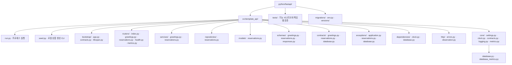
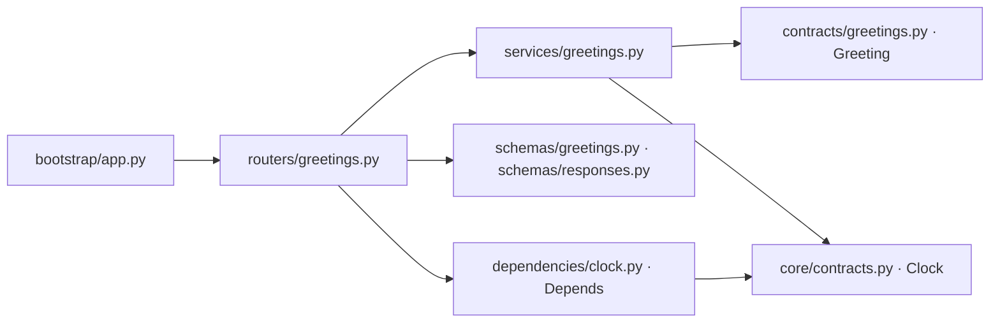
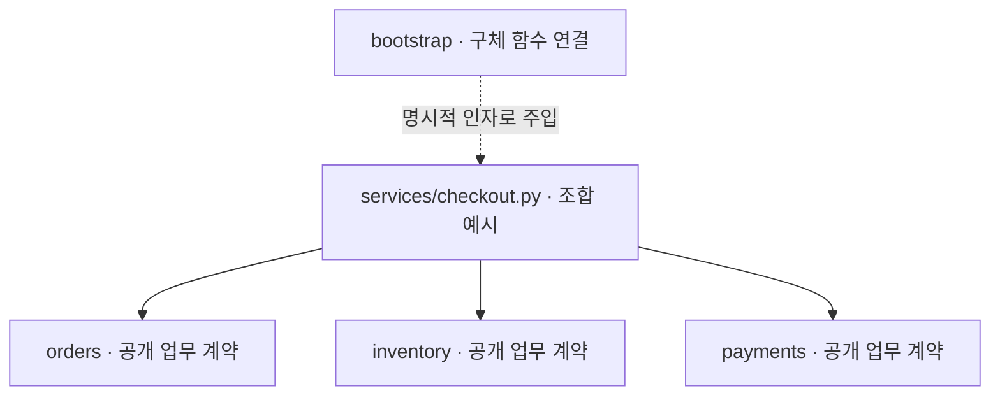
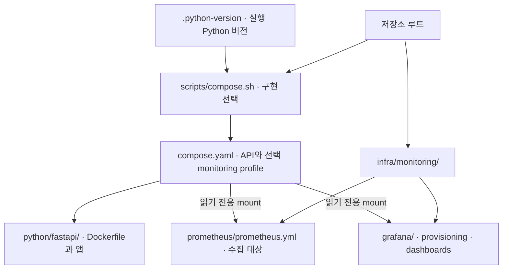

# FastAPI 폴더 구조와 활용 기준

Status: 역할별 배치·예약 저장 적용 · 2026-09-08

이 문서는 FastAPI 구현의 폴더·파일 역할과 배치 선택을 소유합니다.
공통 책임 계약은 [Backend](../backend.md), 개발 판단은 [개발 원칙](../engineering.md),
DI 조립은 [DI 설계](fastapi-di-options.md)가 소유합니다.

## 기본 선택과 특징

**역할별로 폴더를 나누고, 각 폴더 안에서 기능별 파일로 구분합니다.**
예를 들어 인사 기능은 `routers/greetings.py`·`services/greetings.py`·
`schemas/greetings.py`·`contracts/greetings.py`에 나뉩니다.
사용자 합의로 이 배치를 기본으로 선택했습니다. 다른 언어에 동일한 폴더 구성을 강제하지 않습니다.

같은 역할의 코드를 함께 살펴보기 쉽고 HTTP·업무·저장 경계를 경로로 표현할 수 있습니다.
한 기능의 변경이 여러 폴더에 걸치므로 기능 파일명을 맞추고 공개 계약을 명시합니다.
폴더를 나누는 것만으로 순환 의존이나 업무 결합이 해결되지는 않습니다.

## 현재 실제 구조

아래 경로는 `python/fastapi/` 기준입니다. `src/`와 `tests/`는 같은 레벨입니다.
예약의 HTTP·업무·저장·내부 계약을 역할별로 구분합니다. DB 모델은 SQLAlchemy Core Table이며 ORM Base는 없습니다.

| 경로 | 역할 |
| --- | --- |
| `run.py` | 설정·프로세스 로깅·Uvicorn 실행 진입점입니다. |
| `bootstrap/app.py` | 설정·자원·라우터·오류 처리를 연결해 앱을 조립합니다. 업무 함수나 endpoint를 소유하지 않습니다. |
| `bootstrap/lifespan.py`, `bootstrap/contracts.py` | 시작·종료와 자원 정리, 앱 수명 타입을 소유합니다. |
| `routers/index.py`, `routers/greetings.py` | HTTP 입력·응답을 처리하며 인사 router가 업무 함수를 호출합니다. |
| `routers/health.py`, `routers/metrics.py` | 생존·준비 상태와 metrics 노출 endpoint입니다. |
| `services/greetings.py` | clock을 명시적 인자로 받아 인사 결과를 만드는 일반 업무 함수입니다. |
| `schemas/greetings.py` | 외부 응답 `GreetingData`를 소유합니다. |
| `schemas/responses.py` | 공통 성공 envelope·Problem Details·공개 오류 코드입니다. |
| `contracts/greetings.py` | 내부 업무 결과 `Greeting`을 소유합니다. HTTP 스키마·ORM과 구분합니다. |
| `exceptions/application.py` | 예상 가능한 업무 실패의 공통 타입입니다. 기능별 예외는 해당 기능 도입 시 이 폴더에 추가합니다. |
| `dependencies/clock.py` | FastAPI Depends와 앱 상태 접근을 연결하는 HTTP provider입니다. |
| `dependencies/database.py` | Primary Session·DB metrics의 HTTP provider입니다. 자동 commit은 하지 않습니다. |
| `core/database.py`, `core/database_metrics.py` | Engine·SQLite 옵션·Session 수명·명시적 연결 획득과 DB 계측입니다. |
| `contracts/database.py` | 연결 획득·업무 트랜잭션 결과 enum입니다. |
| `http/errors.py` | 예외의 공개 응답 매핑·안전한 검증 오류·OpenAPI 오류 명세입니다. |
| `http/observation.py` | ASGI 전송·실행 결과를 관측합니다. router와 별도로 HTTP 전체를 감싸는 경계입니다. |
| `core/settings.py`, `core/clock.py` | 환경 설정과 UTC 시간 공급 구현입니다. |
| `core/contracts.py` | Clock·관측 결과·로그 문맥 등 공통 기반 계약입니다. |
| `core/logging.py`, `core/metrics.py` | JSON 로그 출력과 Prometheus registry·지표 기록입니다. |
| `routers/reservations.py`, `schemas/reservations.py` | 예약 HTTP 입력 검증·응답 변환·멱등 헤더입니다. |
| `services/reservations.py` | 업무 순서·트랜잭션·재생·실패 분류를 소유합니다. |
| `repositories/reservations.py` | 조건부 차감·예약/키 저장·결과 조회 SQL입니다. commit하지 않습니다. |
| `models/reservations.py` | Core Table·DB 제약·metadata입니다. 외부 요청 schema와 구분합니다. |
| `contracts/reservations.py` | 불변 업무 결과 타입입니다. HTTP·저장 구현을 import하지 않습니다. |
| `exceptions/reservations.py`, `exceptions/database.py`, `http/database.py` | 업무/DB 실패 타입과 HTTP 503 변환을 구분합니다. |
| `migrations/`, `alembic.ini` | 공식 Alembic async scaffold 기반 schema 변경입니다. 앱 lifespan에서 적용하지 않습니다. |
| `scripts/start.sh` | 로컬 컨테이너에서 migration 성공 후 앱을 실행합니다. lifespan 외부의 실행 순서입니다. |
| `seed.py` | 없는 상품만 생성하는 로컬 CLI입니다. 기존 재고를 초기화하지 않습니다. |
| `tests/` | 기반·예약·경합·복구 시험입니다. `reservations/process_worker.py`는 독립 프로세스/강제 종료 대역입니다. 소스와 일대일 대응을 강제하지 않습니다. |

`http/`는 HTTP 전반의 오류 처리·관측을 소유하고, 모든 endpoint는 `routers/`에 둡니다.
`bootstrap/`은 실행할 앱을 연결하는 곳이며 업무 계층이 아닙니다.
`core/`는 router·service·bootstrap 등 상위 구현을 역으로 import하지 않습니다.

## 호출과 계약의 방향

화살표는 import 방향입니다. service는 router·Depends·외부 응답 스키마를 import하지 않습니다.
계약은 구현을 역으로 import하지 않으며 package `__init__.py`에서 구현을 재노출하지 않습니다.

예약 호출은 router → service → repository입니다. Session·metrics·clock은 명시적 인자로 전달합니다.
DB Table은 `models/`, 외부 요청·응답 모델은 `schemas/`, 내부 업무 타입은 `contracts/`에 둡니다.
같은 필드를 가진다는 이유만으로 모든 타입과 변환 함수를 미리 만들지는 않습니다.
설정·의존성·자원 수명은 기존 명시적 DI 계약을 유지합니다.
업무 예외의 정의·등록·응답 매핑은 [업무 예외 처리](fastapi.md#업무-예외-처리)가 소유합니다.

## 여러 서비스를 조합할 때

아래는 향후 설계 예시이며 현재 주문·재고·결제 구현이 있다는 뜻은 아닙니다.
주문 확정이 여러 업무를 조합한다면 `services/checkout.py`의 함수가 순서와 실패 처리를 소유할 수 있습니다.
이는 Facade 역할이며 별도 `facades/` 폴더·클래스·중첩 Facade가 필수는 아닙니다.

실선은 업무 호출 방향입니다. 참여 서비스는 조합 서비스를 역으로 호출하지 않습니다.
A → B → A가 생기면 조합 서비스가 필요한 데이터를 구해 각각 전달하거나 업무 경계를 다시 정합니다.
계약 타입 분리·DI·지연 import만으로 순환 업무 호출이 해결되지는 않습니다.
다른 기능의 ORM 내부를 직접 조작하지 않고 소유 기능의 공개 업무·조회 계약을 사용합니다.

트랜잭션 소유권·재시도는 조합 단계에서 명시합니다. 같은 DB에서 원자성이 필요하면 같은 트랜잭션을 전달하고,
독립 DB·외부 결제까지 포함하면 실패·응답 유실·보상 정책을 별도로 정합니다. Facade 자체가 원자성을 보장하지 않습니다.

## 실행 설정과 후속 배치

DB migration은 공식 `alembic init -t async migrations`와 `alembic revision`으로 생성한 경로를 사용합니다.
Dockerfile·빌드 context 허용 목록은 `python/fastapi/`에서 관리합니다.
로컬 실행 정의는 루트 `compose.yaml` 하나가 소유하며 `scripts/compose.sh`가 구현별 build 경로와 환경 예시를 선택합니다.
API는 기본 실행하고 Prometheus·Grafana는 `monitoring` profile로 선택합니다.
수집기 설정은 루트 `infra/monitoring/`에 둡니다. Java·Nest 선택지는 해당 구현을 만들 때 추가합니다.
파일명은 도구가 정한 이름(`Dockerfile`, `compose.yaml`, `.python-version`, `prometheus.yml`)을 우선합니다.
자체 실행 스크립트는 `scripts/compose.sh`, HTTP 대시보드는 `http-overview.json`,
Grafana dashboard provider 설정은 `provisioning/dashboards/dashboards.yml`처럼 역할을 드러냅니다.
이는 자체 파일의 명명 기준이며 Grafana가 해당 파일명을 강제하는 것은 아닙니다.
공통 설정은 현재 FastAPI의 지표 계약으로 검증했으며 다른 구현에서 재사용할 때 지표 이름·라벨 호환성을 확인합니다.

스크립트는 호출 위치와 무관하게 저장소 루트를 Compose 기준 경로로 사용합니다.
기본 실행은 [루트 안내](../../README.md#사용할-방식), 앱 확인은 [사용 안내](../../python/fastapi/README.md#로컬-모니터링)를 따릅니다.
Java/Spring Boot·TypeScript/Nest에는 각 언어와 프레임워크에 맞는 별도 배치를 정합니다.

## 소비 프로젝트에서 바꿀 수 있는 부분

폴더명·기능 경계·파일 분리 수준·역할별 배치는 팀의 작업 방식에 맞게 변경할 수 있습니다.
바꿀 때는 import·앱 조립·테스트 수집·빌드 포함 범위·실행 명령과 안내를 함께 확인합니다.
경로가 달라져도 명시적 DI, 자원 소유권, 업무와 HTTP/ORM 경계, 검증 계약은 유지합니다.
템플릿을 복사한 뒤의 구조는 소비 프로젝트가 소유하며 원본 업데이트로 자동 덮어쓰지 않습니다.
