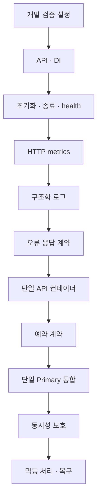
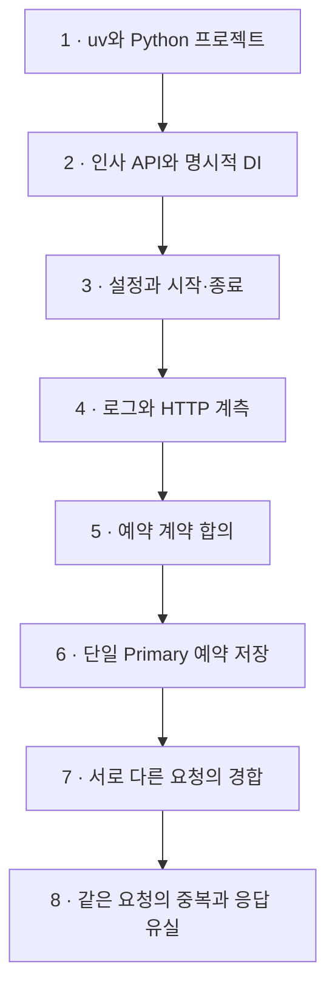

# FastAPI 단계별 구현 task

Status: Task 1·2·3 및 HTTP metrics·로그·응답 계약 완료 · 컨테이너 범위 논의 후속 · 2026-09-07

1차 완료 목표는 한정 수량 예약에서 동시성·멱등성·응답 유실 후 재시도를 구현하고 검증한 상태입니다.
uv 사용은 확정했습니다. Python 선택은 [구현 설계](fastapi.md#구성과-의존성)가 소유합니다.
각 task의 내용을 사용자와 맞춘 뒤 구현하고, 결과와 한계를 함께 확인한 후 다음 task로 넘어갑니다.
사용자 합의로 각 task의 검증이 끝나면 해당 범위를 커밋하고 `origin`에 push합니다.
기존 변경을 섞거나 실패한 검증을 통과로 처리하지 않습니다.
아래 후속 task는 순서의 초안이며 파일·의존성·통과 조건은 해당 task 착수 시 구체화합니다.
공통 계약은 [Backend](../backend.md), 기반 구현과 시험은 [구현 설계](fastapi.md)와
[검증 명세](fastapi-verification.md)를 참조하고 복제하지 않습니다.

## 다음 설정 작업의 진행 순서

현재 uv 초기화·lock·패키지 빌드·최소 HTTP 앱·환경 설정은 구현했습니다.
아래는 남은 작업 목록이며 일괄 실행 승인이 아닙니다. 각 항목을 논의하고 하나씩 진행합니다.
기존 Task 1~8의 완료 조건은 아래 상세 항목이 소유합니다.

| 순서 | 필요한 작업 | 이번에 결정하거나 확인할 내용 | 연결 task |
| --- | --- | --- | --- |
| 1 | 개발 검증 설정 · 완료 | 프로젝트 자체 Ruff·pytest·ty 설정과 환경 격리 검증 완료. 상위 라이브러리 경고 1건은 표시 유지·제거 조건 기록 | 1 보완 |
| 2 | API·DI 기본형 · 완료 | B안으로 인사 API·입력 검증·clock 주입·앱별 override 검증 | 2 |
| 3 | 초기화·종료·health · 완료 | lifespan·health·실패/취소 정리·SIGTERM 요청 drain 검증 | 3 |
| 4 | HTTP metrics · 로컬 완료 | prometheus-client, 요청 수·지연·결과, 제한된 라벨, 앱별 registry, 관측 실패·동시 요청 격리 검증 | 4 |
| 5 | 구조화 로그 · 로컬 완료 | 표준 logging, JSON·허용 필드, 요청 ID·ContextVar·실패 격리·실제 Uvicorn 오류 중복 방지 검증 | 4 |
| 6 | 응답 계약 · 기반 완료 | 성공 data·Problem Details, 422/404/405/500·공개 코드·요청 ID·원문 제외·Swagger 일치 검증. 업무 오류는 기능 도입 시 추가 | 2·4 |
| 7 | 컨테이너 실행 | 단일 API Dockerfile·Compose, lock 설치, 비 root, env 제외, 포트·자원·로그 보관 상한 | 4 |
| 8 | 예약 계약 | 수량 불변조건, 성공·품절, 멱등 키 범위·충돌·보존 기간·진행 중 중복 정책 | 5 |
| 9 | DB 통합 | DB·driver·저장 도구 선택, 격리 DB 대상, migration, pool 예산·timeout·트랜잭션 소유권 | 6 |
| 10 | 동시성 보호 | DB 제약·조건부 변경・잠금 중 필요한 방식, 독립 연결 경합에서 초과 예약 방지 | 7 |
| 11 | 멱등 처리·복구 | 키와 결과의 영속화·원자성, 동시 재전송, rollback·commit 후 응답 유실 구분 | 8 |

환경변수는 각 기능을 도입할 때 필요한 항목만 `.env.example`에 추가합니다.
DB·컨테이너 실행 대상과 실제 변경 범위는 해당 단계에서 확인합니다.
CI 자동 실행은 로컬 검증 명령이 안정된 뒤 별도로 논의합니다.
Sentry·Elastic·Replica·샤딩·LB·Gateway·캐시·브로커는 현재 설정 목록에 포함하지 않습니다.

## 전체 milestone

## Task 1. uv와 Python 프로젝트

진행: `uv init`으로 재초기화하고 `uv add`·`uv lock`·`uv sync --locked`를 실행했습니다.
Python 3.14.7과 lock 기반 설치를 확인했습니다. 실제 명령은 [사용 안내](../../python/fastapi/README.md)에 있습니다.
개발 검증 보완: Ruff lint·format·ty 검사와 환경 오염 주입 pytest 3개가 통과했습니다.
프로젝트별 설정과 테스트 환경 격리를 추가했고, TestClient는 공식 권장 httpx2로 전환했습니다.
폴더 구조 보완: 공통 기반은 `src/template_api/core/`, 기능은 `greetings/`로 구분했습니다.
`tests/`는 `src/`와 동급에 두고 책임별로 묶었습니다. 이동 후 테스트 14개·lint·포맷·타입 검사·빌드가 통과했습니다.

목표:
`python/fastapi/`에 프로젝트의 가장 작은 설치·실행 단위를 만듭니다.
최신 안정 Python과 uv를 사용하며 계정 전역 설정은 변경하지 않습니다.

예상 결과:
- `pyproject.toml`, `.python-version`, `uv.lock`과 최소 패키지 구조가 존재합니다.
- 고정한 Python 버전과 프로젝트 환경의 일치, lock 기반 환경 재현이 확인됩니다.
- 사용 안내에 실제 확인한 환경 준비 명령이 있습니다. 이 task 자체는 API·DB 구현을 포함하지 않습니다.

## Task 2. 인사 API와 명시적 DI

진행: B안으로 `GET /v1/greetings`·명시적 clock DI·입력 검증을 구현했습니다.
정상·경계 입력·입력 거절 시 미호출·앱별 override·복원·조립 시 미호출을 포함해 전체 테스트 14개와 lint·타입 검사가 통과했습니다.

목표:
앱 factory와 인사 API 하나를 만들고 clock을 일반 업무 함수에 명시적으로 주입합니다.

예상 결과:
- 정상 응답·입력 거절·고정 clock 교체가 HTTP 시험에서 확인됩니다.
- 업무 함수에 HTTP 객체나 전역 container 의존이 없습니다.

## Task 3. 설정과 시작·종료

진행: 사용자 요청으로 Settings·실행 진입점·`.env.example`·`uv build`를 먼저 적용했습니다.
환경 설정에 이어 lifespan·liveness/readiness와 준비 함수 주입을 구현했습니다.
전체 테스트 21개·lint·타입 검사가 통과했습니다. 초기화 실패·취소·cleanup 오류·앱별 준비 상태 분리와
격리 Uvicorn 프로세스의 SIGTERM → 진행 요청 완료 → 자원 정리를 검증했습니다.
외부 자원은 대역만 사용했으며 강제 종료·반복 취소·실제 DB 자원 정리는 검증 범위 밖입니다.

목표:
Settings와 실행 진입점, lifespan, 생존·준비 상태를 구현합니다.

예상 결과:
- 불량 설정의 안전한 시작 실패, 앱 간 격리, 부분 초기화 실패 정리가 확인됩니다.
- 정상 종료와 취소에서 소유 자원이 정리되며 외부 자원은 시험 대역만 사용합니다.

## Task 4. 로그와 HTTP 계측

진행 순서: 사용자 결정으로 Metrics → Logging 순서입니다.
Metrics 진행: `uv add prometheus-client`로 의존성을 추가하고 앱별 registry·순수 ASGI 관측·`/metrics`를 연결했습니다.
정상·422·404·500·전송 실패·취소·background 오류·동시 요청·관측 실패 격리를 포함해 전체 33개 테스트가 통과했습니다.
계측 실패는 업무 응답·원래 예외를 보존하고 `/metrics`의 503으로 드러냅니다.
외부 수집 서버·CPU/RSS collector·다중 worker 집계·Compose는 미구현입니다.
Metrics 보완: enum 상태·불변 결과 계약·숫자 status와 지표 기록 경계를 분리했습니다.
문서 조회 제외·동적 route template·405 집계 회귀 검증을 포함해 전체 34개 테스트가 통과했습니다.
로컬 `/metrics` 선택이 전체 언어·환경의 전달 방식을 고정하지 않습니다.
Logging 진행: 표준 logging·json 기반 stdout 출력, 앱별 서비스 문맥·서버 생성 요청 ID,
INFO 요약·ERROR 상세와 Uvicorn 중복 제외를 구현했습니다. APP_ENVIRONMENT를 예시에 추가했습니다.
형식·출력 실패의 안전한 stderr 보고, 동시 요청·취소·민감정보 제외·크기 상한을 포함해 전체 44개 테스트가 통과했습니다.
실제 격리 서버에서 설정 두 번·500 오류 상세 1회·요약 연결·SIGTERM drain을 확인했습니다.
응답 계약 진행: 성공 data·Problem Details를 합의하고 내부 업무 타입과 외부 스키마를 분리했습니다.
전체 53개 테스트·lint·타입 검사로 기본 오류·요청 ID·Swagger·헤더 보존·stream 오류 회귀를 확인했습니다.
다음은 컨테이너 실행 범위 논의입니다. 실제 업무 충돌 코드·파일 rotation·queue·외부 수집은 후속입니다.

목표:
기존 관측 계약을 구현하고 정상·실패·취소를 구분해 확인할 수 있게 합니다.

예상 결과:
- JSON 로그·metrics·동시 요청 문맥 분리와 관측 실패 격리가 기존 검증 명세를 충족합니다.
- 기반 검증 명세의 실행 결과와 미검증 항목이 구분됩니다.
- 단일 API Compose와 프로세스 종료 검증의 구체적 실행 범위가 합의되고 결과가 기록됩니다.

## Task 5. 예약 계약 합의

목표:
예약 수량과 성공·품절의 의미, 멱등 키의 범위 및 재사용 정책을 사용자와 정합니다.

예상 결과:
- 수량 1개에 서로 다른 요청 두 개가 경합할 때 예약 하나·차감 한 번이라는 불변조건이 확정됩니다.
- 같은 키·같은 입력, 같은 키·다른 입력, 진행 중 중복, 응답 유실의 기대 결과가 정해집니다.
- 예약 계약을 소유하는 구현 문서와 구체적인 시험 사례가 존재합니다.
- 인증·결제·예약 취소·만료를 첫 실험에 포함할지 여부가 명시됩니다.

## Task 6. 단일 Primary 예약 저장

목표:
합의한 예약 계약에 필요한 최소 schema·migration·저장 경계·트랜잭션을 구현합니다.
DB 선택과 격리 시험 대상, DB 생성·migration 범위는 실행 전에 사용자와 확인합니다.

예상 결과:
- 실제 격리 DB에서 순차 예약·품절·rollback이 검증됩니다.
- 예약과 수량 변경의 원자성, session 소유권과 pool 예산이 명시됩니다.
- Replica·샤딩·범용 읽기 라우터 없이 단일 Primary로 동작합니다.

## Task 7. 서로 다른 요청의 경합

목표:
동시에 들어온 서로 다른 예약 요청으로부터 수량 불변조건을 보호합니다.

예상 결과:
- 실제 DB의 독립 연결에서 경합을 재현하고 수량 1개에 성공 하나·예약 하나·남은 수량 0을 확인합니다.
- 실패 요청의 부분 변경이 없으며 프로세스 메모리 잠금에만 의존하지 않습니다.
- timeout·오류 결과와 시험 환경·한계가 기록됩니다.

## Task 8. 같은 요청의 중복과 응답 유실

목표:
같은 요청의 순차·동시 재전송과 commit 후 응답 유실을 처리합니다.

예상 결과:
- 같은 키의 재전송에도 예약·차감이 한 번이며 합의한 기존 결과를 확인할 수 있습니다.
- 같은 키·다른 입력과 진행 중 중복은 합의한 정책대로 처리됩니다.
- rollback 후 재시도와 commit 후 응답 유실을 구분하여 실제 DB에서 검증합니다.
- 재현 명령·결과·미검증 범위가 남고 사용자와 1차 완료 여부를 확인합니다.

트래픽 급증의 용량·지연 목표와 본격 부하 실험은 별도 합의합니다.
동시성 시험 성공을 처리량 보장으로 설명하지 않으며 [Runtime Review](../runtime-review.md)를 따릅니다.
