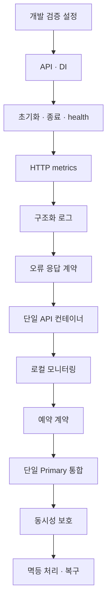
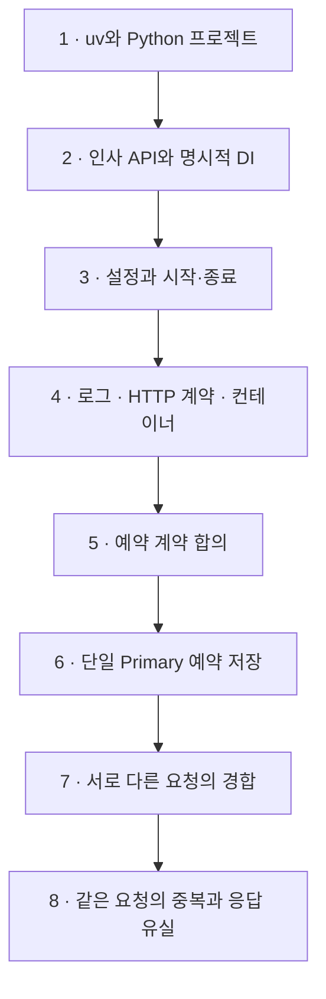
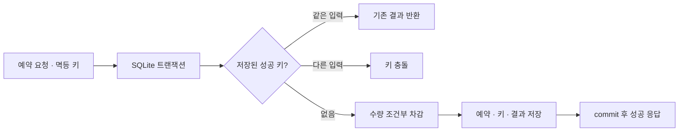

# FastAPI 단계별 구현 task

Status: Task 1~4 로컬 구현 완료 · 다음 Task 6-1 DB 연결 기반 · Task 5 계약 초안 검토 필요 · 2026-09-07

1차 완료 목표는 한정 수량 예약에서 동시성·멱등성·응답 유실 후 재시도를 구현하고 검증한 상태입니다.
uv 사용은 확정했습니다. Python 선택은 [구현 설계](fastapi.md#구성과-의존성)가 소유합니다.
각 task의 내용을 사용자와 맞춘 뒤 구현하고, 결과와 한계를 함께 확인한 후 다음 task로 넘어갑니다.
사용자 합의로 각 task의 검증이 끝나면 해당 범위를 커밋하고 `origin`에 push합니다.
기존 변경을 섞거나 실패한 검증을 통과로 처리하지 않습니다.
아래 후속 task는 순서의 초안이며 파일·의존성·통과 조건은 해당 task 착수 시 구체화합니다.
공통 계약은 [Backend](../backend.md), 기반 구현과 시험은 [구현 설계](fastapi.md)와
[검증 명세](fastapi-verification.md)를 참조하고 복제하지 않습니다.

## 다음 설정 작업의 진행 순서

현재 uv 초기화·lock·패키지 빌드·최소 HTTP 앱·환경 설정은 구현했습니다.
아래는 남은 작업 목록이며 일괄 실행 승인이 아닙니다. 각 항목을 논의하고 하나씩 진행합니다.
기존 Task 1~8의 완료 조건은 아래 상세 항목이 소유합니다.

| 순서 | 필요한 작업 | 이번에 결정하거나 확인할 내용 | 연결 task |
| --- | --- | --- | --- |
| 1 | 개발 검증 설정 · 완료 | 프로젝트 자체 Ruff·pytest·ty 설정과 환경 격리 검증 완료. 상위 라이브러리 경고 1건은 표시 유지·제거 조건 기록 | 1 보완 |
| 2 | API·DI 기본형 · 완료 | B안으로 인사 API·입력 검증·clock 주입·앱별 override 검증 | 2 |
| 3 | 초기화·종료·health · 완료 | lifespan·health·실패/취소 정리·SIGTERM 요청 drain 검증 | 3 |
| 4 | HTTP metrics · 로컬 완료 | prometheus-client, 요청 수·지연·결과, 제한된 라벨, 앱별 registry, 관측 실패·동시 요청 격리 검증 | 4 |
| 5 | 구조화 로그 · 로컬 완료 | 표준 logging, JSON·허용 필드, 요청 ID·ContextVar·실패 격리·실제 Uvicorn 오류 중복 방지 검증 | 4 |
| 6 | 응답 계약 · 기반 완료 | 성공 data·Problem Details, 422/404/405/500·공개 코드·요청 ID·원문 제외·Swagger 일치 검증. 업무 오류는 기능 도입 시 추가 | 2·4 |
| 7 | 컨테이너 실행 · 로컬 완료 | 단일 API 빌드·healthy·응답/관측·UID 10001·env/dev 제외·자원/로그 상한 설정·유휴 종료·재기동 검증 | 4 |
| 7 보완 | 로컬 모니터링 · 완료 | 단일 Compose·구현 선택 스크립트·monitoring profile, 자동 대시보드, 요청 집계·수집 단절·복구 검증 | 4 |
| 8 | 예약 계약 | 수량 불변조건, 성공·품절, 멱등 키 범위·충돌·보존 기간·진행 중 중복 정책 | 5 |
| 9 | DB 통합 | DB·driver·저장 도구 선택, 격리 DB 대상, migration, pool 예산·timeout·트랜잭션 소유권 | 6 |
| 10 | 동시성 보호 | DB 제약·조건부 변경・잠금 중 필요한 방식, 독립 연결 경합에서 초과 예약 방지 | 7 |
| 11 | 멱등 처리·복구 | 키와 결과의 영속화·원자성, 동시 재전송, rollback·commit 후 응답 유실 구분 | 8 |

환경변수는 각 기능을 도입할 때 필요한 항목만 `.env.example`에 추가합니다.
DB·컨테이너 실행 대상과 실제 변경 범위는 해당 단계에서 확인합니다.
CI 자동 실행은 로컬 검증 명령이 안정된 뒤 별도로 논의합니다.
stg·prd는 Sentry 연동 방향만 합의했으며 SDK·DSN·운영 환경 설정은 후속 task에서 구체화합니다.
Elastic·Replica·샤딩·LB·Gateway·캐시·브로커는 현재 설정 목록에 포함하지 않습니다.

## 전체 milestone

## Task 1. uv와 Python 프로젝트

진행: `uv init`으로 재초기화하고 `uv add`·`uv lock`·`uv sync --locked`를 실행했습니다.
Python 3.14.7과 lock 기반 설치를 확인했습니다. 실제 명령은 [사용 안내](../../python/fastapi/README.md)에 있습니다.
개발 검증 보완: Ruff lint·format·ty 검사와 환경 오염 주입 pytest 3개가 통과했습니다.
프로젝트별 설정과 테스트 환경 격리를 추가했고, TestClient는 공식 권장 httpx2로 전환했습니다.
폴더 구조 보완: 공통 기반은 `src/template_api/core/`, 기능은 `greetings/`로 구분했습니다.
`tests/`는 `src/`와 동급에 두고 책임별로 묶었습니다. 이동 후 테스트 14개·lint·포맷·타입 검사·빌드가 통과했습니다.

목표:
`python/fastapi/`에 프로젝트의 가장 작은 설치·실행 단위를 만듭니다.
최신 안정 Python과 uv를 사용하며 계정 전역 설정은 변경하지 않습니다.

예상 결과:
- `pyproject.toml`, `.python-version`, `uv.lock`과 최소 패키지 구조가 존재합니다.
- 고정한 Python 버전과 프로젝트 환경의 일치, lock 기반 환경 재현이 확인됩니다.
- 사용 안내에 실제 확인한 환경 준비 명령이 있습니다. 이 task 자체는 API·DB 구현을 포함하지 않습니다.

## Task 2. 인사 API와 명시적 DI

진행: B안으로 `GET /v1/greetings`·명시적 clock DI·입력 검증을 구현했습니다.
정상·경계 입력·입력 거절 시 미호출·앱별 override·복원·조립 시 미호출을 포함해 전체 테스트 14개와 lint·타입 검사가 통과했습니다.

목표:
앱 factory와 인사 API 하나를 만들고 clock을 일반 업무 함수에 명시적으로 주입합니다.

예상 결과:
- 정상 응답·입력 거절·고정 clock 교체가 HTTP 시험에서 확인됩니다.
- 업무 함수에 HTTP 객체나 전역 container 의존이 없습니다.

## Task 3. 설정과 시작·종료

진행: 사용자 요청으로 Settings·실행 진입점·`.env.example`·`uv build`를 먼저 적용했습니다.
환경 설정에 이어 lifespan·liveness/readiness와 준비 함수 주입을 구현했습니다.
전체 테스트 21개·lint·타입 검사가 통과했습니다. 초기화 실패·취소·cleanup 오류·앱별 준비 상태 분리와
격리 Uvicorn 프로세스의 SIGTERM → 진행 요청 완료 → 자원 정리를 검증했습니다.
외부 자원은 대역만 사용했으며 강제 종료·반복 취소·실제 DB 자원 정리는 검증 범위 밖입니다.

목표:
Settings와 실행 진입점, lifespan, 생존·준비 상태를 구현합니다.

예상 결과:
- 불량 설정의 안전한 시작 실패, 앱 간 격리, 부분 초기화 실패 정리가 확인됩니다.
- 정상 종료와 취소에서 소유 자원이 정리되며 외부 자원은 시험 대역만 사용합니다.

## Task 4. 로그·HTTP 계약·컨테이너

진행 순서: 사용자 결정으로 Metrics → Logging 순서입니다.
Metrics 진행: `uv add prometheus-client`로 의존성을 추가하고 앱별 registry·순수 ASGI 관측·`/metrics`를 연결했습니다.
정상·422·404·500·전송 실패·취소·background 오류·동시 요청·관측 실패 격리를 포함해 전체 33개 테스트가 통과했습니다.
계측 실패는 업무 응답·원래 예외를 보존하고 `/metrics`의 503으로 드러냅니다.
CPU/RSS collector·다중 worker 집계는 미구현입니다. 로컬 수집 서버는 아래 보완 작업에서 추가했습니다.
Metrics 보완: enum 상태·불변 결과 계약·숫자 status와 지표 기록 경계를 분리했습니다.
문서 조회 제외·동적 route template·405 집계 회귀 검증을 포함해 전체 34개 테스트가 통과했습니다.
로컬 `/metrics` 선택이 전체 언어·환경의 전달 방식을 고정하지 않습니다.
Logging 진행: 표준 logging·json 기반 stdout 출력, 앱별 서비스 문맥·서버 생성 요청 ID,
INFO 요약·ERROR 상세와 Uvicorn 중복 제외를 구현했습니다. APP_ENVIRONMENT를 예시에 추가했습니다.
형식·출력 실패의 안전한 stderr 보고, 동시 요청·취소·민감정보 제외·크기 상한을 포함해 전체 44개 테스트가 통과했습니다.
실제 격리 서버에서 설정 두 번·500 오류 상세 1회·요약 연결·SIGTERM drain을 확인했습니다.
응답 계약 진행: 성공 data·Problem Details를 합의하고 내부 업무 타입과 외부 스키마를 분리했습니다.
전체 53개 테스트·lint·타입 검사로 기본 오류·요청 ID·Swagger·헤더 보존·stream 오류 회귀를 확인했습니다.
컨테이너 진행: docker init 생성 후 uv lock·멀티 스테이지·비 root·readiness·loopback 게시를 적용했습니다.
linux/arm64 실제 빌드·healthy·200/422·Swagger/metrics/JSON 로그·UID/dev/env 제외와 자원/로그 보관 설정을 확인했습니다.
SIGTERM 종료 로그·OOM=false·exit 143과 재기동 healthy를 확인했습니다. 컨테이너 내 진행 요청 drain·부하·amd64·실제 로그 회전은 미검증입니다.
모니터링 보완: 루트 Compose의 선택 profile에 Prometheus·Grafana를 추가하고 공식 file provisioning으로 대시보드를 등록했습니다.
루트 `compose.yaml` 하나와 구현 선택용 `scripts/compose.sh`를 사용하고 수집기·대시보드 설정은 `infra/monitoring/`에 둡니다.
Python 빌드 버전은 `.python-version`에서 읽어 전달하며 Dockerfile의 빌드·런타임 base를 공유합니다.
소스 배치 보완: 사용자 합의로 역할별 `routers/`·`services/`·`schemas/`·`contracts/`·`dependencies/`를 기본으로 적용했습니다.
각 역할 안에서 `greetings.py`처럼 기능을 구분하며, `bootstrap/`·`core/`·HTTP 오류/관측 기반은 각각 책임을 유지합니다.
DB 없는 현재 단계에서는 `repositories/`를 생성하지 않습니다.
업무 예외 보완: `ApplicationError`와 공통 HTTP handler를 구현하고 FastAPI 명시적 등록 패턴을 검증했습니다.
테스트 대역으로 매핑·500 fallback·원인 보존·앱별 격리·민감정보 비노출을 확인하며 실제 예약 예외는 Task 5 이후 추가합니다.
업무 예외 보완 후 전체 테스트 59개·lint·포맷·타입 검사·패키지 빌드가 통과했습니다.
이동 후 기존 53개 테스트·lint·포맷·타입 검사·wheel 빌드와 정적 import 순환 검사를 통과했습니다.
재빌드한 컨테이너에서 readiness·성공/422·OpenAPI·metrics·Prometheus 수집을 확인했습니다.
promtool·데이터 소스 연결·6개 PromQL·200/422/404 집계·수집 단절·재기동을 검증했습니다.
설정과 검증 한계는 [로컬 모니터링](fastapi.md#로컬-모니터링)이 소유합니다.
Task 4의 합의된 로컬 범위는 완료했습니다. 전체 관측·배포 검증 명세의 모든 항목 완료를 뜻하지 않습니다.
다음 실행은 업무 정책과 독립적인 Task 6-1 DB 연결 기반입니다. Task 5 예약 계약은 schema 구현 전에 확정합니다.
실제 업무 충돌 코드·queue·운영 수집·로그 검색은 후속입니다.

목표:
기존 관측 계약을 구현하고 정상·실패·취소를 구분해 확인할 수 있게 합니다.

예상 결과:
- JSON 로그·metrics·동시 요청 문맥 분리와 관측 실패 격리가 기존 검증 명세를 충족합니다.
- 기반 검증 명세의 실행 결과와 미검증 항목이 구분됩니다.
- 단일 API Compose와 프로세스 종료 검증의 구체적 실행 범위가 합의되고 결과가 기록됩니다.

## Task 5. 예약 계약 합의

첫 DB 실험은 사용자 제안에 따라 SQLite로 진행합니다. 아래는 검토할 최소 업무 계약 초안이며 아직 구현하지 않았습니다.
요청당 상품 1개를 예약하고 인증·결제·취소·만료는 첫 실험에서 제외하는 안입니다.
성공 예약과 멱등 키·입력·결과를 같은 DB 트랜잭션에 저장합니다.
서로 다른 키의 요청이 재고 1개에 경합하면 성공 하나, 나머지는 품절입니다.
같은 키·같은 입력은 기존 성공 결과를 반환하고, 같은 키·다른 입력은 충돌로 거절합니다.
진행 중 중복은 제한 시간 내 DB 쓰기 잠금을 기다리는 안이며 timeout은 품절로 바꾸지 않습니다.
성공 키는 실험 DB 수명 동안 보존하고, rollback된 실패는 저장하지 않아 같은 키로 재시도할 수 있게 하는 안입니다.

그림의 차감·저장은 한 트랜잭션입니다. 품절·저장 실패 시 rollback하며 성공 응답의 실제 수신 여부와 commit은 구분합니다.

목표:
예약 수량과 성공·품절의 의미, 멱등 키의 범위 및 재사용 정책을 사용자와 정합니다.

예상 결과:
- 수량 1개에 서로 다른 요청 두 개가 경합할 때 예약 하나·차감 한 번이라는 불변조건이 확정됩니다.
- 같은 키·같은 입력, 같은 키·다른 입력, 진행 중 중복, 응답 유실의 기대 결과가 정해집니다.
- 예약 계약을 소유하는 구현 문서와 구체적인 시험 사례가 존재합니다.
- 인증·결제·예약 취소·만료를 첫 실험에 포함할지 여부가 명시됩니다.

## Task 6. 단일 Primary 예약 저장

첫 구현 대상: 서버형 DB 대신 로컬 파일 SQLite입니다. DB 서버·공유 Postgres 변경은 하지 않습니다.
이후 PostgreSQL로 전환하는 방향을 합의했습니다. 드라이버·DB별 연결 설정을 서비스와 분리하며 PostgreSQL 코드를 선행 구현하지 않습니다.
연결 관리안은 표준 `sqlite3` 직접 사용 후보에서 SQLAlchemy AsyncEngine·aiosqlite 후보로 구체화했습니다.
Engine·Session·트랜잭션 소유권과 첫 세부 task는 [DB 연결 기반 계획](fastapi.md#db-연결-기반-계획)이 소유합니다.
실제 파일 기반 임시 DB와 독립 Session/연결로 검증합니다. 아직 DB 의존성·코드는 추가하지 않았습니다.
SQLite는 단일 writer이므로 쓰기 경합이 직렬화됩니다. WAL도 여러 writer를 동시에 실행하게 만들지는 않습니다.
이 실험으로 PostgreSQL의 행 잠금·다중 writer 처리량까지 검증했다고 설명하지 않습니다.
schema 생성 방식·DB 파일 위치·잠금 대기 제한·HTTP 매핑은 구현 착수 시 구체화합니다.
참고(2026-09-07): [SQLite 격리](https://www.sqlite.org/isolation.html),
[SQLite 트랜잭션](https://www.sqlite.org/lang_transaction.html).

목표:
합의한 예약 계약에 필요한 최소 schema·migration·저장 경계·트랜잭션을 구현합니다.
DB 선택과 격리 시험 대상, DB 생성·migration 범위는 실행 전에 사용자와 확인합니다.

예상 결과:
- 실제 격리 DB에서 순차 예약·품절·rollback이 검증됩니다.
- 예약과 수량 변경의 원자성, session 소유권과 pool 예산이 명시됩니다.
- Replica·샤딩·범용 읽기 라우터 없이 단일 Primary로 동작합니다.

### 다음 실행 단위

기존 Task 번호를 유지하면서 작게 나눕니다. 각 행의 검증이 끝나면 task별 커밋·push 후 다음 단계로 넘어갑니다.
Task 6-1/6-2는 예약 정책 확정 전에도 진행할 수 있으며, Task 6-3부터는 Task 5 합의가 필요합니다.
현재 아래 항목은 모두 미구현입니다. 구체 파일·수명 계약은 [DB 연결 기반 계획](fastapi.md#db-연결-기반-계획)을 따릅니다.

| 실행 순서 | Task | 작업 | 완료 기준 |
| --- | --- | --- | --- |
| 1 | 6-1 | SQLite Engine·설정·lifespan·pool 계측 | uv 의존성 추가, DB URL/연결·대기 예산, 실제 파일 DB 연결, 시작 실패/종료 정리, 컨테이너 저장 경로·권한, 연결 점유/반환·점유 시간·pool 상한 계측 확인 |
| 2 | 6-2 | Session·DI·트랜잭션 | [소유권 기준](fastapi.md#session-제공과-트랜잭션-소유권)에 따라 요청/동시 task 격리, 업무 단위 commit·중간 실패 전체 rollback·commit 실패 시 성공 응답 방지, 사전 쿼리 없는 Session 전달, pool 획득 timeout·연결 반환 검증 |
| 2 다음 | 6-2M | DB metrics·로컬 대시보드 통합 | [계측 계약](fastapi.md#db-계측과-로컬-모니터링-계획)의 Session·획득·트랜잭션 지표와 실제 장애 주입 결과를 `/metrics`·Prometheus·Grafana에서 대조 |
| 3 | 5 확정 | 예약·멱등 계약 | 성공·품절·키 범위·다른 입력 충돌·진행 중 중복·보존/실패 재시도 정책과 HTTP 응답 합의 |
| 4 | 6-3 | 모델·Alembic migration | 수량·예약·키 저장에 필요한 schema와 제약, 새 임시 DB에 upgrade, 반복 실행·제약 위반 검증 |
| 5 | 6-4 | 순차 예약 API | service/repository·업무 예외 연결, 성공·품절·중간 실패에서 차감과 예약의 원자성 검증 |
| 6 | 7 | 서로 다른 요청의 동시성 | 독립 DB 연결에서 재고 1개에 성공 하나, 초과 예약·부분 변경 없음, 잠금 timeout 구분 |
| 7 | 8-1 | 멱등 키·결과 영속화 | 같은 키·같은 입력은 기존 결과, 다른 입력은 충돌, 차감·예약·키 결과가 같은 트랜잭션 |
| 8 | 8-2 | 동시 중복·응답 유실 | 같은 키 경합·rollback 후 재시도·commit 후 응답 유실/재시작을 검증하고 SQLite 1차 완료 판정 |
| 후속 | 9 | PostgreSQL 전환 | 드라이버·연결 설정·migration·타입/제약/잠금 검토, 동일 업무 불변조건의 실제 PostgreSQL 재검증 |

### Task 6-1. Engine과 pool 계측

목표:
SQLite Primary 연결 기반과 연결 점유 계측을 함께 구현합니다.

예상 결과:
- Engine·설정·lifespan 및 DB 지표 파일이 [구현 설계](fastapi.md#db-계측과-로컬-모니터링-계획)의 책임대로 구성됩니다.
- 실제 임시 파일 DB에서 checkout/checkin 후 점유 gauge가 원래 값으로 돌아가고 점유 시간 표본이 기록됩니다.
- 연결 무효화·시작 실패·종료 정리에서 중복 집계가 없고, 앱 두 개의 registry/listener가 격리됩니다.
- DB 없는 앱은 DB 지표가 없으며, 계측 실패가 원래 DB 결과·예외를 바꾸지 않는 시험이 통과합니다.

### Task 6-2. Session과 업무 트랜잭션 계측

목표:
명시적 Session 제공과 업무 트랜잭션에 수명·획득·결과 계측을 연결합니다.

예상 결과:
- Session만 생성한 상태와 실제 연결 점유 상태의 수치가 구분되며, 정상·예외·취소 후 활성 Session과 연결 점유가 유휴 값으로 돌아갑니다.
- 작은 pool을 독립 연결로 고갈시킨 시험에서 획득 시간과 timeout 한 건이 기록되고 반환 후 새 작업이 성공합니다. SQLite 잠금 실패는 pool timeout으로 세지 않습니다.
- 시험용 업무에서 여러 저장의 중간 실패는 전체 rollback되고 commit 실패는 성공 응답·성공 지표를 남기지 않습니다.
- 성공·rollback·commit/rollback 실패의 알려진 실행 건수와 지표가 일치합니다. 실제 예약 업무 연결은 6-4에서 확인합니다.

### Task 6-2M. 로컬 DB 모니터링 검증

목표:
기존 로컬 Prometheus·Grafana에서 DB 기반의 점유·대기·실패를 확인할 수 있게 합니다.

예상 결과:
- `db-overview.json`이 기존 provisioning으로 로드되고 [지표 계약](fastapi.md#db-계측과-로컬-모니터링-계획)의 패널이 표시됩니다.
- 격리된 시험 앱·파일 DB에서 유휴 → 연결 점유 → pool timeout → 반환/회복을 발생시키고 `/metrics`, Prometheus 조회, 실제 Grafana 화면의 값이 대조됩니다.
- 실행 중인 사용자 앱에 실패를 주입하지 않으며 운영용 테스트 API를 추가하지 않습니다. 기존 수집 설정의 시험 대상 변경은 검증 후 복원합니다.
- 앱 중지·수집 단절·DB 미설정·지연 표본 없음이 정상 0으로 표시되지 않으며 기존 HTTP 대시보드도 유지됩니다.
- 실행 명령과 확인 결과는 기존 FastAPI 검증 문서에 기록합니다. 서버·SDK 추가, 운영 경보, Replica·PostgreSQL 구축은 포함하지 않습니다.

## Task 7. 서로 다른 요청의 경합

목표:
동시에 들어온 서로 다른 예약 요청으로부터 수량 불변조건을 보호합니다.

예상 결과:
- 실제 DB의 독립 연결에서 경합을 재현하고 수량 1개에 성공 하나·예약 하나·남은 수량 0을 확인합니다.
- 실패 요청의 부분 변경이 없으며 프로세스 메모리 잠금에만 의존하지 않습니다.
- timeout·오류 결과와 시험 환경·한계가 기록됩니다.

## Task 8. 같은 요청의 중복과 응답 유실

목표:
같은 요청의 순차·동시 재전송과 commit 후 응답 유실을 처리합니다.

예상 결과:
- 같은 키의 재전송에도 예약·차감이 한 번이며 합의한 기존 결과를 확인할 수 있습니다.
- 같은 키·다른 입력과 진행 중 중복은 합의한 정책대로 처리됩니다.
- rollback 후 재시도와 commit 후 응답 유실을 구분하여 실제 DB에서 검증합니다.
- 재현 명령·결과·미검증 범위가 남고 사용자와 1차 완료 여부를 확인합니다.

트래픽 급증의 용량·지연 목표와 본격 부하 실험은 별도 합의합니다.
동시성 시험 성공을 처리량 보장으로 설명하지 않으며 [Runtime Review](../runtime-review.md)를 따릅니다.

## Task 9. PostgreSQL 전환

SQLite에서 검증한 업무 불변조건을 유지하면서 PostgreSQL에 맞는 연결·schema·트랜잭션 동작을 검증합니다.
URL 교체만으로 완료로 판단하지 않습니다. 실제 검증 대상은 머신 공통 DB 규칙에 맞는 격리 DB로 선정하며,
DB 생성·migration 범위는 착수 시 확인합니다. 기존 SQLite 데이터 이관 여부도 이 단계에서 결정합니다.
완료 기준은 migration·순차 처리·rollback·독립 연결 경합·멱등 재시도·응답 유실 시험의 PostgreSQL 통과입니다.
SQLite 1차 완료와 PostgreSQL 검증 완료를 별도로 기록합니다.
