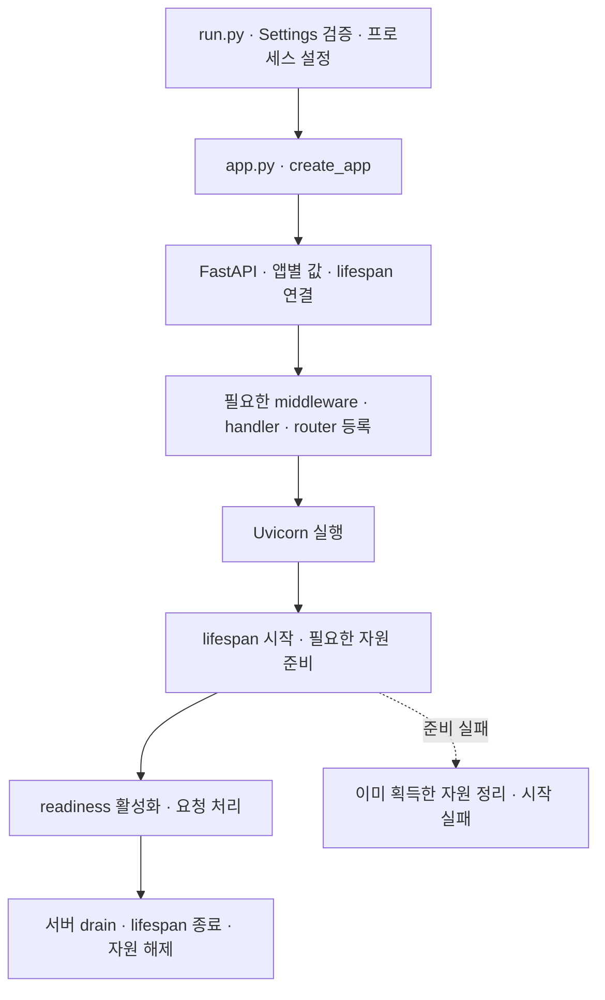
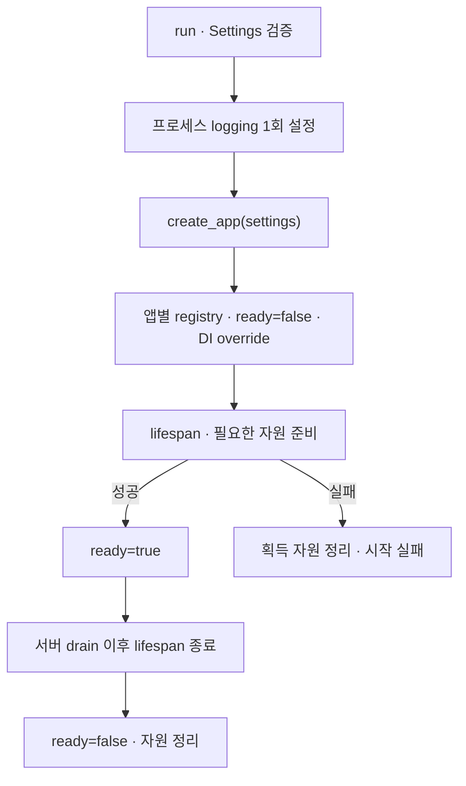
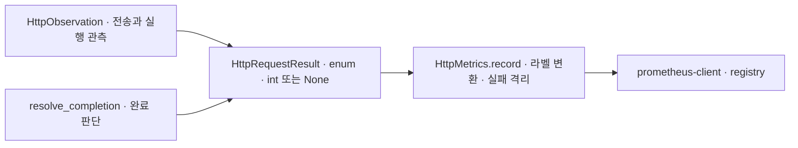
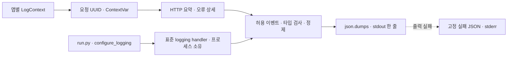
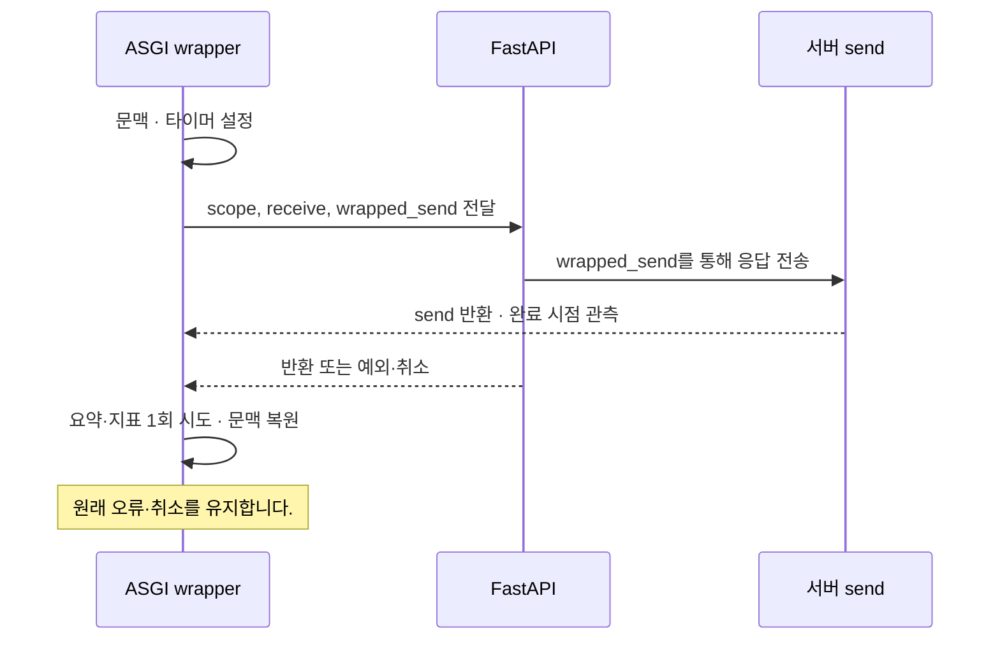
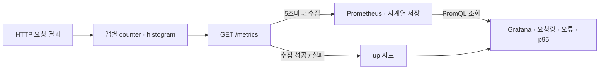

# Python / FastAPI 구현 설계

Status: uv 환경·최소 앱 기동 확인 · 아래 전체 계약·자동 테스트 미완료 · 2026-09-07

[Backend 계약](../backend.md)과 [관측 계약](../observability.md)을 FastAPI에서 구현하는 후보입니다.
첫 기능은 DB 없는 인사 API이며 다른 서비스·사용자 환경에 의존하지 않습니다.

## 구성과 의존성

패키지·환경 관리는 uv를 사용합니다. Python은 최신 안정 버전을 사용하며 2026-09-07 확인 기준
3.14.7입니다([공식 릴리스 목록](https://www.python.org/getit/source/)). 프리릴리스는 기본 선택에서 제외합니다.
착수 시 최신 안정 패치와 의존성 호환성을 다시 확인하고 프로젝트에 버전을 고정합니다.
FastAPI, Uvicorn, pydantic-settings, prometheus-client를 사용합니다.
uv lockfile과 pytest·httpx2·Ruff·ty로 설치·테스트·lint·타입 검사를 재현합니다.
현재 설치 버전과 확인한 명령은 [사용 안내](../../python/fastapi/README.md)가 소유합니다.
추가 의존성은 해당 단계에서 호환성을 확인하고 uv로 추가합니다.

파일별 역할·현재 배치·후속 분리 기준은 [폴더 구조와 활용 기준](fastapi-structure.md)이 소유합니다.
이 문서는 실행·DI·수명·관측 계약을 정의하며 폴더 구조의 본문을 복제하지 않습니다.

클래스 Builder·BaseService·BaseRepository·범용 container를 만들지 않습니다.
상태·자원·DTO의 응집이 필요할 때는 클래스를 사용하며 OOP 자체를 금지하지 않습니다.
공통 기반은 복사형 템플릿이며 별도 runtime 패키지나 generator는 현재 범위가 아닙니다.

## 초기화와 DI

[DI 두 가지 선택안](fastapi-di-options.md)에서 외부 라이브러리 방식과 dependencies/Depends 방식을 비교합니다.
B안을 선택하여 dependencies 모듈·Depends·clock 주입과 lifespan 자원 정리 경계를 구현했습니다. 실제 DB·외부 client 통합은 후속입니다.

### Python 개발 규칙

업무 함수·변수는 snake_case, 입력·반환 타입은 명시적으로 작성합니다. 내부용이라는 이유만으로
`_`·`__` 접두사를 추가하지 않습니다. `__init__` 등 언어·라이브러리 프로토콜 요구는 예외입니다.
`T | None`, 혼동하기 쉬운 인자의 keyword-only, 패키지 기준 절대 import를 기본으로 사용합니다.
Any·타입 예외는 외부 경계 등 필요한 곳에 이유를 남깁니다. 이유·예외 조건은 한국어 docstring으로 설명합니다.
업무 결과가 구조화되어야 하면 불변 dataclass를 우선하고, 단순 값을 불필요하게 감싸지 않습니다.
문자열 상태는 StrEnum을 기본 후보로 두며 멤버는 UPPER_SNAKE_CASE, 값은 lower_snake_case로 표현합니다.
외부 표준의 코드 형식은 유지합니다. 순수 변환은 I/O를 하지 않으며 업무 함수가 ORM session을 직접 조회하지 않습니다.
단일 행위 교체는 typed callable, 응집된 여러 행위는 필요한 Protocol로 표현합니다. 주입 인자가 과도하면 책임부터 검토합니다.

### 자원 수명

#### 앱 조립 차용안

Status: 사용자 승인 · 함수 기반 조립·lifespan·health 구현 검증 · 2026-09-07

참조 구현의 `main.py`·`core/app_builder.py`·`core/lifespan.py`를 읽고,
앱 구성 항목을 모으는 책임과 실행 자원의 시작·종료 책임을 구분하는 방식을 검토했습니다.
참조 저장소의 본문·업무 기능을 이관하지 않고 이 템플릿의 계약을 기준으로 아래 적용안을 제안합니다.

| 참조 구현의 방식 | 이 템플릿의 적용 제안 |
| --- | --- |
| Builder에서 앱 구성 항목을 모아 등록 | 기존 `create_app(settings, *, clock=...)`를 조립 지점으로 유지합니다. |
| Container 생성·앱 연결 | 합의한 B안의 명시적 인자와 `dependencies.py`를 유지합니다. |
| 미들웨어·예외 처리·라우터 등록을 구분 | 필요한 기능을 구현할 때 해당 등록을 조립 지점에서 명시합니다. 커질 때만 작은 함수로 분리합니다. |
| 별도 lifespan에서 시작·종료 | 자원 수명과 readiness를 lifespan에서 관리합니다. logging의 프로세스 설정은 `run.py`가 소유합니다. |
| 제품의 DB·scheduler·외부 client 초기화 | 실제 기능 도입 단계에서 필요한 자원만 연결합니다. |



등록 단계의 표시는 요청 처리 순서가 아닙니다. 실제 미들웨어 순서는 관측·오류 처리 도입 시
프레임워크 실행 경계를 확인하고 시험합니다. 아직 필요 없는 등록 함수·hook 목록·Builder는 생성하지 않습니다.

참조 코드에서는 일부 초기화가 `yield`를 감싼 `try/finally`보다 먼저 실행됩니다.
우리 계약은 부분 초기화 실패에서도 이미 획득한 자원을 정리해야 하므로, 실제 자원 획득 직후
정리를 등록하는 방식으로 구현·검증합니다. 이 관찰은 참조 서비스의 운영 장애를 재현했다는 뜻은 아닙니다.

`core/lifespan.py`와 `health.py`에 수명·health를 구현했습니다.
`create_app(..., prepare=prepare_resources)`가 준비 함수를 명시적으로 받습니다.
준비 함수는 앱과 `AsyncExitStack`을 받아 자원 획득 직후 정리를 등록합니다.
현재 기본 준비 함수는 외부 자원이 없어 아무 자원도 만들지 않으며, 대역 주입으로 실패·취소를 시험합니다.
정리는 역순으로 실행하며 cleanup 오류가 있어도 나머지를 시도합니다.
원래 시작 실패·취소가 있으면 이를 다시 전파하고 cleanup 오류는 원인 체인으로 보존합니다.

`/health/live`는 응답 가능한 앱의 생존, `/health/ready`는 준비 완료 200·미완료 503을 표현합니다.
ready는 앱 조립 시 false, 준비 성공 후 true, cleanup 전에 false입니다.
Uvicorn은 startup 완료 전 HTTP를 받지 않으므로 준비 전 503은 직접 ASGI 시험으로 확인했습니다.
readiness가 업무 라우트의 실행을 차단하거나 drain 시작을 알려주는 자동 장치는 아닙니다.
현재 readiness는 서버 drain 이후 lifespan 종료 때 내려갑니다. LB 연계·사전 drain 신호는 후속 배포 설계입니다.

`SHUTDOWN_TIMEOUT_SECONDS`는 Uvicorn의 진행 작업 대기 시간이며 기본 15초입니다.
lifespan cleanup 전체의 timeout은 아니며 실제 외부 자원 도입 시 자원별 종료 예산을 정합니다.
SIGTERM 요청 완료·정리 순서는 격리 서버에서 검증했습니다. 강제 종료·반복 취소의 cleanup 보장은 하지 않습니다.



factory/import에서 I/O·프로세스 logger 변경을 하지 않습니다. handler는 프로세스 공용이며 앱별 문맥은 이벤트에 주입합니다.
서버 로그 설정이 앱 설정을 덮거나 handler를 중복 등록하지 않도록 실행 조립 지점에서 소유합니다.
설정 실패 시 입력값을 제외한 필드 이름·고정 오류 코드만 stderr에 출력합니다.
향후 pool/client를 만들 때 lifespan에서 획득 직후 AsyncExitStack 등에 정리를 등록합니다.
초기 버전에는 외부 자원이 없으며 초기화 실패는 가짜 async 자원으로 검증합니다.

FastAPI `Depends`는 API/provider 경계에서 사용하고 업무 함수는 일반 인자를 받습니다.
`get_clock` provider가 시간 공급 함수를 반환하고, 업무 함수가 호출하도록 예제를 구성합니다.
테스트는 provider override와 고정 clock으로 교체합니다. app.state는 provider가 접근하며 업무가 직접 조회하지 않습니다.
현재 `dependencies.py`가 `get_clock`과 `ClockDep`를 소유하고, `core/contracts.py`가 시간 공급 계약을,
`core/clock.py`가 UTC 구현을 소유합니다. 인사 결과는 `greetings/contracts.py`에 둡니다.
`create_app(settings, *, clock=system_clock)`가 참조를 조립하며 인사 API가 불변 업무 결과를 외부 응답 스키마로 변환합니다.

`GET /v1/greetings?name=Marin`은 앞뒤 공백 제거 후 1~80자를 허용하고 message·UTC generated_at을 반환합니다.
공백만 있거나 길이를 초과하면 422이며 업무 함수는 실행하지 않습니다. 인증 없는 로컬 예제입니다.

## HTTP 응답 포맷

Status: 사용자 합의 · 첫 HTTP 계약 구현·검증 · 2026-09-07

언어 독립 포맷은 [Backend HTTP 응답 계약](../backend.md#http-응답-계약)이 소유합니다.
FastAPI는 `schemas.py`의 `Success[T]`·`Problem`·오류 enum으로 이 계약을 구현합니다.
`greetings/schemas.py`는 외부 `GreetingData`를 소유하고 API가 내부 `Greeting`을 명시적으로 변환합니다.
성공 body를 다시 읽어 감싸는 middleware는 만들지 않습니다.

`errors.py`가 RequestValidationError·HTTPException·예상 밖 Exception을 공개 오류로 변환합니다.
기본 422 응답의 input·context·msg는 반환하지 않고 첫 20개 오류의 공개 위치·고정 코드만 제공합니다.
현재 공개 위치는 `query.name`입니다. 새 입력을 추가할 때 승인한 위치와 코드 매핑을 함께 확장하며,
알 수 없는 위치는 빈 배열, 알려지지 않은 검증 오류는 INVALID로 축약합니다.
500은 고정 INTERNAL_ERROR입니다. 업무 충돌·멱등 오류는 해당 기능 도입 시 추가합니다.

`HttpObservation`이 요청 ID를 로그 설정 여부와 관계없이 생성해 request state와 응답 헤더에 전달합니다.
오류 handler는 같은 ID를 본문에 넣습니다. bare factory 테스트에서는 오류 handler가 ID를 생성하지만
전체 성공 응답의 ID·관측을 적용하는 실행 경로는 기존 `run.py`입니다.
HTTPException의 의미 있는 헤더는 보존하고 Content-Type·Content-Length·X-Request-ID는 새 응답 기준으로 생성합니다.

Swagger 스키마는 FastAPI가 생성합니다. `problem_openapi`는 Problem 모델을 가리키는 응답의
media type만 application/problem+json으로 조정하며 스키마 본문을 수기로 복제하지 않습니다.
health·metrics 자체 응답과 204·stream 등은 envelope로 감싸지 않습니다.
이미 전송이 시작된 오류는 Starlette의 기존 전송 상태 검사로 재응답하지 않고 원래 오류를 전파합니다.
오류 handler에서 로그를 중복 기록하지 않으며 기존 ASGI 관측 경계가 오류 상세를 소유합니다.

전체 테스트 53개가 통과했습니다. 성공 schema·422/404/405/500·헤더/본문 요청 ID·입력 비노출·
Swagger media type과 모델 참조·405 Allow·429 Retry-After·204·stream 재응답 금지와 로그·metrics 회귀를 검증했습니다.
참고: [FastAPI 오류 handler](https://fastapi.tiangolo.com/tutorial/handling-errors/).

## 로깅과 metrics 매핑

HTTP metrics·구조화 로깅·요청 문맥 주입을 구현했습니다.
`core/contracts.py`의 `HttpCompletion`·`HttpExecution`은 StrEnum이며
불변 `HttpRequestResult`가 관측 결과를 전달합니다. HTTP status는 내부에서 `int | None`으로
보존하고 `HttpMetrics.record`에서만 Prometheus 문자열 라벨로 변환합니다.
완료 판단은 `resolve_completion`, 전송 관측은 ASGI wrapper, 지표 기록·실패 격리는 registry 소유자가 담당합니다.



`prometheus-client` 0.26.0이 counter·histogram·registry·텍스트 직렬화를 담당합니다.
[공식 client](https://prometheus.github.io/client_python/exporting/http/asgi/)를 사용하며
`uv add prometheus-client`로 설치했습니다. FastAPI Instrumentator도 검토했지만 전송 완료와
후속 실행 오류·취소를 구분하는 현재 계약을 직접 제공하지 않아 그 ASGI 경계만 구현했습니다.

표준 `logging.getLogger(__name__)`와 info/warning/error를 사용합니다.
표준 라이브러리 `logging`이 수준·handler·출력을, `json.dumps`가 직렬화를 담당합니다.
별도 패키지 설치는 없으며 자체 Logger API를 만들지 않습니다. formatter/filter는 프로젝트 필드 허용·정제만 담당합니다.
고정 이벤트명과 enum `EventOutcome`, 불변 `HttpRequestResult`만 허용한 extra로 읽고 나머지는 제외합니다.
새 업무 이벤트는 소유 기능이 의미를 정하고 허용 목록을 함께 갱신합니다.

```python
logger.info(
    "greeting.completed",
    extra={"event_outcome": EventOutcome.SUCCESS},
)
```

`run.py`가 Settings 검증 후 앱 생성 전에 `configure_logging`을 호출합니다.
`template_api`·`uvicorn` 각각에 소유 JSON handler 하나만 연결하고 반복 호출 시 재사용합니다.
Uvicorn은 `log_config=None`, `access_log=False`로 실행합니다. 다른 도구 handler는 삭제하지 않으며
별도로 붙인 handler의 출력은 이 formatter의 보호 범위 밖입니다.



서비스 설정·작업 ID는 불변 `LogContext`와 ContextVar로 주입합니다. finally에서 token을 복원합니다.
작업 ID는 서버 UUID이며 `X-Request-ID` 응답 헤더와 `app.work.id`를 연결합니다.
클라이언트의 동명 헤더를 재사용하지 않으며 멱등 키·trace ID로 해석하지 않습니다.
동시 요청에 mutable dict를 공유하지 않습니다. 자식 task의 상속 문맥은 부모 reset으로 사라지지 않으므로
분리된 background 작업은 별도 문맥·수명이 필요합니다. queue·독립 Job 구현은 후속입니다.

`http.completed` INFO 요약에는 숫자 status(미관측 null), enum 완료·실행 상태와 정수 ns 지연을 넣습니다.
정상·입력 거절·취소 요약을 기록하며 WARNING 이상 설정에서는 INFO 요약이 출력되지 않습니다.
예외는 `http.failed` ERROR 상세 1건으로 같은 작업 ID에 연결합니다. 오류 메시지·소스 줄·지역변수는 제외하고
타입과 마지막 20개 프레임의 파일명·함수명·행만 기록합니다. health·문서·metrics는 정상 요약을 제외하되 예외는 기록합니다.
Uvicorn의 알려진 ASGI 예외 로그는 traceback에 주입한 HTTP wrapper 코드 객체가 있을 때만 중복 제외합니다.
이 연결은 고정 Uvicorn 버전의 실제 프로세스로 검증하며, 업그레이드 시 회귀 시험이 필요합니다.
나머지 서버 로그는 고정 이벤트명과 수준으로 변환하며 알 수 없는 메시지는 `server.event`로 남기고 원문을 출력하지 않습니다.

로그는 UTF-8 16 KiB, 최대 20 stack frame입니다. 문자열 필드별 상한을 적용하고 전체 상한 초과 시
선택 오류 프레임을 제외한 후 JSON을 다시 직렬화해 `app.truncated=true`를 표시합니다.
형식·출력 실패는 업무 응답을 유지하고 고정 `logging.output_failed` JSON을 stderr에 한 번 시도합니다.
이를 같은 logger로 재귀 보고하지 않습니다. stdout·stderr가 모두 실패하면 보고를 보장할 수 없습니다.
현재 동기 stdout이며 느린 출력·유실·보관 상한·외부 수집은 해결하지 않았습니다.

HTTP counter `http_requests_total`과 histogram `http_request_duration_seconds`를 제공합니다.
앱별 registry를 사용하고 라벨은 제한된 method·route template·status·completion·execution입니다.
status가 없으면 고정값 none을 쓰고 미일치 route는 unmatched로 합칩니다.
health·metrics와 기본 문서 경로(`/docs`, `/docs/oauth2-redirect`, `/openapi.json`, `/redoc`)는 제외합니다.
문서 라우트는 `scope["route"]`가 없는 Starlette Route여서 기존에는 정상 응답도 unmatched에 섞였습니다.
제외 목록은 현재 앱 경로 기준이며 문서 URL 변경 시 함께 조정합니다.
알려진 HTTP method 외 값은 OTHER로 합치며 원문 경로·query·사용자 입력을 라벨에 넣지 않습니다.
지연 bucket(초)은 0.005, 0.01, 0.025, 0.05, 0.1, 0.25, 0.5, 1, 2.5, 5와 +Inf입니다.
계측·직렬화 실패는 앱별 실패 상태를 남겨 이후 `/metrics`가 503을 반환합니다.
이 상태는 앱 재생성 전까지 유지하며 누락된 registry를 정상으로 공개하지 않습니다.
업무 응답·원래 예외는 유지합니다. 현재 단일 worker 메모리 집계이며 재시작 시 초기화됩니다.
CPU/RSS process collector는 아직 연결하지 않았으며 OOM·재시작은 컨테이너 관측 책임입니다.
시계열 수집·저장은 아래 로컬 모니터링 선택 확장으로 제공합니다. 경보·HPA·프로파일링·분산 trace는 포함하지 않습니다.

## 요청 종료와 취소

완성된 FastAPI 오류 처리 경계 바깥의 순수 ASGI wrapper로 metrics·로그를 관측합니다.
`run.py`가 `HttpObservation(app, app.state.metrics, log_context=app.state.log_context)`를 Uvicorn에 전달합니다.
wrapper는 요청별 지역 변수와 ContextVar로 계측 상태·로그 문맥을 격리합니다.
내부 FastAPI 객체에서 DI override를 관리하고 wrapper는 설정·registry를 별도로 중복 소유하지 않습니다.
HTTP 이외 scope는 그대로 위임하며 BaseHTTPMiddleware의 문맥 전달 제약에 의존하지 않습니다.



`send` 반환 후 전송 상태를 갱신합니다. JSON 응답의 최종 body 반환까지를 지연으로 측정하며 클라이언트 수신을 보장하지 않습니다.
trailers는 첫 계약에서 제외하며 추가 시 완료 지점을 확장합니다. receive는 앱이 읽은 이벤트만 관측하고 body를 별도 소비하지 않습니다.
disconnect 관측은 task 취소와 같지 않으며 즉시 탐지도 보장하지 않습니다. 전송 중 OSError는 일반 앱 오류와 분리합니다.

completion은 complete/cancelled/send_failed/disconnected/incomplete, execution은 returned/error/cancelled입니다.
최종 body 완료 뒤 background 오류는 complete와 error를 함께 기록합니다. 지연은 body 완료 시 저장한 값입니다.
요약은 앱 호출 종료 finally에서 1회 시도합니다. 실제 status 없는 취소를 499 전송으로 꾸미지 않습니다.
CancelledError를 삼키지 않고 cleanup 후 다시 전파합니다. 관측 실패가 원래 실패나 문맥 복원을 방해하지 않게 합니다.
응답 시작 후 새 500 응답을 보내지 않습니다. 강제 종료에서는 로그·finally를 보장하지 않습니다.

## 로컬 컨테이너 실행

Status: 단일 API 이미지·Compose 구현 및 linux/arm64 검증 · 2026-09-07

실행 정의는 [Dockerfile](../../python/fastapi/Dockerfile)과 [compose.yaml](../../compose.yaml),
명령·접속 주소는 [사용 안내](../../python/fastapi/README.md#컨테이너-실행)가 소유합니다.
`docker init`으로 생성한 Python 기본 파일을 기존 uv 프로젝트에 맞게 수정했습니다.

Python 버전은 `.python-version`만 소유합니다. `scripts/compose.sh` → Compose build args → Dockerfile 순서로 전달하며,
빌드·런타임은 같은 `python-base` 단계를 사용합니다. Python 이미지는 버전별 `slim-trixie` 태그로 선택하고
digest는 고정하지 않습니다. uv 0.12.10 이미지는 버전·manifest digest로 고정합니다.
`pyproject.toml`의 `requires-python`은 지원 범위이며 실행할 정확한 버전 선택과 구분합니다.
builder에서 `uv sync --locked --no-dev --no-editable`로 설치하고 런타임에는 설치된 환경만 복사합니다.
로컬 env·tests·cache·dist는 빌드 context 허용 목록에서 제외합니다. 최종 앱은 UID/GID 10001로 실행합니다.

기본 Compose는 모니터링 profile 없이 단일 API를 실행하고 host 127.0.0.1:18081을 컨테이너 8000에 연결합니다.
앱 서비스 이름·버전·환경·로그 수준은 명시적으로 환경변수에 전달합니다.
내부 바인딩 0.0.0.0:8000과 앱 종료 대기 15초·Compose 종료 유예 20초는 Compose에서 함께 관리합니다.
컨테이너의 0.0.0.0 바인딩이 host 전체 공개를 뜻하지 않습니다. host 게시 주소는 loopback입니다.

readiness를 Python 표준 HTTP client로 10초마다 확인하며 timeout 3초·시작 유예 5초·실패 3회 기준입니다.
health 상태는 자동 재시작·LB drain을 구현하지 않습니다.
CPU 0.5개·메모리 512MiB·json-file 로그 10MiB 단위 최대 3개는 초기 실행 예산이며 성능 보장 수치가 아닙니다.
애플리케이션 cleanup 전체 timeout과 장기 수집·무손실 로그는 보장하지 않습니다.

Docker Desktop에서 이미지 빌드·healthy·200/422 응답·Swagger·metrics·JSON 로그,
실제 UID·Python 버전·dev 도구/env 제외·적용 자원/게시 포트를 확인했습니다.
`docker compose stop` 후 application.stopped·server.stopped, OOM=false와 종료 코드 143(SIGTERM)을 확인했습니다.
재기동 후 healthy를 확인했습니다. 요청 drain의 기존 격리 프로세스 시험과 별도로,
이 컨테이너 smoke는 유휴 상태 종료이며 진행 중 요청의 컨테이너 drain·강제 종료·부하·amd64는 검증하지 않았습니다.
로그 회전 옵션 적용을 확인했으며 대량 출력에 의한 실제 회전 실험은 하지 않았습니다.

참고(2026-09-07): [uv Docker 통합](https://docs.astral.sh/uv/guides/integration/docker/),
[Compose 서비스 설정](https://docs.docker.com/reference/compose-file/services/).

## 로컬 모니터링

Status: Prometheus·Grafana 선택 확장 구현·로컬 검증 · 2026-09-07

[루트 compose.yaml](../../compose.yaml)의 `monitoring` profile을 선택합니다.
버전·digest·보관·자원 설정은 이 파일, 수집 대상과 대시보드는
[infra/monitoring/](../../infra/monitoring/), 실행 명령은 [사용 안내](../../python/fastapi/README.md#로컬-모니터링)가 소유합니다.
공식 Prometheus 설정과 Grafana file provisioning을 사용하며 앱에 별도 전송 코드를 추가하지 않습니다.



단일 API 컨테이너의 HTTP 지표를 수집합니다. 데이터 소스와 대시보드는 기동 시 자동 등록하며,
로컬 loopback에서 익명 Viewer로 조회합니다. 관리자 계정·외부 계정·Sentry SDK를 생성하지 않습니다.
Prometheus 보관은 24시간·256MB 중 먼저 도달하는 조건을 사용하며 named volume에 유지합니다.
용량 설정은 TSDB 블록 보관 기준으로 WAL·head·파일시스템까지 포함한 디스크 hard limit이 아닙니다.
각 관측 컨테이너는 CPU 0.5개·메모리 512MiB, Docker 로그 10MiB × 3개 설정을 갖습니다.

대시보드는 수집 상태·초당 요청량·5xx 비율·완료 요청 p95·상태별 요청량·초당 실행 실패를 표시합니다.
5xx와 실행 실패는 별개이며 4xx는 5xx 비율 분자에서 제외합니다.
p95는 마지막 응답 body 송신까지의 histogram 추정값입니다. 저표본에서는 정밀한 실측 percentile로 해석하지 않습니다.
수집 상태는 instant query로 조회합니다. 그래프는 수집 성공 구간만 계산하고 단절 구간은 비우며 과거 표본을 유지합니다.
표본 부재·요청 0건에서 비율이나 p95를 정상 0으로 채우지 않습니다.

검증: Compose healthy·promtool 설정 검사·Grafana provisioning과 데이터 소스 health·6개 PromQL 조회를 확인했습니다.
200/422/404 요청 집계, API 중지 후 up=0과 나머지 instant query의 빈 결과, 재기동 healthy를 확인했습니다.
실제 Grafana 화면의 DOWN·과거 그래프·표시 범위를 확인했습니다.
이 smoke는 5xx/취소 주입·부하·보관 만료·디스크 포화·재해 복구 시험을 포함하지 않습니다.
로그 검색·CPU/RSS 수집·경보는 미구현이며 stg·prd Sentry SDK 설정과 운영 metrics 선택은 후속입니다.

참고(2026-09-07): [Prometheus 설치](https://prometheus.io/docs/prometheus/latest/installation/),
[Grafana Docker](https://grafana.com/docs/grafana/latest/setup-grafana/installation/docker/),
[Grafana provisioning](https://grafana.com/docs/grafana/latest/administration/provisioning/).

## 확인할 사항

후속 `postgres-integration`은 foundation 위에 pool/session·트랜잭션·migration·실제 격리 DB 시험을 추가하는
선택 기능입니다. DB 없는 앱과 DB 필수 앱을 명확히 구분하고 DB 장애를 인메모리 성공으로 숨기지 않습니다.
수명주기 자원은 factory 입력으로 교체하고, 요청의 Depends override와 별도로 검증합니다.
한 세션은 동시 task에 공유하지 않습니다. WS/stream 전체에 DB transaction을 유지하지 않습니다.
선택 DB의 rollback·취소·경합 시험은 실제 DB에서 하며 대역 시험으로 대신 통과시키지 않습니다.

`template-distribution`은 복사형 시작점입니다. 원본 커밋/릴리스·복사 후 변경 지점·검증 명령을 기록하고
서비스 소유 코드에 원본 업데이트를 자동 덮어쓰지 않습니다. generator는 치환 반복이 생기면,
runtime package는 실제 공통 동작과 호환성 유지 수요가 생기면 별도로 검토합니다.
라이선스와 외부 코드 재사용 권한은 코드 도입 전에 확인합니다.

정확한 의존성 버전·이미지·예외 처리 배치·ASGI wrapper·logging entrypoint의 호환성을 구현 전에 고정합니다.
확인한 실행 명령은 구현 README에 제공합니다. [검증 케이스](fastapi-verification.md)의 일부만 구현·실행했으며 완료 범위는 단계별 task와 사용 안내에 기록합니다.

참고(확인일 2026-09-07): [FastAPI DI](https://fastapi.tiangolo.com/tutorial/dependencies/), [lifespan](https://fastapi.tiangolo.com/advanced/events/), [Starlette middleware](https://starlette.dev/middleware/), [ASGI HTTP](https://asgi.readthedocs.io/en/latest/specs/www.html), [Python logging](https://docs.python.org/3/library/logging.html), [ContextVar 로깅](https://docs.python.org/3/howto/logging-cookbook.html#use-of-contextvars), [Compose 환경변수](https://docs.docker.com/compose/how-tos/environment-variables/variable-interpolation/).
