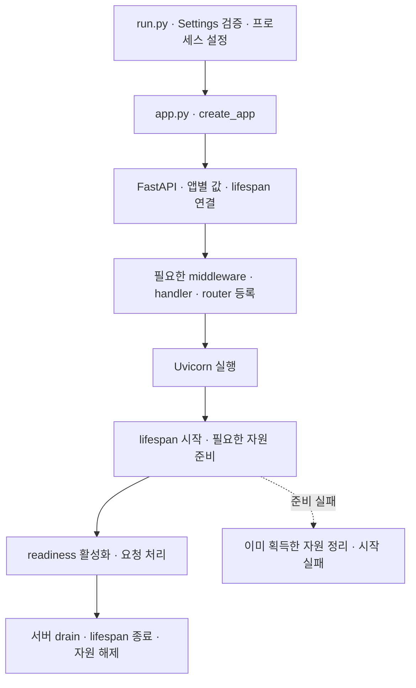
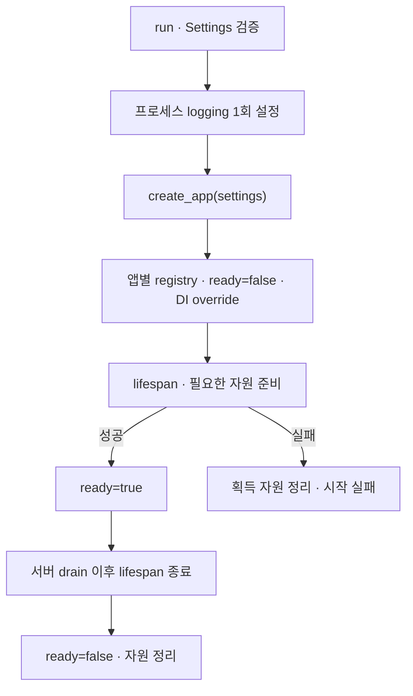
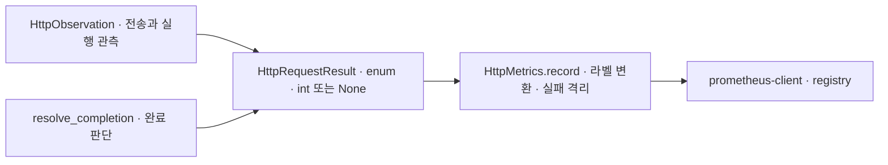
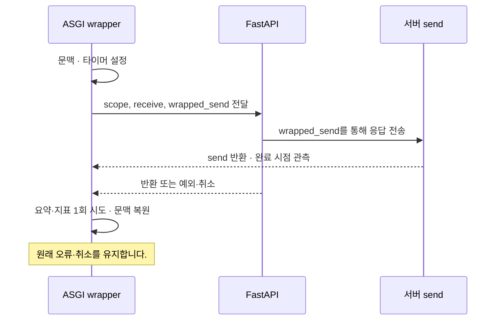

# Python / FastAPI 구현 설계

Status: uv 환경·최소 앱 기동 확인 · 아래 전체 계약·자동 테스트 미완료 · 2026-09-07

[Backend 계약](../backend.md)과 [관측 계약](../observability.md)을 FastAPI에서 구현하는 후보입니다.
첫 기능은 DB 없는 인사 API이며 다른 서비스·사용자 환경에 의존하지 않습니다.

## 구성과 의존성

패키지·환경 관리는 uv를 사용합니다. Python은 최신 안정 버전을 사용하며 2026-09-07 확인 기준
3.14.7입니다([공식 릴리스 목록](https://www.python.org/getit/source/)). 프리릴리스는 기본 선택에서 제외합니다.
착수 시 최신 안정 패치와 의존성 호환성을 다시 확인하고 프로젝트에 버전을 고정합니다.
FastAPI, Uvicorn, pydantic-settings, prometheus-client를 사용합니다.
uv lockfile과 pytest·httpx2·Ruff·ty로 설치·테스트·lint·타입 검사를 재현합니다.
현재 설치 버전과 확인한 명령은 [사용 안내](../../python/fastapi/README.md)가 소유합니다.
추가 의존성은 해당 단계에서 호환성을 확인하고 uv로 추가합니다.

파일별 역할·현재 배치·후속 분리 기준은 [폴더 구조와 활용 기준](fastapi-structure.md)이 소유합니다.
이 문서는 실행·DI·수명·관측 계약을 정의하며 폴더 구조의 본문을 복제하지 않습니다.

클래스 Builder·BaseService·BaseRepository·범용 container를 만들지 않습니다.
상태·자원·DTO의 응집이 필요할 때는 클래스를 사용하며 OOP 자체를 금지하지 않습니다.
공통 기반은 복사형 템플릿이며 별도 runtime 패키지나 generator는 현재 범위가 아닙니다.

## 초기화와 DI

[DI 두 가지 선택안](fastapi-di-options.md)에서 외부 라이브러리 방식과 dependencies/Depends 방식을 비교합니다.
B안을 선택하여 dependencies 모듈·Depends·clock 주입과 lifespan 자원 정리 경계를 구현했습니다. 실제 DB·외부 client 통합은 후속입니다.

### Python 개발 규칙

업무 함수·변수는 snake_case, 입력·반환 타입은 명시적으로 작성합니다. 내부용이라는 이유만으로
`_`·`__` 접두사를 추가하지 않습니다. `__init__` 등 언어·라이브러리 프로토콜 요구는 예외입니다.
`T | None`, 혼동하기 쉬운 인자의 keyword-only, 패키지 기준 절대 import를 기본으로 사용합니다.
Any·타입 예외는 외부 경계 등 필요한 곳에 이유를 남깁니다. 이유·예외 조건은 한국어 docstring으로 설명합니다.
업무 결과가 구조화되어야 하면 불변 dataclass를 우선하고, 단순 값을 불필요하게 감싸지 않습니다.
문자열 상태는 StrEnum을 기본 후보로 두며 멤버는 UPPER_SNAKE_CASE, 값은 lower_snake_case로 표현합니다.
외부 표준의 코드 형식은 유지합니다. 순수 변환은 I/O를 하지 않으며 업무 함수가 ORM session을 직접 조회하지 않습니다.
단일 행위 교체는 typed callable, 응집된 여러 행위는 필요한 Protocol로 표현합니다. 주입 인자가 과도하면 책임부터 검토합니다.

### 자원 수명

#### 앱 조립 차용안

Status: 사용자 승인 · 함수 기반 조립·lifespan·health 구현 검증 · 2026-09-07

참조 구현의 `main.py`·`core/app_builder.py`·`core/lifespan.py`를 읽고,
앱 구성 항목을 모으는 책임과 실행 자원의 시작·종료 책임을 구분하는 방식을 검토했습니다.
참조 저장소의 본문·업무 기능을 이관하지 않고 이 템플릿의 계약을 기준으로 아래 적용안을 제안합니다.

| 참조 구현의 방식 | 이 템플릿의 적용 제안 |
| --- | --- |
| Builder에서 앱 구성 항목을 모아 등록 | 기존 `create_app(settings, *, clock=...)`를 조립 지점으로 유지합니다. |
| Container 생성·앱 연결 | 합의한 B안의 명시적 인자와 `dependencies.py`를 유지합니다. |
| 미들웨어·예외 처리·라우터 등록을 구분 | 필요한 기능을 구현할 때 해당 등록을 조립 지점에서 명시합니다. 커질 때만 작은 함수로 분리합니다. |
| 별도 lifespan에서 시작·종료 | 자원 수명과 readiness를 lifespan에서 관리합니다. logging의 프로세스 설정은 `run.py`가 소유합니다. |
| 제품의 DB·scheduler·외부 client 초기화 | 실제 기능 도입 단계에서 필요한 자원만 연결합니다. |



등록 단계의 표시는 요청 처리 순서가 아닙니다. 실제 미들웨어 순서는 관측·오류 처리 도입 시
프레임워크 실행 경계를 확인하고 시험합니다. 아직 필요 없는 등록 함수·hook 목록·Builder는 생성하지 않습니다.

참조 코드에서는 일부 초기화가 `yield`를 감싼 `try/finally`보다 먼저 실행됩니다.
우리 계약은 부분 초기화 실패에서도 이미 획득한 자원을 정리해야 하므로, 실제 자원 획득 직후
정리를 등록하는 방식으로 구현·검증합니다. 이 관찰은 참조 서비스의 운영 장애를 재현했다는 뜻은 아닙니다.

`core/lifespan.py`와 `health.py`에 수명·health를 구현했습니다.
`create_app(..., prepare=prepare_resources)`가 준비 함수를 명시적으로 받습니다.
준비 함수는 앱과 `AsyncExitStack`을 받아 자원 획득 직후 정리를 등록합니다.
현재 기본 준비 함수는 외부 자원이 없어 아무 자원도 만들지 않으며, 대역 주입으로 실패·취소를 시험합니다.
정리는 역순으로 실행하며 cleanup 오류가 있어도 나머지를 시도합니다.
원래 시작 실패·취소가 있으면 이를 다시 전파하고 cleanup 오류는 원인 체인으로 보존합니다.

`/health/live`는 응답 가능한 앱의 생존, `/health/ready`는 준비 완료 200·미완료 503을 표현합니다.
ready는 앱 조립 시 false, 준비 성공 후 true, cleanup 전에 false입니다.
Uvicorn은 startup 완료 전 HTTP를 받지 않으므로 준비 전 503은 직접 ASGI 시험으로 확인했습니다.
readiness가 업무 라우트의 실행을 차단하거나 drain 시작을 알려주는 자동 장치는 아닙니다.
현재 readiness는 서버 drain 이후 lifespan 종료 때 내려갑니다. LB 연계·사전 drain 신호는 후속 배포 설계입니다.

`SHUTDOWN_TIMEOUT_SECONDS`는 Uvicorn의 진행 작업 대기 시간이며 기본 15초입니다.
lifespan cleanup 전체의 timeout은 아니며 실제 외부 자원 도입 시 자원별 종료 예산을 정합니다.
SIGTERM 요청 완료·정리 순서는 격리 서버에서 검증했습니다. 강제 종료·반복 취소의 cleanup 보장은 하지 않습니다.



factory/import에서 I/O·프로세스 logger 변경을 하지 않습니다. handler는 프로세스 공용이며 앱별 문맥은 이벤트에 주입합니다.
서버 로그 설정이 앱 설정을 덮거나 handler를 중복 등록하지 않도록 실행 조립 지점에서 소유합니다.
설정 실패 시 입력값을 제외한 필드 이름·고정 오류 코드만 stderr에 출력합니다.
향후 pool/client를 만들 때 lifespan에서 획득 직후 AsyncExitStack 등에 정리를 등록합니다.
초기 버전에는 외부 자원이 없으며 초기화 실패는 가짜 async 자원으로 검증합니다.

FastAPI `Depends`는 API/provider 경계에서 사용하고 업무 함수는 일반 인자를 받습니다.
`get_clock` provider가 시간 공급 함수를 반환하고, 업무 함수가 호출하도록 예제를 구성합니다.
테스트는 provider override와 고정 clock으로 교체합니다. app.state는 provider가 접근하며 업무가 직접 조회하지 않습니다.
현재 `dependencies.py`가 `get_clock`과 `ClockDep`를 소유하고, `core/contracts.py`가 시간 공급 계약을,
`core/clock.py`가 UTC 구현을 소유합니다. 인사 결과는 `greetings/contracts.py`에 둡니다.
`create_app(settings, *, clock=system_clock)`가 참조를 조립하며 인사 응답은 불변 dataclass를 FastAPI가 직렬화합니다.

`GET /v1/greetings?name=Marin`은 앞뒤 공백 제거 후 1~80자를 허용하고 message·UTC generated_at을 반환합니다.
공백만 있거나 길이를 초과하면 422이며 업무 함수는 실행하지 않습니다. 인증 없는 로컬 예제입니다.

## 로깅과 metrics 매핑

Metrics는 구현했고 아래 구조화 로깅·문맥 주입은 후속 계약입니다.
`core/contracts.py`의 `HttpCompletion`·`HttpExecution`은 StrEnum이며
불변 `HttpRequestResult`가 관측 결과를 전달합니다. HTTP status는 내부에서 `int | None`으로
보존하고 `HttpMetrics.record`에서만 Prometheus 문자열 라벨로 변환합니다.
완료 판단은 `resolve_completion`, 전송 관측은 ASGI wrapper, 지표 기록·실패 격리는 registry 소유자가 담당합니다.



`prometheus-client` 0.26.0이 counter·histogram·registry·텍스트 직렬화를 담당합니다.
[공식 client](https://prometheus.github.io/client_python/exporting/http/asgi/)를 사용하며
`uv add prometheus-client`로 설치했습니다. FastAPI Instrumentator도 검토했지만 전송 완료와
후속 실행 오류·취소를 구분하는 현재 계약을 직접 제공하지 않아 그 ASGI 경계만 구현했습니다.

표준 `logging.getLogger(__name__)`와 info/warning/error를 사용합니다. 고정 메시지와 허용한 extra만 전달합니다.
TypedDict는 작성 시 도움이며 런타임 검증은 formatter/filter가 별도로 수행합니다.

```python
logger.info(
    "greeting.completed",
    extra={"event_action": "greeting.completed", "event_outcome": "success"},
)
```

서비스 설정·작업 ID는 작업별 immutable ContextVar 문맥으로 주입합니다. finally에서 token을 복원합니다.
동시 요청에 mutable dict를 공유하지 않습니다. 자식 task의 상속 문맥은 부모 reset으로 사라지지 않으므로
background 작업은 별도 문맥·수명을 갖습니다. queue 도입 시 enqueue 전에 문맥을 복사합니다.
로그는 UTF-8 16 KiB, 최대 20 stack frame을 초기 상한 후보로 둡니다. 선택 필드를 줄인 후 JSON을 다시 직렬화하고 잘림을 표시합니다.
형식·출력 실패를 같은 logger로 재귀 보고하지 않습니다. 개인정보·예약 필드 충돌을 시험합니다.

HTTP counter `http_requests_total`과 histogram `http_request_duration_seconds`를 제공합니다.
앱별 registry를 사용하고 라벨은 제한된 method·route template·status·completion·execution입니다.
status가 없으면 고정값 none을 쓰고 미일치 route는 unmatched로 합칩니다.
health·metrics와 기본 문서 경로(`/docs`, `/docs/oauth2-redirect`, `/openapi.json`, `/redoc`)는 제외합니다.
문서 라우트는 `scope["route"]`가 없는 Starlette Route여서 기존에는 정상 응답도 unmatched에 섞였습니다.
제외 목록은 현재 앱 경로 기준이며 문서 URL 변경 시 함께 조정합니다.
알려진 HTTP method 외 값은 OTHER로 합치며 원문 경로·query·사용자 입력을 라벨에 넣지 않습니다.
지연 bucket(초)은 0.005, 0.01, 0.025, 0.05, 0.1, 0.25, 0.5, 1, 2.5, 5와 +Inf입니다.
계측·직렬화 실패는 앱별 실패 상태를 남겨 이후 `/metrics`가 503을 반환합니다.
이 상태는 앱 재생성 전까지 유지하며 누락된 registry를 정상으로 공개하지 않습니다.
업무 응답·원래 예외는 유지합니다. 현재 단일 worker 메모리 집계이며 재시작 시 초기화됩니다.
CPU/RSS process collector는 아직 연결하지 않았으며 OOM·재시작은 컨테이너 관측 책임입니다.
시계열 수집기·저장·경보·HPA·프로파일링·분산 trace는 포함하지 않습니다.

## 요청 종료와 취소

완성된 FastAPI 오류 처리 경계 바깥의 순수 ASGI wrapper로 metrics를 관측합니다.
`run.py`가 `HttpObservation(app, app.state.metrics)`를 Uvicorn에 전달합니다.
아래 요약 로그·문맥 설정과 복원은 후속이며 현재 wrapper는 요청별 지역 변수로 계측 상태를 격리합니다.
내부 FastAPI 객체에서 DI override를 관리하고 wrapper는 설정·registry를 별도로 중복 소유하지 않습니다.
HTTP 이외 scope는 그대로 위임하며 BaseHTTPMiddleware의 문맥 전달 제약에 의존하지 않습니다.



`send` 반환 후 전송 상태를 갱신합니다. JSON 응답의 최종 body 반환까지를 지연으로 측정하며 클라이언트 수신을 보장하지 않습니다.
trailers는 첫 계약에서 제외하며 추가 시 완료 지점을 확장합니다. receive는 앱이 읽은 이벤트만 관측하고 body를 별도 소비하지 않습니다.
disconnect 관측은 task 취소와 같지 않으며 즉시 탐지도 보장하지 않습니다. 전송 중 OSError는 일반 앱 오류와 분리합니다.

completion은 complete/cancelled/send_failed/disconnected/incomplete, execution은 returned/error/cancelled입니다.
최종 body 완료 뒤 background 오류는 complete와 error를 함께 기록합니다. 지연은 body 완료 시 저장한 값입니다.
요약은 앱 호출 종료 finally에서 1회 시도합니다. 실제 status 없는 취소를 499 전송으로 꾸미지 않습니다.
CancelledError를 삼키지 않고 cleanup 후 다시 전파합니다. 관측 실패가 원래 실패나 문맥 복원을 방해하지 않게 합니다.
응답 시작 후 새 500 응답을 보내지 않습니다. 강제 종료에서는 로그·finally를 보장하지 않습니다.

## 로컬 실행 후보

단일 API 컨테이너만 사용하며 DB·프록시·모니터링 서버는 추가하지 않습니다.
Dockerfile은 비 root 실행과 lock 기반 설치, `.env`·개발 캐시 제외를 포함할 예정입니다.
아래는 아직 실행할 수 없는 manifest 설계 예시입니다.

```yaml
name: backend-template-fastapi
services:
  api:
    build: .
    command: ["python", "-m", "template_api.run"]
    ports: ["127.0.0.1:${HTTP_PORT:-18080}:8000"]
    environment:
      APP_NAME: "${APP_NAME:-fastapi-template}"
      APP_ENV: local
      LOG_LEVEL: "${LOG_LEVEL:-INFO}"
      SERVICE_VERSION: "${SERVICE_VERSION:-dev}"
    init: true
    cpus: 0.5
    mem_limit: 512m
    stop_grace_period: 20s
    logging:
      driver: json-file
      options: {max-size: "10m", max-file: "3"}
```

실제 `.env`를 만들 때 아래 예시 값으로 시작할 예정입니다. 비밀값은 없습니다.

```dotenv
HTTP_PORT=18080
APP_NAME=fastapi-template
LOG_LEVEL=INFO
SERVICE_VERSION=dev
```

Compose 변수 치환과 앱 환경 주입을 분리합니다. 실제 `.env`는 Git·이미지에 넣지 않고 example만 추적합니다.
run은 컨테이너 내부 0.0.0.0:8000에서 단일 worker로 실행하고 접근 로그 원문 출력을 끕니다.
readiness healthcheck, graceful shutdown timeout, 로그 보관·자원 상한은 구현 시 manifest와 검증을 함께 추가합니다.
후보 수치는 처리 능력이나 종료 보장 수치가 아닙니다. 실제 기동 전에 포트 점유를 확인합니다.

## 확인할 사항

후속 `postgres-integration`은 foundation 위에 pool/session·트랜잭션·migration·실제 격리 DB 시험을 추가하는
선택 기능입니다. DB 없는 앱과 DB 필수 앱을 명확히 구분하고 DB 장애를 인메모리 성공으로 숨기지 않습니다.
수명주기 자원은 factory 입력으로 교체하고, 요청의 Depends override와 별도로 검증합니다.
한 세션은 동시 task에 공유하지 않습니다. WS/stream 전체에 DB transaction을 유지하지 않습니다.
선택 DB의 rollback·취소·경합 시험은 실제 DB에서 하며 대역 시험으로 대신 통과시키지 않습니다.

`template-distribution`은 복사형 시작점입니다. 원본 커밋/릴리스·복사 후 변경 지점·검증 명령을 기록하고
서비스 소유 코드에 원본 업데이트를 자동 덮어쓰지 않습니다. generator는 치환 반복이 생기면,
runtime package는 실제 공통 동작과 호환성 유지 수요가 생기면 별도로 검토합니다.
라이선스와 외부 코드 재사용 권한은 코드 도입 전에 확인합니다.

정확한 의존성 버전·이미지·예외 처리 배치·ASGI wrapper·logging entrypoint의 호환성을 구현 전에 고정합니다.
확인한 실행 명령은 구현 README에 제공합니다. [검증 케이스](fastapi-verification.md)의 일부만 구현·실행했으며 완료 범위는 단계별 task와 사용 안내에 기록합니다.

참고(확인일 2026-09-07): [FastAPI DI](https://fastapi.tiangolo.com/tutorial/dependencies/), [lifespan](https://fastapi.tiangolo.com/advanced/events/), [Starlette middleware](https://starlette.dev/middleware/), [ASGI HTTP](https://asgi.readthedocs.io/en/latest/specs/www.html), [Python logging](https://docs.python.org/3/library/logging.html), [ContextVar 로깅](https://docs.python.org/3/howto/logging-cookbook.html#use-of-contextvars), [Compose 환경변수](https://docs.docker.com/compose/how-tos/environment-variables/variable-interpolation/).
