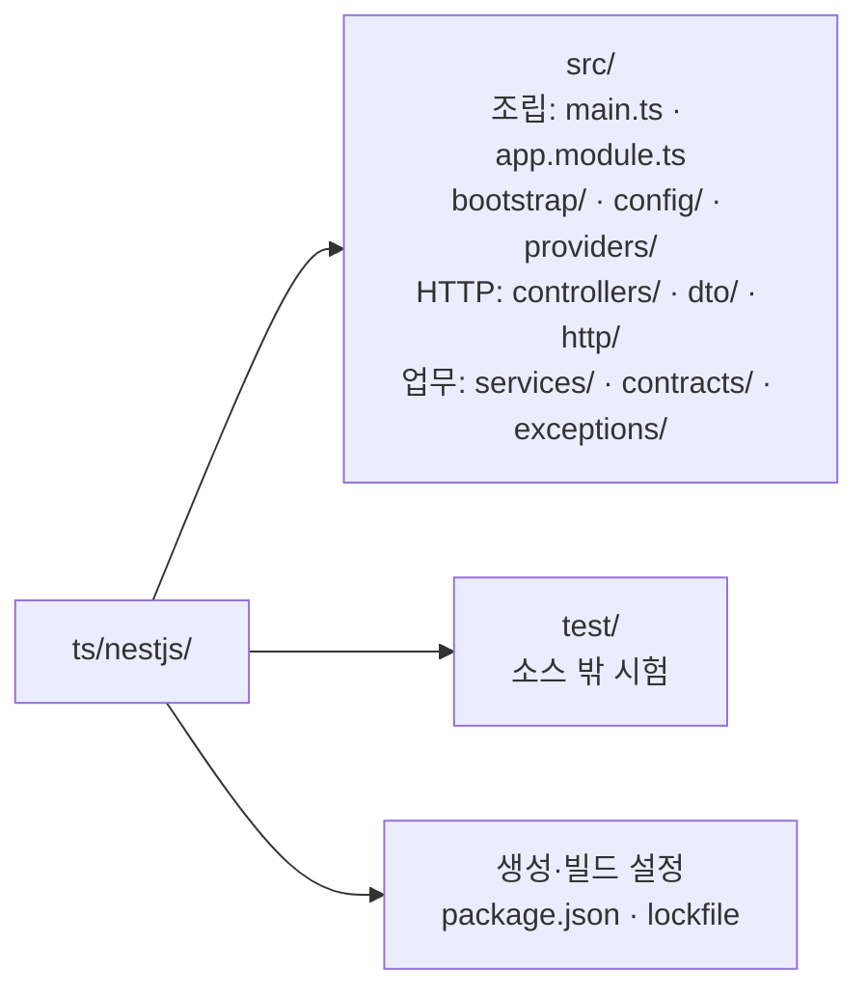
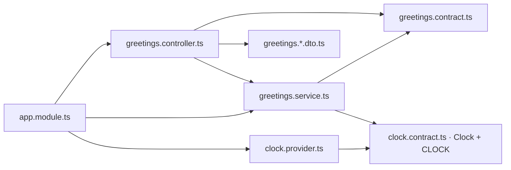
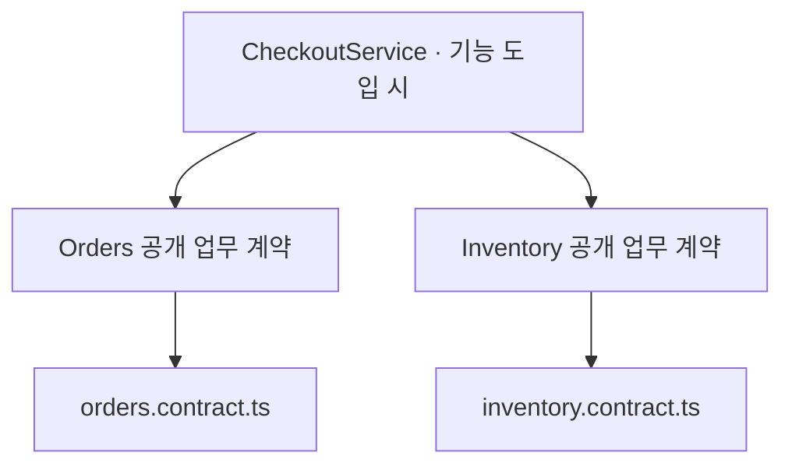

# NestJS 폴더 구조와 활용 기준

Status: 배치 설계안 · 아래 경로는 생성 예정이며 현재 코드가 아닙니다 · 2026-09-08

이 문서는 폴더·파일 역할과 의존 방향을 소유합니다.
Nest 조립·수명·프로토콜 선택은 [구현 설계](nestjs.md), 진행 단계는 [작업 계획](nestjs-tasks.md)에 있습니다.

## 배치 기준

**역할별 폴더 안에서 기능별 파일을 맞춥니다.** 인사 기능은
`controllers/greetings.controller.ts`·`services/greetings.service.ts`처럼 찾습니다.
Nest의 Controller·Provider·Module 구분을 사용하면서 물리 폴더를 feature 단위로 강제하지 않습니다.

아래는 초기 앱·DI·HTTP 계약 단계까지 필요한 배치안입니다. 각 파일은 해당 책임을 구현할 때 생성합니다.

그림의 조립·HTTP 경계·업무는 역할 묶음입니다. 실제 디렉터리와 파일은 아래 표를 따릅니다.

| 파일·경로 | 소유하는 내용 | 넣지 않는 내용 |
| --- | --- | --- |
| `main.ts` | 프로세스 시작·listen·종료 hook 설정 | 업무 처리 |
| `app.module.ts` | Controller·Provider 등록과 외부 Module 연결 | 범용 컨테이너·업무 함수 |
| `bootstrap/app.ts` | 앱 생성과 시험에서도 쓰는 HTTP 설정 | 환경별 기능 분기 전체 |
| `config/settings.ts` | 환경 입력의 검증·기본값·설정 타입 | 업무에서 호출하는 전역 env getter |
| `controllers/*.controller.ts` | HTTP 입력·업무 호출·응답 변환 | SQL·업무 트랜잭션 |
| `services/*.service.ts` | 업무 순서·정합성·트랜잭션 경계 | Request/Response·외부 응답 DTO |
| `dto/*.request.dto.ts`, `*.response.dto.ts` | 외부 필드·검증·OpenAPI metadata | DB entity의 그대로 노출 |
| `contracts/*.contract.ts` | 내부 결과·필요한 호출 계약·해당 DI 토큰 | 구현 클래스의 재수출 |
| `providers/*.provider.ts` | 함수·외부 구현의 Provider binding | 모든 Service를 포장하는 별도 Provider 클래스 |
| `http/` | Problem 변환·HTTP 관측·공개 응답 표현 | 업무 정책 |
| `exceptions/*.error.ts` | 기능 소유 오류 타입과 필요한 업무 정보 | HTTP status·로그 출력 |

`greetings.response.dto.ts`는 HTTP 표현이고 `greetings.contract.ts`는 내부 결과입니다.
필드가 같아도 전송 검증 metadata와 업무 타입의 변경 이유가 다르면 분리합니다.
단순 문자열 반환에 빈 내부 DTO를 하나 더 만들지는 않습니다.

## 타입과 주입 토큰

외부 DTO는 런타임 검증을 위해 클래스와 일반 import를 사용합니다.
내부 계약은 `type`·`interface`와 `import type`을 사용하고 Nest·Controller·ORM 구현을 import하지 않습니다.
DI용 `Symbol`은 런타임 값이므로 일반 import를 사용합니다.
[Validation](https://docs.nestjs.com/techniques/validation)·[Custom providers](https://docs.nestjs.com/fundamentals/custom-providers), 확인일: 2026-09-08.

화살표는 import 방향입니다. 계약 파일은 위 계층을 역으로 참조하지 않습니다.
구현 전체를 재수출하는 `index.ts` barrel은 기본안에 만들지 않고 필요한 파일을 직접 import합니다.
타입 순환을 없애도 A 업무 → B 업무 → A 업무 호출은 남을 수 있으므로 두 문제를 따로 확인합니다.

## 여러 기능을 조합할 때

예를 들어 실제 주문 확정이 주문·재고 작업을 조합하게 되면 `services/checkout.service.ts`가
순서와 실패 정책을 소유합니다. 참여 Service가 조합 Service를 다시 호출하지 않게 합니다.
단일 호출을 포장하는 Facade나 빈 `facades/` 폴더는 생성하지 않습니다.

다른 기능은 소유 기능의 공개 조회·업무 계약을 사용합니다. Repository·DB model 내부를 직접 조작하지 않습니다.
Module 분리가 필요해지면 `modules/orders.module.ts`처럼 공개 계약을 export하고 조합 Module이 이를 import합니다.
전역 `@Global()`·`forwardRef()`·서비스 탐색으로 순환 구조를 먼저 덮지 않습니다.
Nest는 순환 의존용 `forwardRef()`를 제공하지만 이 템플릿은 호출 방향을 먼저 정리합니다.
[Circular dependency](https://docs.nestjs.com/fundamentals/circular-dependency), 확인일: 2026-09-08.

## 책임이 생길 때 추가하는 파일

| 도입 단계 | 추가 후보 | 배치 이유 |
| --- | --- | --- |
| 관측 | `observability/logging.ts`, `observability/metrics.ts`, `http/observation.middleware.ts` | 라이브러리 설정과 HTTP 종료 감지를 나눕니다. |
| DB 기반 | `database/`의 연결·수명 파일, 도구가 생성한 migration 경로 | pool과 schema 변경은 업무 파일 밖에서 관리합니다. |
| 예약 | `repositories/reservations.repository.ts`, `models/`의 저장 모델 | transaction client를 받아 저장하고 내부 결과로 반환합니다. |
| 예약 계약 | Controller·Service·DTO·contract·error의 `reservations` 파일 | 기존 역할 폴더에서 같은 기능명으로 연결합니다. |
| feature Module | `modules/*.module.ts` | 공개 Provider와 수명 경계가 생긴 기능만 분리합니다. |

DB model의 세부 파일명은 선택한 저장 도구의 관용을 따릅니다. ORM entity인지 schema 정의인지 결정하기 전에
빈 entity·BaseRepository·범용 transaction wrapper를 만들지 않습니다.
Dockerfile·환경 예시는 `ts/nestjs/`가, 공통 Compose·모니터링 설정은 저장소 루트가 소유합니다.
구현별 독립 Compose 파일과 동일한 수집기 구성을 복제하지 않습니다.

## 테스트와 생성 도구

`test/`는 `src/`와 같은 레벨로 두고 `unit/`·`integration/`·`e2e/`를 필요한 단계에 추가합니다.
단위 파일은 `*.spec.ts`, HTTP 통합 파일은 `*.e2e-spec.ts`로 구분합니다.
Nest 공식 CLI도 root `test/`를 생성합니다. 공식 예제의 단위 시험 근접 배치와 달리
이 템플릿은 사용자 합의대로 시험을 소스 밖에 모으므로 runner의 수집 경로와 빌드 제외를 함께 맞춥니다.
[CLI](https://docs.nestjs.com/cli/usages)·[Testing](https://docs.nestjs.com/fundamentals/testing), 확인일: 2026-09-08.

프로젝트·Controller·Service는 선택한 버전의 공식 CLI로 생성하고 차이를 검토한 뒤 경로를 정리합니다.
생성기에는 역할 폴더 경로를 명시하고 실제 CLI의 `--flat`·spec 관련 지원 옵션을 확인합니다.
현재 없는 실행 명령을 검증 완료 사용법으로 싣지 않습니다.

소비 프로젝트는 이 배치를 바꿀 수 있습니다. 그때 import·Module 등록·test 수집·빌드 포함 범위와 가이드를 함께 바꿉니다.
