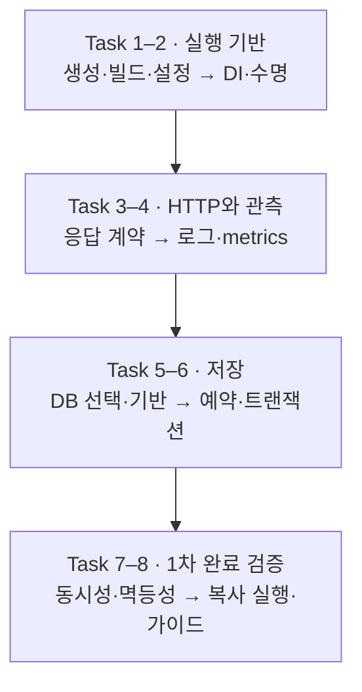

# NestJS 작업 계획

Status: Task 1–8 1차 구현·검증 완료 · 컨테이너·공유 수집·가이드 통합 · 2026-09-08

목표는 작은 실행 앱에서 시작해 예약의 동시성·멱등성까지 한 사이클을 검증하는 것입니다.
승인된 구현에 따라 Nest 앱과 로컬 파일 SQLite 예제를 만들었습니다. 공유 운영 인프라·계정·수집기는 변경하지 않았습니다.
설계 선택은 [NestJS 설계](nestjs.md), 경로는 [폴더와 역할](nestjs-structure.md), 통과 조건은 [검증 계획](nestjs-verification.md)이 소유합니다.

| 단계 | 현재 결과 |
| --- | --- |
| Task 1 | 공식 CLI 12 ESM 생성물 보존, Node·Nest·pnpm 고정, 설정·빌드·typecheck·lint와 native 18083 확인 |
| Task 2 | 생성자 DI·CLOCK 교체·앱 격리·readiness·초기화/listen 실패 정리·SIGTERM drain 검증 |
| Task 3 | DTO·422(잘못된 JSON 포함)·Problem·405 Allow·request ID·OpenAPI·특수 응답 검증 |
| Task 4 | Pino·앱별 Prometheus registry·송신/실행 분리·오류 격리·공유 Prometheus 수집 검증 |
| Task 5 | 중앙 승인 Drizzle·worker SQLite·tarn, 공식 migration 생성/적용, pool/lock timeout·반환·계측 검증 |
| Task 6 | 동일 transaction client로 차감·예약·멱등 저장; 실제 COMMIT 실패와 rollback 실패 정리 검증 |
| Task 7 | 독립 프로세스 경합·동일/충돌 키·commit 전후 SIGKILL·응답 유실·재시작 재생 검증 |
| Task 8 | 새 디렉터리 locked 설치·빌드·migration·예약, 컨테이너 재시작 재생·공유 대시보드·MkDocs 통합 |

코드 checkpoint: `56cf0c7` 공식 생성물, `521e098` 설정·DI·수명,
`5c3eb31` HTTP·관측·SQLite 예약·프로세스 복구 검증,
`6e077ca` DB 비활성 라우트 제외·매개변수 경로 관측·컨테이너 파일 소유권 반영입니다.
상세 명령·한계는 검증 기록이 소유합니다.

## Task 1. 최소 앱·빌드·환경 설정

목표:
Node·Nest·pnpm 호환 버전과 모듈 형식을 고정하고 공식 CLI로 `ts/nestjs/` 앱을 생성합니다.
환경 설정과 test 수집 경로를 프로젝트 배치에 맞춥니다.

예상 결과:

- 공식 생성 명령과 도구 버전, lockfile·빌드·시험 설정이 기록됩니다.
- 환경 예시에 필요한 값과 기본값이 구분되고 잘못된 설정은 시작 전에 거절됩니다.
- [중앙 포트 배정](README.md#로컬-포트-배정)에서 최소 HTTP 응답을 확인하며 기존 앱은 유지됩니다.

## Task 2. DI·앱 수명·health

목표:
AppModule에서 인사 Service와 clock Provider를 조립하고 앱 생성·준비·종료 책임을 구분합니다.

예상 결과:

- Controller·Service·내부 계약이 연결되고 Provider 교체 시험이 통과합니다.
- `/health/live`·`/health/ready`와 초기화 실패·종료 시 자원 해제 결과가 확인됩니다.
- 시험과 실행 앱에 같은 HTTP 설정이 적용되고 요청 상태를 singleton에 저장하지 않습니다.

## Task 3. 응답·입력 검증·업무 예외

목표:
DTO·ValidationPipe·ProblemFilter로 공통 HTTP 계약을 연결합니다.

예상 결과:

- 업무 성공·422·업무 오류·500·라우팅 오류의 공개 응답과 OpenAPI가 일치합니다.
- health·metrics·본문 없는 응답·stream의 예외 경계가 확인됩니다.
- 입력 원문·비공개 필드·예외 메시지가 공개 응답에 섞이지 않습니다.

## Task 4. Metrics·로그·로컬 확인

목표:
Node용 수집 라이브러리를 선택하고 요청 실행·전송 완료를 구분해 관측 계약을 연결합니다.

예상 결과:

- 앱별 metrics registry와 구조화 로그가 요청 ID로 연결됩니다.
- 전송 중단·중복 기록·관측 실패 시험이 통과합니다.
- 기존 로컬 수집 설정의 대상 추가 범위와 대시보드 호환성이 확인됩니다. 운영 수집기 구축은 후속입니다.

## Task 5. DB 선택·연결·migration·계측

목표:
첫 DB와 저장·migration 도구를 결정하고 Primary 연결 수명과 transaction client 전달 기반을 구성합니다.

예상 결과:

- 첫 DB·PostgreSQL 전환 경로·저장 도구가 정해지고 잠금·트랜잭션·pool 계측 검토 근거가 기록됩니다.
- 설정·migration 명령·시작 순서가 결정되고 빈 DB와 재실행에서 검증됩니다.
- 격리 DB에서 연결 점유·대기·timeout·반환과 실제 지표가 대조됩니다.

## Task 6. 예약과 트랜잭션

목표:
기존 예약 예제의 업무 계약에 맞춰 Service·Repository·DB 제약을 연결합니다.

예상 결과:

- 재고 차감·예약·멱등 결과 저장이 같은 transaction client를 사용합니다.
- 순차 성공·품절·부분 저장 실패·commit 실패의 결과와 DB 상태가 일치합니다.
- 성공 응답은 commit 뒤에만 반환하며 Repository는 독립 commit을 하지 않습니다.

## Task 7. 동시성·멱등성·복구

목표:
서로 다른 요청의 경합과 같은 요청의 재전송·응답 유실을 실제 DB에서 처리합니다.

예상 결과:

- 독립 연결·프로세스의 재고 1개 경합에서 예약은 하나만 남습니다.
- 같은 키·다른 입력·동시 재전송의 응답과 저장 결과가 계약대로 유지됩니다.
- rollback 뒤 재시도, commit 전후 종료, 응답 유실 뒤 재생이 검증 기록에 남습니다.

## Task 8. 복사 실행과 가이드 마무리

목표:
새 디렉터리에서 설치·빌드·migration·실행하고 실제 서비스의 기능을 붙이는 경로를 정리합니다.

예상 결과:

- 사용 가이드·상세 설명·작업 및 검증 기록이 기존 MkDocs 영역 안에서 구분됩니다.
- 네이티브·컨테이너 실행 범위와 전체 시험 결과, 남은 운영 선택이 기록됩니다.
- FastAPI·Spring Boot와 공통 계약의 의미 차이 및 구현별 제약을 비교할 수 있습니다.

컨테이너·수집기 공통 파일과 포트는 중앙에서 조정하고 Nest 작업은 소유 구현 경로에 한정합니다.
각 단계의 완료 변경을 검토·커밋하고, 다음 단계는 남은 선택과 실제 검증 결과를 기준으로 구체화합니다.
