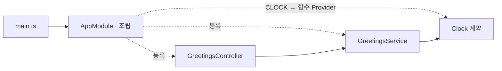
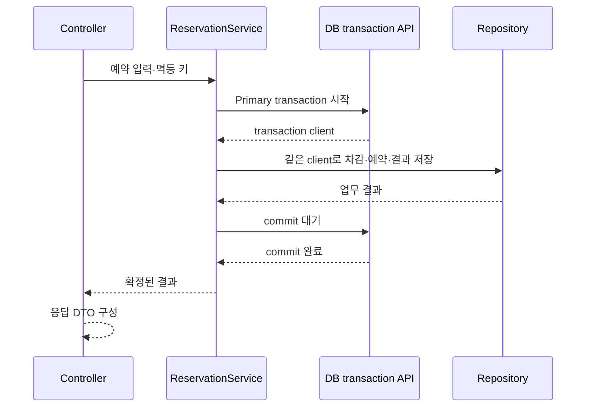

# TypeScript / NestJS 구현 설계

Status: SQLite 예약·동시성·멱등성 1차 구현·검증 및 로컬 통합 완료 · 2026-09-08

이 문서는 NestJS의 조립·DI·수명·HTTP·저장 경계를 소유합니다.
파일 배치는 [폴더와 역할](nestjs-structure.md), 착수 순서는 [작업 계획](nestjs-tasks.md),
통과 조건은 [검증 계획](nestjs-verification.md)에서 확인합니다.
공통 의미는 [Backend](../backend.md)와 [관측](../observability.md)을 따릅니다.

## 기본 선택

| 항목 | 구현 선택 |
| --- | --- |
| 위치·도구 | `ts/nestjs/`, pnpm, 공식 Nest CLI로 생성합니다. |
| HTTP | 첫 구현은 기본 Express adapter로 시작합니다. Fastify 전환은 별도 검증합니다. |
| 앱 조립 | 첫 프로젝트 Module은 `AppModule` 하나입니다. 내장 DI에 Controller와 Provider를 등록합니다. |
| 코드 스타일 | Controller·주입받는 Service는 클래스, 값 변환·계산은 일반 함수와 readonly 타입을 사용합니다. |
| 테스트 | `src/` 옆 `test/`에 단위·통합·HTTP 시험을 둡니다. |
| 로컬 주소 | [포트 배정](README.md#로컬-포트-배정)에 따라 native 18083·컨테이너 18084를 검증했습니다. |

Node.js 24.20.0 LTS·Nest 12.0.1·CLI 12.0.0·pnpm 12.3.4를 고정했습니다.
Node 정확 버전은 `.node-version`, pnpm 정확 버전은 `packageManager`가 소유하며
`engines`는 호환 범위만 표현합니다. `scripts/toolchain.mjs`는 두 정본을 읽어 전역 도구 변경 없이 실행합니다.
공식 CLI ESM 생성물과 Vitest·oxlint를 유지했습니다. 생성물은 commit `56cf0c7`에 보존했습니다.
생성된 vite-tsconfig-paths의 TypeScript 6 peer 충돌은 Vite의 현재 내장 tsconfigPaths로 대체해 제거했습니다.
[Nest CLI](https://docs.nestjs.com/cli/usages)는 프로젝트 생성과 pnpm 선택을 지원합니다. 확인일: 2026-09-08.

## DI와 앱 조립

Controller는 Service를 생성자에서 받고, Service는 필요한 clock·저장·외부 호출 의존성을 받습니다.
구현이 하나인 Service는 클래스 토큰으로 주입합니다. 교체 가능한 함수·인터페이스에는 `Symbol` 토큰과
`@Inject()`를 사용하며 토큰은 해당 계약 파일이 소유합니다. 인터페이스 이름만으로 주입할 수는 없습니다.
[Providers](https://docs.nestjs.com/providers)·[Custom providers](https://docs.nestjs.com/fundamentals/custom-providers), 확인일: 2026-09-08.

Provider는 기본 앱 수명을 사용합니다. 요청 ID·사용자·트랜잭션을 singleton 필드에 저장하지 않습니다.
clock은 `useValue` 또는 `useFactory`로 연결하고 시험에서는 `overrideProvider(CLOCK)`으로 교체합니다.
업무 코드에서 `ModuleRef.get()`·전역 컨테이너 조회로 의존성을 숨기지 않습니다.
`private readonly` 생성자 매개변수는 TypeScript 관용 문법으로 사용하며 이름 앞에 밑줄을 붙이지 않습니다.

AppModule은 참조를 연결하고 업무를 실행하지 않습니다. 프로젝트가 커져 독립된 공개 Provider와 수명 경계가
생기면 feature Module을 추가합니다. 역할 폴더마다 ControllerModule·ServiceModule을 만들지는 않습니다.
모듈 간에는 필요한 Provider만 `exports`로 공개하며 같은 Provider를 여러 모듈에 중복 등록하지 않습니다.
[Modules](https://docs.nestjs.com/modules), 확인일: 2026-09-08.

## 초기화와 종료

`main.ts`는 프로세스 실행, `bootstrap/app.ts`는 앱 생성·공통 HTTP 설정을 소유합니다.
테스트도 같은 설정 함수를 사용해 ValidationPipe·Filter가 빠지는 별도 앱을 만들지 않습니다.
설정은 시작 시 한 번 읽고 검증합니다. 업무 파일은 `process.env`를 직접 읽지 않습니다.

| 시점 | 책임 |
| --- | --- |
| 생성자 | 의존성을 저장합니다. DB 연결·외부 I/O를 시작하지 않습니다. |
| `onModuleInit` | 자원 소유 Provider가 연결을 준비합니다. 부분 초기화 실패는 생성한 자원부터 정리합니다. |
| `onApplicationBootstrap` | 필수 준비가 완료되면 readiness를 켭니다. 그 후 HTTP listen이 진행됩니다. |
| 시작 실패 | 앱 참조가 생긴 뒤 초기화·listen이 실패하면 실행 경계에서 `app.close()`를 기다리고 실패 종료합니다. |
| `onModuleDestroy` | readiness를 끕니다. 처리 중 요청이 쓰는 DB pool을 먼저 닫지 않습니다. |
| HTTP 종료 후 `onApplicationShutdown` | 자원 소유 Provider가 pool·client·timer를 정리합니다. |

실행 진입점에서 `enableShutdownHooks()`를 켭니다. 시험 앱은 `app.close()`를 명시적으로 기다립니다.
요청 scope의 자동 정리나 hook 등록만으로 초기화 실패·요청 drain이 보장된다고 가정하지 않습니다.
`Shutdown`은 설정된 시간 뒤 HTTP socket을 닫습니다. `Primary`의 종료 hook은
활성 DB lease가 반납된 뒤 worker pool을 닫으므로 socket 종료를 transaction 취소로 해석하지 않습니다.
실제 초기화 실패·listen 실패·SIGTERM drain·socket 종료 기한·DB worker 반환을 검증했습니다.
[Lifecycle events](https://docs.nestjs.com/fundamentals/lifecycle-events), 확인일: 2026-09-08.

## 입력·응답·예외

외부 입력 DTO는 검증 metadata가 필요한 클래스입니다. 내부 계약은 Nest·검증 데코레이터를 모르는
readonly 타입으로 두고, Controller가 DTO를 업무 인자로 바꿉니다.
`ValidationPipe`는 허용 필드 검증과 초과 필드 거절을 켜고, 전역 암묵적 타입 변환은 켜지 않습니다.
query·path의 변환이 필요한 곳에서 명시적인 Pipe를 사용합니다.
[Validation](https://docs.nestjs.com/techniques/validation), 확인일: 2026-09-08.

[공통 HTTP 계약](../backend.md#http-응답-계약)을 다음 경계에서 적용합니다.

| 경계 | NestJS 적용 |
| --- | --- |
| 정상 업무 JSON | Controller가 응답 DTO와 `data`를 명시적으로 구성합니다. 전역 응답 Interceptor는 먼저 만들지 않습니다. |
| 입력 검증 | 기본 검증 오류를 422·공개 위치·고정 코드로 바꾸는 `exceptionFactory`를 구성합니다. 원본 입력·검증 메시지는 노출하지 않습니다. |
| JSON 해석 실패 | ValidationPipe 이전에 발생하는 body parser 오류도 HTTP 경계에서 422 Problem으로 변환합니다. parser 메시지·원문 body는 공개하지 않습니다. |
| 업무 오류 | 업무 오류 타입에는 HTTP 상태를 넣지 않습니다. `ProblemFilter`가 공개 코드와 상태를 매핑합니다. |
| 예상 밖 오류 | `APP_FILTER`로 등록한 Filter가 500 Problem으로 변환하고 상세는 관측 경계에 한 번 기록합니다. |
| 특수 응답 | health·metrics·문서·파일·stream은 해당 프로토콜의 응답을 유지합니다. |
| 라우팅 오류 | 알려지지 않은 경로와 지원하지 않는 메서드의 404·405/Allow를 별도로 확인합니다. adapter 기본값만으로 완료 처리하지 않습니다. |
| 요청 추적 | 서버 요청 ID를 `X-Request-ID`로 반환하고 Problem의 `request_id`·로그 ID와 일치시킵니다. |

DI가 필요한 Filter는 Module의 `APP_FILTER`로 등록합니다. 응답이 이미 시작됐다면 새 오류 본문을 보내지 않습니다.
직접 `@Res()`를 사용하는 코드는 전송 제어가 필요한 HTTP 파일에 한정합니다.
[Exception filters](https://docs.nestjs.com/exception-filters), 확인일: 2026-09-08.

## 로깅과 metrics

수집은 해당 환경의 라이브러리를 우선하고, 앱은 [관측 계약](../observability.md)의 의미를 연결합니다.
Pino 10.3.1과 Prometheus 공식 Node client `@prometheus-io/client` 0.16.1을 사용합니다.
기존 `prom-client`는 공식 이전 안내가 있어 후속 패키지를 선택했습니다. 수집 서버를 새로 만들지 않았습니다.

HTTP middleware가 서버 요청 ID와 전송 상태를 소유합니다. Node의 `ServerResponse`에서 `finish`는
서버가 응답을 운영체제에 넘긴 시점이며 클라이언트 수신 보장이 아닙니다.
`close`는 정상 완료에도 발생하므로 `finish` 여부를 함께 보고 중도 종료를 구분합니다.
업무 실행 종료는 Service/Interceptor 경계에서 별도로 관측합니다. Observable 종료를 응답 전송 완료로 세지 않습니다.
[Node HTTP events](https://nodejs.org/api/http.html#class-httpserverresponse), 확인일: 2026-09-08.

registry는 앱 인스턴스별로 만들고 경로 template·method·상태·종료 결과를 제한된 라벨로 기록합니다.
관측 라이브러리가 제공하지 않는 전송·실행 구분만 작은 연결 코드로 보완합니다.
관측 실패가 원래 업무 결과를 바꾸지 않는지, 같은 요청을 두 번 기록하지 않는지는 [검증 계획](nestjs-verification.md)으로 확인합니다.

`contracts/observation.contract.ts`의 HTTP 결과는 `status: number | null`, 한정된
`completion`·`execution` union을 사용합니다. 숫자→문자열 변환은 Prometheus 라벨 경계만 소유합니다.
HTTP 관측은 `http_requests_total`, `http_request_duration_seconds`와 FastAPI의
`method/route/status/completion/execution` 라벨 의미를 맞춥니다. 미전송 status 라벨은 `none`입니다.
health·metrics·docs의 요약 기록은 제외하고 request ID는 반환합니다. 관측 실패 후 `/metrics`는 503입니다.

## DB·트랜잭션

중앙 승인으로 SQLite·Drizzle ORM 0.45.2·drizzle-kit 0.31.10·better-sqlite3 13.0.3·tarn 3.1.2를 선택했습니다.
단일 Primary만 구현했습니다. `DB_PRIMARY_URL` 공백은 DB 비활성이며 readiness 실패가 아닙니다.
이때 예약 controller·DB provider·OpenAPI 항목을 등록하지 않아 예약 경로는 404입니다.
실제 native SQLite engine은 `sqlite_version()`으로 3.53.4를 확인했습니다.
Prisma 7.10.0의 기본 SQLite adapter와 libsql 로컬 driver는 동기 실행 제약이 있고,
Knex 3.3.0+sqlite3 6.0.1은 실제 비동기 I/O지만 sqlite3 공식 저장소의 유지보수 중단 선언이 있어 제외했습니다.

better-sqlite3의 동기 I/O는 전용 Node worker 안에서만 실행합니다. Drizzle 공식 `sqlite-proxy`
callback이 작은 SQL/결과 메시지를 기다립니다. tarn은 worker/연결의 지연 생성·획득 대기·반환을 맡습니다.
기본 pool 상한 2, 연결 획득·잠금 timeout 각각 1000ms입니다. 잠금 대기 중 timer·health 응답을 실제 확인했습니다.
DB 파일은 미리 공식 migration CLI로 만들며 앱은 시작 시 schema를 확인합니다. WAL·foreign keys·FULL synchronous를 사용합니다.

Service가 한 업무의 트랜잭션을 열고 저장 도구가 제공하는 transaction client를 Repository 호출에 명시적으로 전달합니다.
같은 업무의 저장은 같은 client를 사용하며 commit 완료를 기다린 다음 결과를 반환합니다.
Repository의 독립 commit, 전역 transaction client, 요청 전체를 감싸는 자동 transaction Interceptor는 기본안에 넣지 않습니다.

Service는 연결 lease를 얻고 Drizzle `transaction(..., { behavior: 'immediate' })`를 호출합니다.
Repository에는 그 callback의 client만 전달합니다. 선조회·조건부 차감·예약·멱등 응답 저장을 같은
연결에서 수행하며 공식 Drizzle API가 COMMIT/ROLLBACK을 기다립니다. 실패한 rollback 뒤 dirty 연결은 닫고 재사용하지 않습니다.
실제 deferred foreign key COMMIT 실패·독립 프로세스 경합·commit 전후 강제 종료·응답 유실을 검증했습니다.
HTTP가 아닌 Job·GraphQL·WebSocket도 같은 업무 메서드를 호출할 수 있지만, 프로토콜 adapter와 취소 처리는 각각 검증해야 합니다.
Nest hook이나 DI만으로 여러 DB·외부 호출의 원자성이 생기지는 않습니다.

## 검증 범위와 후속 선택

| 영역 | 상태와 후속 |
| --- | --- |
| HTTP | 현재 정적 API 경로는 공식 Swagger 생성 path/method로 405를 판정합니다. 관측은 공개 Express `req.route.path`를 사용하며 매개변수 template 집계를 시험했습니다. private router 접근은 없습니다. 동적 경로의 405·다른 adapter는 추가 시험이 필요합니다. |
| 수집·컨테이너 | Compose·Prometheus·Grafana 실제 연결과 MkDocs 통합을 확인했습니다. 실행은 [로컬 모니터링](local-monitoring.md)을 따릅니다. |
| PostgreSQL | driver·schema·migration 교체 뒤 해당 DB의 경합·복구 시험을 다시 수행해야 합니다. 인스턴스를 만들지 않았습니다. |
| 운영 | 인증·감사 영속성·외부 SDK·네트워크 파일시스템·OS stdout 장애·부하 지연/용량 보장은 미검증입니다. |

예약의 API 의미는 [기존 예약 예제](fastapi.md#예약-업무-계약)와 비교하되 SQLite 고유 SQL·잠금 구현은 옮겨 쓰지 않습니다.
실행 명령은 [NestJS 사용 안내](../../ts/nestjs/README.md), 실제 결과는 [검증 기록](nestjs-verification.md)에 있습니다.

공식 근거(확인일 2026-09-08): [Nest 12 migration](https://docs.nestjs.com/migration-guide),
[Node LTS](https://nodejs.org/en/about/previous-releases), [Drizzle proxy](https://orm.drizzle.team/docs/connect-drizzle-proxy),
[tarn pool](https://github.com/Vincit/tarn.js), [sqlite3 유지보수 상태](https://github.com/TryGhost/node-sqlite3),
[libsql 로컬 구현](https://github.com/tursodatabase/libsql-client-ts/blob/main/packages/libsql-client/src/sqlite3.ts),
[Prometheus Node client](https://github.com/prometheus/client_js).
