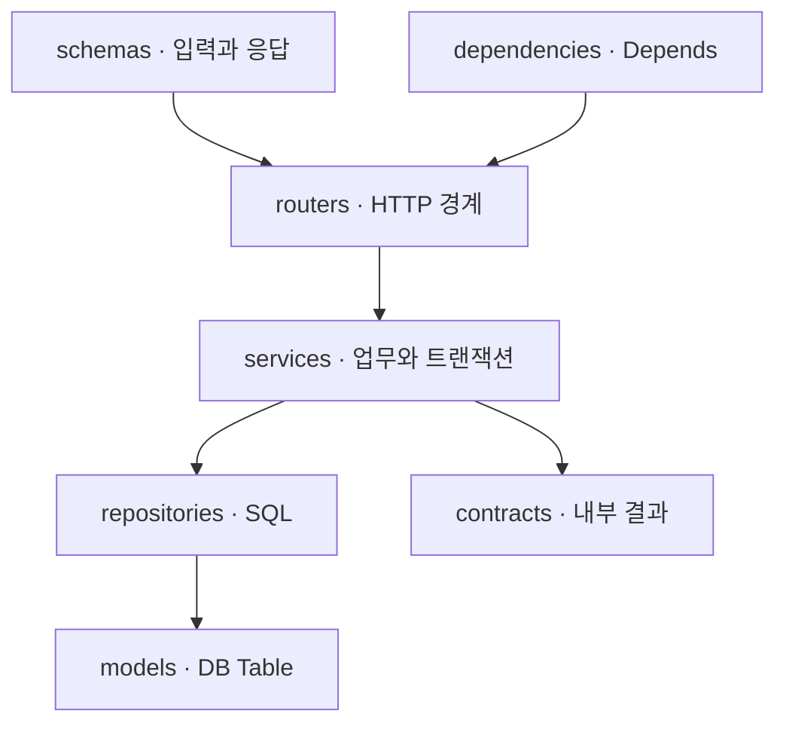

# 내 서비스에 적용하기

이 가이드는 템플릿을 실행한 다음 실제 업무를 붙이는 순서를 안내합니다.
현재 구현은 FastAPI와 파일 SQLite입니다. Java·Nest는 후속 후보이고 PostgreSQL은 아직 지원하지 않습니다.

## 먼저 한 번 실행합니다

[로컬 실행 가이드](quickstart.md)를 따라 앱과 선택 모니터링을 실행합니다.
Swagger에서 예약을 요청하고 같은 키로 재요청해 결과가 재생되는지 확인합니다.
코드를 바꾸기 전 [검증 명령](../../python/fastapi/README.md#빌드와-검증)으로 기준 상태를 확인합니다.

| 확인할 것 | 기대 결과 |
| --- | --- |
| `/health/ready` | 준비 완료 200 |
| `/docs` | 예약 입력과 필수 Idempotency-Key 표시 |
| 같은 키·같은 상품 재요청 | 같은 예약 결과, Idempotency-Replayed: true |
| 로그·DB 대시보드 | 요청 결과와 트랜잭션·연결 상태 관측 |

## 가져갈 파일과 설정을 정합니다

독립 앱은 `python/fastapi/`입니다. `src/`, `tests/`, `migrations/`, `scripts/`, `alembic.ini`,
`pyproject.toml`, `uv.lock`, `.python-version`, `Dockerfile`, `.dockerignore`, `.env.example`을 함께 관리합니다.
`.venv`, `.env`, `data/`, `dist/`와 개인 캐시는 복사 대상에서 제외합니다.
루트의 `compose.yaml`·`scripts/compose.sh`는 이 저장소의 경로를 사용하므로 소비 서비스에 맞게 build 경로를 정합니다.
로컬 모니터링을 사용한다면 `infra/monitoring/`도 가져가고 수집 대상과 게시 포트를 확인합니다.

설정은 `.env.example`을 기준으로 자신의 `.env`를 만듭니다. 우선 `APP_NAME`, `SERVICE_VERSION`,
`APP_ENVIRONMENT`, `DB_PRIMARY_URL`과 포트를 정합니다. 기존 서비스의 포트·DB 파일을 공유하지 않습니다.
의존성 변경은 `uv add`·`uv remove`로 수행하고 lockfile을 함께 커밋합니다.

## 가장 작은 업무 하나를 연결합니다

인사 예제를 참고해 입력·업무 결과·라우터부터 연결합니다. 저장이 필요한 경우에만 repository와 DB 모델을 추가합니다.
파일 이름은 기능 이름으로 맞추되 폴더는 역할별로 유지합니다.

Service에는 Session·clock 같은 의존성을 일반 인자로 전달합니다. 같은 업무 트랜잭션에 참여하는 저장은 같은 Session을 씁니다.
예상 가능한 실패는 업무 예외로 표현하고 HTTP 응답 변환은 앱 조립에서 등록합니다.
상세 배치 기준은 [폴더와 역할](fastapi-structure.md), 응답·예외 계약은 [FastAPI 구현 설계](fastapi.md)가 소유합니다.

## DB 변경과 재시도를 검증합니다

Table을 바꾸면 Alembic revision을 만들고 생성 내용을 검토합니다. 새 DB와 기존 DB 모두에 upgrade를 확인합니다.
로컬 컨테이너는 [migration 성공 후 시작](fastapi.md#로컬-컨테이너-migration-순서)하며 네이티브 실행은 Alembic을 먼저 실행합니다.

예약 예제의 멱등 키는 인증 없는 실험 계약입니다. 실제 서비스에서는 **누구의 어떤 업무에 대한 키인지**,
성공 결과를 얼마나 보존할지, 실패 후 재시도가 가능한지를 먼저 정합니다.
결제·외부 API 호출까지 한 DB 트랜잭션으로 원자성이 보장되지는 않습니다.

새 기능은 정상·업무 거절·중간 실패를 확인하고, 경쟁하는 쓰기가 있다면 독립 연결의 동시 요청도 확인합니다.
[예약 검증 기록](fastapi-verification.md#예약-동시성멱등성-실행-결과)을 사례로 사용합니다.

## 로컬에서 막혔을 때

| 증상 | 먼저 확인할 내용 |
| --- | --- |
| 예약 API가 Swagger에 없음 | DB_PRIMARY_URL이 설정됐는지 확인합니다. |
| 컨테이너가 시작되지 않음 | `./scripts/compose.sh fastapi logs api`에서 migration·설정 오류를 확인합니다. |
| no such table | 네이티브 실행의 migration 대상 DB가 앱 DB와 같은지 확인합니다. |
| 409 IDEMPOTENCY_CONFLICT | 같은 키에 다른 상품을 전달했는지 확인합니다. 새 업무에는 새 키를 사용합니다. |
| 503 DATABASE_BUSY / DATABASE_POOL_TIMEOUT | 잠금·pool 점유를 확인하고 같은 업무는 같은 키로 제한된 재시도를 합니다. |
| Grafana의 p95가 No data | 최근 구간의 요청과 수집 표본이 있는지 확인합니다. |

## 후속 선택

실제 서비스에 맞춰 인증·권한, PostgreSQL 전환, 외부 연계, 운영 Sentry·경보를 선택합니다.
현재 SQLite 시험은 PostgreSQL의 잠금·처리량이나 운영 준비 완료를 증명하지 않습니다.
완료 범위와 후속 작업은 [단계별 task](fastapi-tasks.md)에서 확인합니다.
