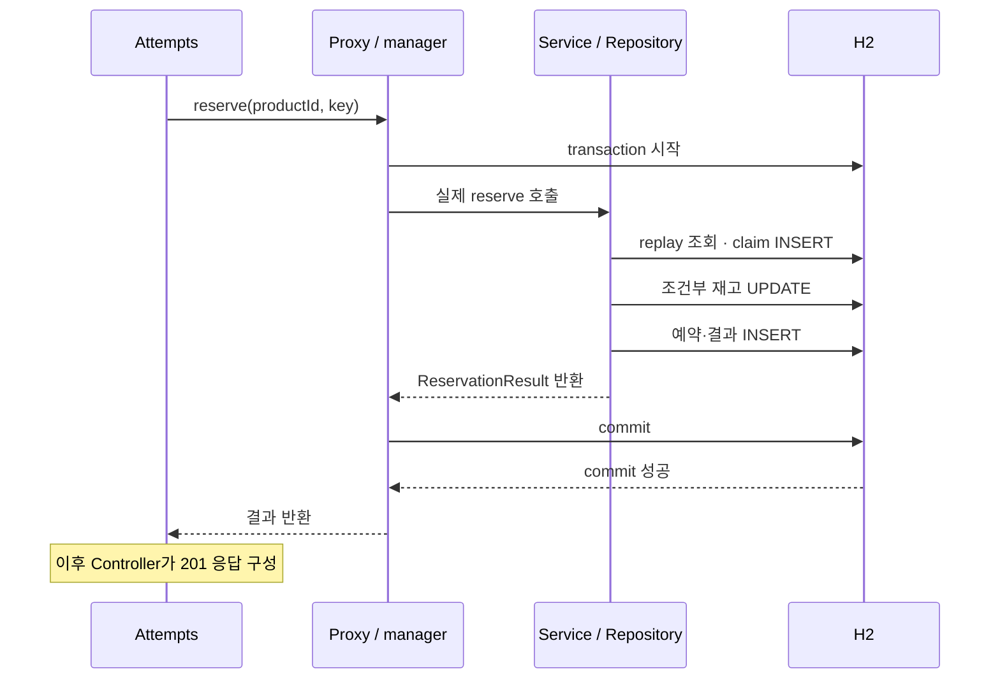

# Spring Boot 로직과 내부 동작

예약 요청 하나를 따라가며 **코드가 하는 일 → 내부에서 일어나는 일 → 그렇게 작성한 이유**를 설명합니다.
실행 명령은 [사용 안내](../../java/spring-boot/README.md), API·DB 정책과 구현 제약은
[구현 설계](spring-boot.md), 파일 배치는 [폴더와 역할](spring-boot-structure.md)이 소유합니다.
아래 클래스는 `src/main/java/com/backendtemplate/`에 있습니다.

## 객체 주입과 요청별 상태

`ReservationService` 생성자는 `ReservationRepository`와 `Clock`을 받아 `final` 필드에 보관합니다.
Spring이 Bean을 조립할 때 필요한 객체 참조를 전달하고, 이후 요청은 그 참조로 메서드를 호출합니다.
`@Service`는 Spring이 읽는 메타데이터이며 JVM이 이 annotation만 보고 객체를 주입하지는 않습니다.

현재 Controller·Service는 Spring context 안에서 공유하는 singleton Bean입니다.
여러 요청이 같은 Service 객체를 호출하므로 `productId`·`key`·`reservation`을 요청별 인자와 지역 변수로 둡니다.
JVM의 호출별 지역 변수는 분리되지만, 그 변수가 가리키는 객체까지 복사되는 것은 아닙니다.
`final`도 참조의 재할당만 막습니다. Service 필드에 현재 요청이나 재고를 담으면 여러 요청이 같은 상태를 읽고 바꾸게 됩니다.

`GreetingServiceTest`는 `new GreetingService(Clock.fixed(...))`로 고정 시간을 전달합니다.
생성자 의존성이 드러나 있으므로 이 순수 로직 시험에는 Spring context가 필요하지 않습니다.
객체 공유 범위는 [Spring singleton scope](https://docs.spring.io/spring-framework/reference/core/beans/factory-scopes.html#beans-factory-scopes-singleton)를 따릅니다.

## Service의 return과 transaction 완료

Controller는 입력 검증 후 `ReservationAttempts`를 호출합니다. Attempts가 가진 `ReservationService` 참조는
transaction 처리를 끼워 넣는 Spring proxy입니다. 현재처럼 interface가 없는 Service에는 클래스 기반 proxy가 적용됩니다.
JDK의 interface 기반 동적 proxy와는 생성 방식이 다르며, 호출 앞뒤에 처리를 넣는 원리는 같습니다.
[Spring proxy 설명](https://docs.spring.io/spring-framework/reference/core/aop/proxying.html)을 기준으로 합니다.

다음은 **신규 예약 성공** 경로입니다. proxy가 manager에 위임하는 transaction 처리를 한 칸으로 표시합니다.

`ReservationService.reserve()`의 마지막 `return`은 proxy로 돌아가는 시점입니다.
proxy가 `JpaTransactionManager`를 통해 commit한 뒤에야 Attempts와 Controller가 결과를 받습니다.
따라서 commit이 실패하면 Controller의 성공 응답 생성 줄까지 진행하지 않습니다.
업무 중 예외가 나오면 `rollbackFor = Exception.class`에 따라 rollback하고 예외를 호출자에게 전달합니다.

`@Transactional`은 메서드 본문을 Java 문법으로 바꾸는 기능이 아닙니다.
직접 `new ReservationService(...)`로 만든 객체나 같은 객체의 `this.reserve(...)` 호출은 proxy를 통과하지 않습니다.
이미 있는 transaction에는 참여할 수 있지만 새 annotation 경계가 적용되지는 않습니다.
이 때문에 실패 transaction 밖에서 다시 호출해야 하는 복구를 `ReservationAttempts`에 둡니다.
[Spring transaction 적용 방식](https://docs.spring.io/spring-framework/reference/data-access/transaction/declarative/annotations.html)을 따릅니다.

## EntityManager와 SQL 실행 시점

`ReservationRepository`가 보관하는 `EntityManager` 참조는 현재 transaction의 실제 EntityManager로 호출을 전달하는
Spring 공유 proxy입니다. 여러 요청이 하나의 영속성 context를 함께 수정하는 구조가 아닙니다.
현재 동기 MVC 호출에서는 manager가 실행 thread에 transaction 자원을 연결하고 완료 뒤 정리합니다.
새 thread나 `CompletableFuture` 작업에 그 transaction이 자동 전파되지는 않습니다.
이는 [공유 EntityManager](https://docs.spring.io/spring-framework/docs/current/javadoc-api/org/springframework/orm/jpa/SharedEntityManagerCreator.html)와
[JpaTransactionManager](https://docs.spring.io/spring-framework/docs/current/javadoc-api/org/springframework/orm/jpa/JpaTransactionManager.html)의 동작입니다.

영속성 context는 entity의 식별자와 객체 상태를 관리합니다. Hibernate는 managed entity의 변경을 추적하여
flush 때 SQL에 반영할 수 있습니다. 현재 코드에서 구분해야 하는 시점은 다음과 같습니다.

| 코드·동작 | 내부 의미 | 이 로직에서 필요한 이유 |
| --- | --- | --- |
| `entities.persist(claim)` | 새 entity를 관리 대상으로 등록합니다. 이 호출만으로 commit되지는 않습니다 | 할당한 키를 새 claim으로 INSERT해야 합니다 |
| `entities.flush()` | 대기 중인 변경을 SQL로 DB에 반영합니다. 여전히 rollback할 수 있습니다 | claim의 unique 충돌을 재고 변경 전에 드러냅니다 |
| 조건부 JPQL UPDATE | DB 행을 직접 변경하며 이미 읽은 Java entity의 필드는 자동 갱신하지 않습니다 | DB의 현재 재고를 조건으로 차감합니다 |
| `flushAutomatically`·`clearAutomatically` | UPDATE 전에 대기 변경을 flush하고, 뒤에 context의 managed entity를 모두 detach합니다 | 오래된 재고 객체가 이후 flush에서 DB 값을 덮어쓰지 않게 합니다 |
| proxy의 commit | transaction의 변경을 확정합니다 | claim·재고·예약·재생 결과를 함께 확정합니다 |

`clear`는 DB 데이터를 지우거나 transaction을 끝내는 명령이 아닙니다.
기존 Java 객체는 남지만 더 이상 managed 상태가 아니므로 그 필드를 바꿔도 자동 저장되지 않습니다.
앞서 pending 변경을 flush하는 이유도 detach로 저장 예정 변경을 잃지 않기 위해서입니다.
용어는 [EntityManager](https://jakarta.ee/specifications/persistence/3.2/apidocs/jakarta.persistence/jakarta/persistence/entitymanager),
벌크 변경의 주의점은 [Spring Data modifying query](https://docs.spring.io/spring-data/jpa/reference/jpa/query-methods.html#jpa.modifying-queries)를 기준으로 합니다.

`ReservationRepository.save()`의 마지막 flush도 commit은 아닙니다.
Repository는 entity를 `Reservation` contract로 변환하고, Controller는 DB 조회가 필요 없는 값으로 응답을 만듭니다.
`open-in-view=false`에서 응답 직렬화 중 lazy association을 읽지 않도록 entity를 저장 계층 밖으로 반환하지 않습니다.

## 같은 키와 남은 재고가 경쟁할 때

`reserve()` 첫 replay 조회는 빠른 재시도 경로입니다. 요청 두 개가 동시에 조회하면 둘 다 결과가 없다고 볼 수 있으므로
이 조회만으로 중복을 막을 수는 없습니다. 그 다음 `claim()`의 unique INSERT가 실제 소유권을 결정합니다.

| 경쟁 상황 | 코드가 처리하는 순서 | 보호되는 값 |
| --- | --- | --- |
| 같은 키로 두 요청 | 먼저 성공한 transaction이 결과를 저장합니다. 다른 요청이 claim unique 충돌을 받으면 rollback 후 `Attempts`가 새 proxy transaction에서 replay합니다 | 예약 효과는 한 번, 재시도는 저장된 ID·시각 반환 |
| 다른 키로 재고 1개에 두 요청 | `available > 0` 조건을 포함한 UPDATE를 DB에서 경쟁시킵니다. 변경 행 수가 0이면 존재 여부에 따라 품절·제품 없음으로 분류합니다 | 재고가 음수가 되지 않음 |
| 예약 결과 저장 중 실패 | 앞서 flush한 claim·재고 변경도 같은 transaction에서 rollback합니다 | 실패한 요청이 키나 재고를 소비하지 않음 |

claim 충돌 예외는 **실패한 transaction이 종료된 뒤** Attempts에서 잡습니다.
실패한 JPA transaction 안에서 예외만 삼키고 조회를 계속하면 정상 commit을 기대할 수 없기 때문입니다.
대기 중 선행 transaction이 rollback하면 후행 INSERT가 성공할 수도 있고, 잠금 시간 초과면 별도 실패가 됩니다.
`ReservationRepository.isH2ClaimInsertConflict()`는 H2 23505와 claim INSERT SQL만 판별합니다.
모든 DB 오류를 중복 요청으로 취급하지 않으며 구체적인 충돌 분류는 [구현 제약](spring-boot.md#h2와-transaction)을 따릅니다.

여기서 Java `synchronized`로 Service를 잠가도 다른 JVM의 요청은 보호하지 못합니다.
현재 보장은 같은 DB를 사용하는 transaction·unique·조건부 UPDATE·CHECK 제약에 있습니다.
프로세스 간 H2 시험은 임시 TCP 서버를 사용하며 기본 embedded 파일 실행과 구분합니다.

## JDK API가 해결하는 실제 문제

| 코드 | 내부 동작 | 적용 범위 |
| --- | --- | --- |
| `Reservation`·`ReservationResult` record | 값 필드를 `final`로 보관하고 accessor·동등성 메서드를 생성합니다 | 현재 구성 요소도 String·Instant·record 값이므로 결과를 변경 없이 전달합니다. mutable 컬렉션을 추가하면 별도 복사·불변화가 필요합니다 |
| `clock.instant()` | 주입된 Clock에서 사건 시각을 얻습니다 | 신규 예약 때 한 번 생성해 저장합니다. replay는 Clock을 다시 읽지 않고 저장 시각을 사용합니다 |
| `System.nanoTime() - started` | 기준점 자체가 아닌 두 측정값의 차이로 경과 시간을 구합니다 | HTTP·transaction 소요 시간용이며 응답의 UTC 시각으로 사용하지 않습니다 |
| `AtomicBoolean.compareAndSet(false, true)` | 값 확인과 변경을 하나의 원자적 연산으로 수행해 한 호출만 성공시킵니다 | `RequestContextFilter`의 완료 로그 중복을 막습니다. DB 멱등성이나 로그 전달 보장은 아닙니다 |
| `ConcurrentHashMap`의 `active.remove(transaction)` | 여러 thread가 접근할 수 있는 map에서 제거한 값을 한 호출이 가져갑니다 | `TransactionMetrics`의 완료 기록을 한 번 처리합니다. JVM 종료 뒤 남는 업무 저장소는 아닙니다 |

HTTP 로그의 MDC도 thread별 문맥이므로 thread가 다음 요청에 재사용되기 전에 `finally`에서 정리합니다.
async 완료 callback에서는 필요한 값을 다시 넣고 이전 문맥으로 복구합니다.
transaction 지표는 Service return이 아니라 manager의 `afterCommit`·`afterRollback`에서 기록합니다.

JDK 25 공식 근거(2026-09-08 확인): [Record](https://docs.oracle.com/en/java/javase/25/docs/api/java.base/java/lang/Record.html),
[Clock](https://docs.oracle.com/en/java/javase/25/docs/api/java.base/java/time/Clock.html),
[nanoTime](https://docs.oracle.com/en/java/javase/25/docs/api/java.base/java/lang/System.html#nanoTime()),
[AtomicBoolean](https://docs.oracle.com/en/java/javase/25/docs/api/java.base/java/util/concurrent/atomic/AtomicBoolean.html),
[ConcurrentHashMap](https://docs.oracle.com/en/java/javase/25/docs/api/java.base/java/util/concurrent/ConcurrentHashMap.html).

대응하는 기존 시험은 `GreetingServiceTest`, `JpaPersistenceTest`, `HttpDatabaseTest`,
`TransactionFailureTest`, `ProcessRecoveryTest`, `ObservationTest`입니다.
실행 결과와 한계는 [검증 기록](spring-boot-verification.md)을 봅니다.
