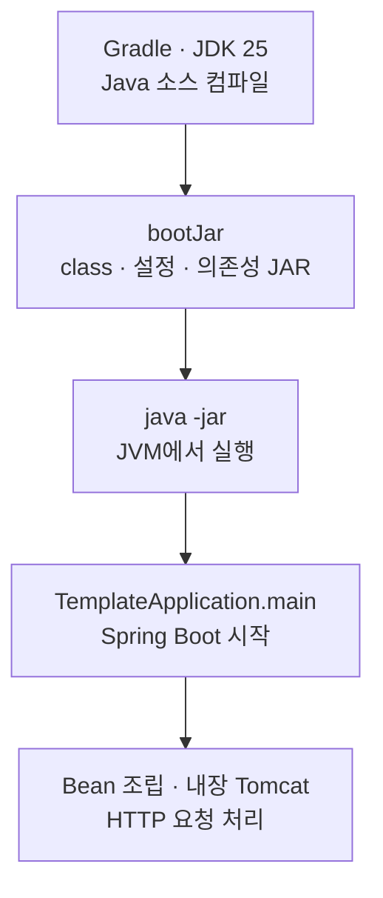

# JDK와 Spring Boot 실행 이해

이 구현은 Java 25를 기준으로 빌드하고 실행합니다. 실행 순서와 명령은
[사용 안내](../../java/spring-boot/README.md), 아래는 그 명령이 동작하는 원리입니다.

## 각 도구의 역할

| 구성 | 담당하는 일 | 이 프로젝트에서 보는 곳 |
| --- | --- | --- |
| JDK | Java 개발 도구와 실행 환경. `javac`는 소스를 class 파일로 컴파일하고 `java`는 JVM을 시작합니다 | 로컬 빌드·테스트, Docker 빌드 단계 |
| JVM | class의 bytecode 실행, 메모리·GC·thread 관리 | 실행 중인 서버 프로세스 |
| Gradle Wrapper | 정해진 Gradle 버전으로 의존성 해석·컴파일·테스트·패키징을 실행합니다 | `./gradlew`, `build.gradle.kts` |
| Spring Boot | JVM 안에서 설정·Bean·내장 Tomcat을 조립하고 앱의 시작·종료를 관리합니다 | `TemplateApplication`, `config/` |
| JPA·Hibernate | Jakarta Persistence 계약과 그 구현체로 객체·DB 저장을 연결합니다 | `repositories/`, `TransactionConfiguration` |

JDK의 JDBC API(`java.sql`) 위에서 H2 driver·Hikari·Hibernate가 동작합니다.
Spring의 DI나 JPA transaction은 JDK 자체 기능에 포함되지 않습니다.
컴파일과 실행의 구분은 JDK 25의 [javac](https://docs.oracle.com/en/java/javase/25/docs/specs/man/javac.html),
[java](https://docs.oracle.com/en/java/javase/25/docs/specs/man/java.html) 명령 설명을 기준으로 합니다.

## 소스에서 서버까지

`clean test bootJar`는 이전 빌드 산출물을 지우고 테스트한 뒤 실행 JAR를 만듭니다.
`bootJar` 단독 실행은 테스트를 실행하지 않습니다. 생성된 JAR에는 앱 class·설정과 실행 의존성이 들어가며,
`scripts/start.sh`는 `java -jar`로 실행합니다. 별도 Tomcat 설치는 필요하지 않습니다.
이는 [Spring Boot 실행 JAR](https://docs.spring.io/spring-boot/reference/using/running-your-application.html) 방식입니다.
`--seed` 실행은 같은 main에서 웹 서버를 끄고 seed 작업 후 Spring context를 닫습니다.

Docker는 JDK 이미지에서 빌드하고 Temurin JRE 이미지에서 실행합니다.
최종 이미지에는 컴파일러가 필요하지 않으며, JVM과 실행 라이브러리로 JAR를 구동합니다.

## 버전이 적용되는 위치

Java major의 정본은 `java/spring-boot/.java-version`입니다.
Gradle toolchain이 이 값을 읽어 컴파일·테스트 JDK를 선택하고,
중앙 `scripts/compose.sh`는 같은 값을 Docker의 `JAVA_VERSION` build arg로 전달합니다.
Docker 빌드 단계에서도 파일과 arg의 일치를 검사합니다.

`.java-version` 자체가 JDK를 설치하거나 셸의 Java를 바꾸지는 않습니다.
`gradlew`를 시작하는 Java는 `JAVA_HOME`을 우선 사용하지만,
`scripts/start.sh`는 `PATH`에서 `java`를 찾습니다. 따라서 로컬에서는 둘을 같은 JDK 25로 맞춥니다.
현재 Gradle 설정에는 JDK 자동 다운로드용 resolver가 없으므로 JDK를 먼저 설치해야 합니다.
Gradle을 실행하는 JVM과 toolchain의 구분은 [공식 toolchain 설명](https://docs.gradle.org/current/userguide/toolchains.html)을 따릅니다.

현재 `--release` 하위 버전 타깃은 설정하지 않았으며 Java 21에서의 실행을 지원한다고 가정하지 않습니다.
`25`는 major 선택입니다. 로컬 JDK의 배포판·patch까지 고정하지 않으며 Docker 태그도 major 기준입니다.
실제 사용한 버전과 시험 결과는 [검증 기록](spring-boot-verification.md)이 소유합니다.

## 실제 코드를 읽는 기준

아래 경로는 `src/main/java/com/example/backendtemplate/` 기준입니다.

| 코드 | Java·JDK가 제공하는 것 | 이 구현의 사용 방식 |
| --- | --- | --- |
| `contracts/Greeting.java` | `record`, `java.time.Instant` | 내부 결과를 값으로 전달합니다. record는 필드 참조의 재할당을 막지만 참조한 컬렉션까지 불변으로 만들지는 않습니다 |
| `services/GreetingService.java` | 생성자·`final` 필드·`java.time.Clock` | 필요한 Clock을 생성자로 받고 현재 시각을 읽습니다. Spring이 실제 Bean을 주입합니다 |
| `config/ClockConfiguration.java` | `Clock.systemUTC()` | UTC Clock을 Bean으로 조립합니다. 테스트는 같은 생성자에 고정 Clock을 전달할 수 있습니다 |
| `TemplateApplication.java` | `main`, 지역 변수 타입 추론 `var`, 예외 처리 | Java 진입점에서 Spring을 시작합니다. `var`는 동적 타입이 아니라 컴파일 시 타입 추론입니다 |

이 문법·표준 API가 모두 Java 25에서 처음 도입된 것은 아닙니다.
현재 구현은 preview 옵션이나 virtual thread 활성화를 설정하지 않습니다.
JDK 버전을 올리는 것만으로 예약 정합성·멱등성이 보장되지 않으며,
그 보장은 [Service transaction과 DB 제약](spring-boot.md#h2와-transaction)이 담당합니다.

공식 근거 확인: 2026-09-08. JDK 표준 API는 [Record](https://docs.oracle.com/en/java/javase/25/docs/api/java.base/java/lang/Record.html),
[Clock](https://docs.oracle.com/en/java/javase/25/docs/api/java.base/java/time/Clock.html),
[JDBC](https://docs.oracle.com/en/java/javase/25/docs/api/java.sql/module-summary.html)를 참조합니다.
