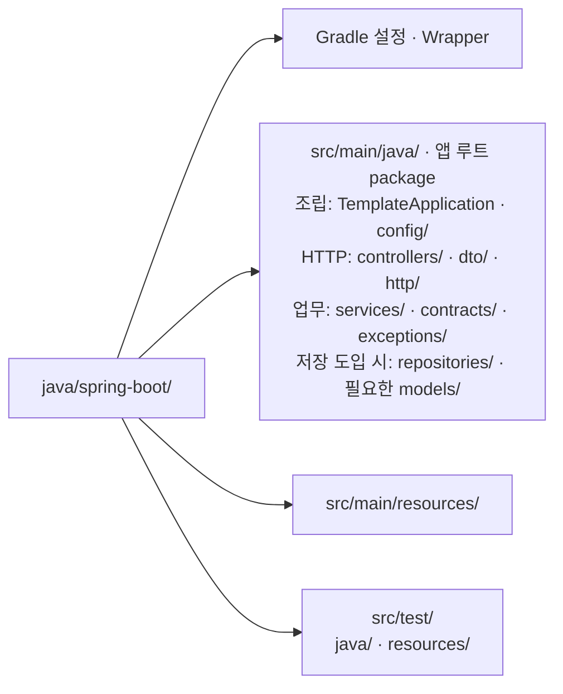
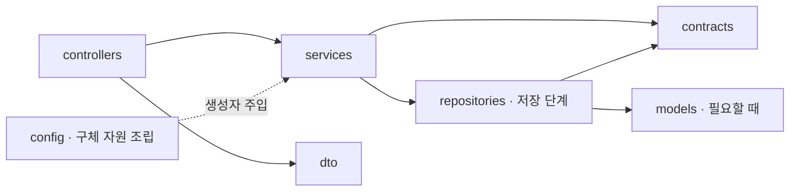

# Spring Boot 폴더 구조와 활용 기준

Status: 역할별 배치 설계안 · 아래 파일은 생성 예정 · 2026-09-08

이 문서는 package·파일의 역할과 기능을 추가하는 위치를 소유합니다.
DI·수명·transaction 선택은 [구현 설계](spring-boot.md), 실행 순서는 [task](spring-boot-tasks.md)가 소유합니다.

## 기본 배치

**Gradle 표준 source set 안에서 역할별 package를 나누고, 기능별 Java 파일을 둡니다.**
FastAPI의 `src/`와 `tests/`를 그대로 복제하지 않고 Java 관용 배치인
`src/main/java`·`src/test/java`를 사용합니다. 테스트 자원도 `src/test/resources`로 분리합니다.
[Gradle Java project layout](https://docs.gradle.org/current/userguide/java_plugin.html#sec:java_project_layout)

아래는 단계가 진행되면서 생길 위치입니다. Task 1에는 인사 API에 필요한 파일만 만들고
예약·DB·migration·추가 계층은 해당 task에서 생성합니다.

그림의 조립·HTTP 경계·업무·저장은 역할 묶음입니다. 실제 package와 파일은 아래 표를 따릅니다.

## 파일 분배

경로는 별도 표시가 없으면 `src/main/java/com/example/backendtemplate/` 기준입니다.
Java의 public top-level 타입은 타입명과 같은 파일에 하나씩 둡니다.

| 위치 | 소유하는 내용 | 넣지 않는 내용 |
| --- | --- | --- |
| `TemplateApplication.java` | `main`·`@SpringBootApplication`, 앱의 scan 루트 | endpoint·업무 판단 |
| `config/ClockConfiguration.java` | `Clock` 같은 의존성의 `@Bean` 조립 | 요청 처리·업무 상태 |
| `config/AppProperties.java` | 검증되는 앱 설정 record | 런타임 container 조회 |
| `controllers/GreetingController.java` | HTTP 입력·업무 호출·DTO 변환 | SQL·transaction 제어 |
| `services/GreetingService.java` | 주입받은 Clock으로 인사 결과 생성 | Servlet·HTTP 응답 DTO |
| `contracts/Greeting.java` | 내부 업무 결과 record | Jackson·JPA annotation |
| `dto/GreetingResponse.java`, `dto/ApiResponse.java` | 외부 JSON과 성공 envelope | 저장 모델·업무 정책 |
| `http/ApiExceptionHandler.java` | 공개 오류 코드·ProblemDetail·HTTP 상태 매핑 | DB 또는 업무 변경 |
| `http/RequestContextFilter.java` | 요청 ID·로그 문맥 설정과 정리 | 숨은 commit |
| `exceptions/` | 발생한 업무 실패의 명시적 타입 | 모든 오류를 감싸는 범용 예외 |
| `services/ReservationService.java` | 예약 순서·원자적 범위·멱등 결과 판단 | 직접 SQL·HTTP 헤더 객체 |
| `repositories/ReservationRepository.java` | 조건부 변경·저장·조회·저장 오류 번역 | commit·Controller 호출 |
| `models/` | DB 매핑에 실제로 필요한 타입 | 공통 API schema·빈 Entity Base |
| `src/main/resources/` | 앱 설정, DB 선정 후 migration 리소스 | 환경별 비밀값 |
| `src/test/java/` | 단위·HTTP·DB·경합·복구 시험 | 운영 코드의 테스트 도우미 의존 |
| `src/test/resources/` | 격리 시험 설정·fixture | 개인 `.env` 복제 |

루트 package 위의 default package나 저장소 전체를 scan하지 않습니다.
`config/`는 앱 조립 위치이며 Nest의 `Module`과 같은 export 경계가 아닙니다.
Spring은 특정 폴더 구성을 강제하지 않으므로 역할별 package는 이 프로젝트의 선택입니다.
[Spring Boot code layout](https://docs.spring.io/spring-boot/reference/using/structuring-your-code.html)

## DTO·contract·저장 모델

외부 입출력 DTO는 `dto/`, 업무 간 공유 값은 `contracts/`, DB 전용 표현은 필요할 때 `models/`에 둡니다.
단순 불변 입력·결과에는 record를 사용할 수 있습니다. JPA를 선택하더라도 HTTP DTO를 Entity로 사용하지 않습니다.
JDBC RowMapper가 바로 내부 결과를 만들 수 있다면 중복된 row model은 만들지 않습니다.

여러 기능이 사용하는 `Reservation` 타입은 `ReservationService.java`의 중첩 타입으로 숨기지 않고
`contracts/Reservation.java`에 둡니다. 한 파일에서만 쓰는 작은 helper·중첩 타입은 그 파일에 유지합니다.
단순 문자열 하나에 별도 command record를 만들지 않으며 필드가 같다는 이유만으로 모든 경계에 변환기를 추가하지 않습니다.

Java에서 하위 package는 부모 package의 package-private 멤버를 공유하지 않습니다.
package 간 계약에는 `public`, 파일 내부 구현에는 필요한 접근 제한자를 사용합니다.
멤버는 `private final`처럼 Java의 실제 접근 제한으로 표현하고 이름 앞 밑줄을 붙이지 않습니다.
transaction proxy 대상의 `final`·`private` 제약은 [transaction 설계](spring-boot.md#db와-업무-트랜잭션)를 따릅니다.
[Java 접근 제어](https://docs.oracle.com/javase/specs/jls/se26/html/jls-6.html#jls-6.6)

## 의존 방향과 업무 조합

실선은 소스 의존 방향입니다. contract는 Service·Controller·Repository 구현을 import하지 않습니다.
저장 구현을 실제로 교체해야 할 때는 필요한 행위의 interface를 `contracts/`에 두고 Repository가 구현합니다.
각 Service마다 interface/Impl·Mapper·Facade를 기계적으로 만들지 않습니다.

여러 업무를 묶는 기능이 생기면 `services/CheckoutService.java`처럼 그 업무의 이름으로 조합합니다.
Controller → CheckoutService → 주문·재고 업무의 방향을 유지하고 참여 업무는 CheckoutService를 역호출하지 않습니다.
다른 기능의 테이블을 직접 조작하는 대신 소유 기능의 공개 조회·변경 계약을 호출합니다.

A → B → A가 생기면 필요한 데이터를 조합 Service가 구해 전달하거나 업무 경계를 바꿉니다.
`@Lazy`·setter injection·순환 참조 허용 설정으로 숨기지 않습니다.
여러 package가 있다는 사실만으로 접근 경계가 강제되지는 않으므로 review와 실제 의존 관계를 확인합니다.

## 빌드·컨테이너와 문서

`java/spring-boot/`는 자기 Gradle Wrapper·빌드 설정·환경 예시를 소유합니다.
Dockerfile은 실행 이미지가 필요할 때 이 경로에 추가합니다.
공통 실행 선택과 모니터링 수집은 기존 루트 구성을 확장하며 별도 Compose를 복제하지 않습니다.
실행 포트는 [중앙 배정표](README.md#로컬-포트-배정)가 소유합니다.

생성·빌드가 검증된 다음 구현 디렉터리의 README를 사용 가이드로 연결합니다.
구조·선택 근거는 이 문서와 구현 설계에, 작업 현황·실제 시험 결과는 각각 task와 검증 문서에 유지합니다.

공식 문서 확인일: **2026-09-08**.
