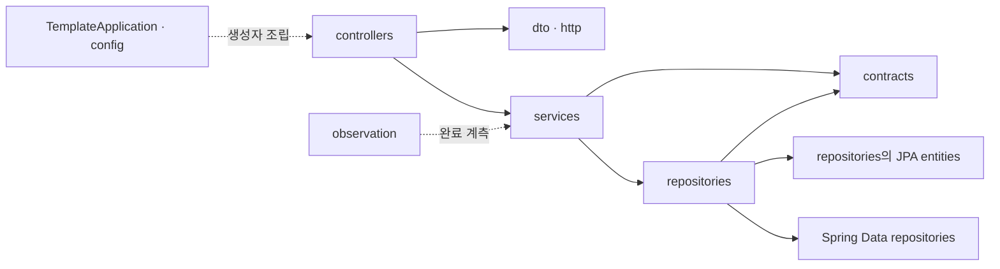

# Spring Boot 폴더 구조와 활용 기준

Status: 실제 구현 파일 기준 · 2026-09-08

Gradle 표준 `src/main/java`·`src/test/java` 안에서 역할별 package, 그 안에 기능별 파일을 둡니다.
설정·transaction 의미는 [구현 설계](spring-boot.md), 명령은 [사용 가이드](../../java/spring-boot/README.md)를 봅니다.

아래 경로는 `java/spring-boot/src/main/java/com/example/backendtemplate/` 기준입니다.

| 파일·영역 | 실제 책임 |
| --- | --- |
| TemplateApplication | scan 루트·main·명시적인 seed 실행·시작 실패 종료 |
| config/DatabaseEnvironment | 빈 DB URL의 초기 no-db 조립 |
| config/AppProperties, PoolProperties | 환경·pool 입력 검증 |
| config/ClockConfiguration | Clock Bean |
| config/TransactionConfiguration | 단일 JpaTransactionManager·rollback-on-commit-failure·listener |
| config/SeedConfiguration | 명시적 CLI seed의 입력과 호출 |
| config/OpenApiConfiguration | 공개 Problem schema·오류 응답 문서 |
| controllers | HTTP 입력·업무 호출·외부 DTO 변환 |
| dto | ApiResponse, GreetingResponse, ReserveRequest, ReservationResponse, Problem, FieldError |
| http/Inputs, InvalidInput, ReserveRequestDeserializer | 허용 입력·누락/null의 구분·field 오류 |
| http/ApiExceptionHandler, FallbackErrorController | 공개 오류 번역·프로토콜 헤더 |
| http/RequestContextFilter | 서버 request ID·MDC·Servlet 완료 관측 |
| services/GreetingService | Clock을 사용한 내부 Greeting 생성 |
| services/ReservationService | public transaction·예약/seed/replay |
| services/ReservationAttempts | unique claim 실패 transaction 종료 뒤 재생 transaction 호출 |
| repositories/ReservationRepository | entity persist·claim flush·contract 변환·저장 조합 |
| repositories/ProductRepository, ReservationReplayRepository | Spring Data 조회·존재 확인·조건부 JPQL 재고 차감 |
| repositories/*Entity, UtcTimestampConverter | 기존 H2 table·FK association·VARCHAR UTC timestamp mapping |
| contracts | 프레임워크 독립적인 Greeting, Reservation, ReservationResult |
| exceptions | 업무 거절 Reason·내부 IdempotencyClaimed |
| observation/TransactionMetrics | 실제 transaction 완료 listener |
| observation/SafeLoggingCustomizer | Boot JSON 출력의 민감 원문 정제 |

Entity는 repositories 경계 안에서만 사용하며 저장 결과를 프레임워크 독립 contract로 변환합니다.
신규 assigned ID에는 EntityManager.persist를 사용하고 조회·조건부 변경은 Spring Data 메서드로 표현합니다.
별도 Base·interface/Impl·Facade 또는 entity와 같은 필드의 추가 도메인 객체는 만들지 않습니다.
업무는 SQL·Servlet·HTTP DTO를 import하지 않습니다.
ReservationAttempts는 단순 전달용 wrapper가 아니라 unique claim 충돌의 transaction 간 복구 책임을 가집니다.
새 업무의 transaction은 public Service proxy 경계에 두며 같은 객체 내부 호출에 transaction 적용을 기대하지 않습니다.

`src/main/resources/application.yaml`은 기본 설정, profile 파일은 no-db·seed의 선택 구성을 소유합니다.
`META-INF/spring.factories`는 Boot의 초기 environment processor를 등록합니다.
`db/migration/`에는 공식 CLI로 만든 V1·V2가 있으며 기존 schema를 변경할 때 새 migration을 추가합니다.

`src/test/java/`에는 순수 Clock·MDC·관측 격리 시험, 실제 HTTP/file DB 시험,
JPA manager의 실제 JDBC commit/rollback 실패 주입, flush·stale entity·batch 순서,
migration 보존·schema validate·초기화·종료·독립 JVM 경합·복구 시험이 있습니다.
ProcessWorker·ShutdownWorker는 테스트 전용이며 배포 JAR에 들어가지 않습니다.

`.java-version`, Wrapper, build.gradle.kts, gradle.lockfile이 빌드 입력을 소유합니다.
Dockerfile·scripts/start.sh·.env.example·README는 자기 구현 실행을 소유하고
공통 Compose·수집기·MkDocs 메뉴는 중앙에서 통합합니다.
`data/`, `.env`, build 산출물은 commit하지 않습니다.
