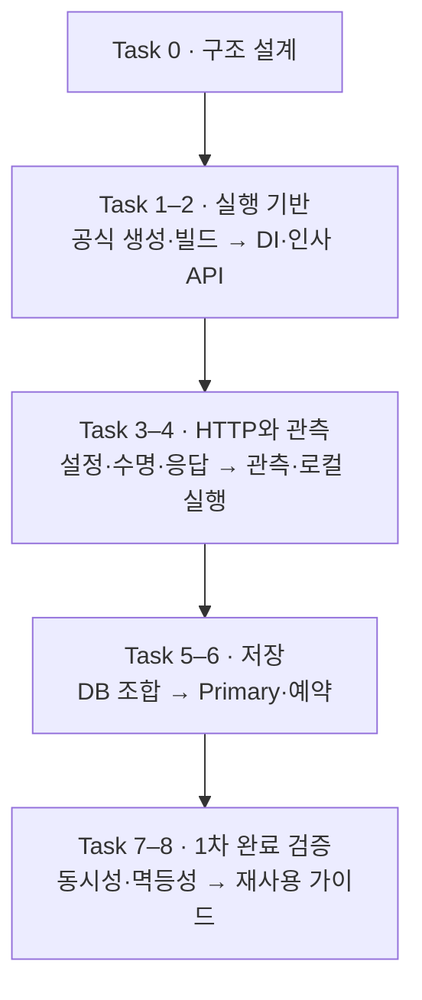

# Spring Boot 단계별 구현 task

Status: Task 0 설계안 작성·검토 완료 · Task 1 이후 미착수 · 2026-09-08

목표는 작은 앱에서 시작해 한정 수량 예약의 동시성·멱등성까지 한 사이클을 검증하는 것입니다.
현재 작업은 구현 준비 문서이며 Java 프로젝트·DB·컨테이너를 생성하지 않습니다.
구현 선택은 [설계](spring-boot.md), 파일 배치는 [구조](spring-boot-structure.md),
시험 기준은 [검증 계획](spring-boot-verification.md)이 소유합니다.

각 task는 독립 검증과 commit 단위로 진행합니다. 완료 시 이 상태와 검증 기록을 함께 갱신합니다.
DB·공유 수집기 변경은 해당 단계에서 변경 대상과 범위를 구체화합니다.

## Task 0. 폴더·DI·런타임 설계

목표:
FastAPI와 같은 책임 계약을 Spring 관용 구조로 표현합니다.

예상 결과:

- 구현·구조·검증·task 문서가 각각의 책임을 소유합니다.
- 생성자 DI·MVC·Service transaction 경계와 남은 선택이 구분됩니다.
- 포트는 [중앙 배정표](README.md#로컬-포트-배정)에 연결됩니다.

## Task 1. Initializr 프로젝트와 Gradle 빌드

목표:
지원되는 JDK·Boot·Gradle 조합으로 `java/spring-boot/`를 공식 생성합니다.

예상 결과:

- Initializr metadata에 근거한 버전·의존성 선택과 Gradle Wrapper가 존재합니다.
- 빌드·기본 시험·앱 시작이 같은 버전 설정으로 재현됩니다.
- 전역 설정 변경 없이 구현별 환경 예시와 정확한 실행 명령이 제공됩니다.

## Task 2. 생성자 DI와 인사 API

목표:
Controller → Service → 내부 결과의 최소 흐름을 역할별 파일로 연결합니다.

예상 결과:

- Clock 주입과 순수 단위 시험이 동작합니다.
- 외부 DTO와 내부 contract가 구분되고 HTTP 성공 응답이 공통 계약을 따릅니다.
- 불필요한 interface/Impl·Base·Facade와 순환 의존이 없습니다.

## Task 3. 설정·수명·예외 처리

목표:
검증되는 설정과 시작·종료, 공개 오류 변환을 구성합니다.

예상 결과:

- 설정 실패·부분 초기화·정상 종료의 자원 정리가 확인됩니다.
- 입력 거절·업무 실패·404·405·500이 공통 Problem 계약으로 반환됩니다.
- liveness와 readiness의 의미 및 필수 조건이 명시됩니다.

## Task 4. Metrics·Logging·로컬 실행

목표:
Actuator·Micrometer와 구조화 로그를 연결하고 기존 로컬 실행 선택에 Spring을 추가합니다.

예상 결과:

- 실제 HTTP·JVM 지표와 기존 대시보드의 대응표가 존재합니다.
- 요청 ID·MDC 정리·로그 필드·민감정보 시험이 통과합니다.
- 구현별 이미지 빌드와 중앙 포트 배정으로 다른 서비스를 침범하지 않고 실행됩니다.
- OpenAPI 라이브러리의 Boot 호환성과 실제 API 문서가 확인됩니다.

## Task 5. DB·driver·migration 조합 결정

목표:
SQLite 또는 PostgreSQL에서 첫 예약 구현에 사용할 JDBC·migration 조합을 확정합니다.

예상 결과:

- driver·transaction 시작·FK·busy/pool timeout·migration 호환성이 확인된 선택이 있습니다.
- SQLite와 PostgreSQL에서 다시 검증할 차이가 기록됩니다.
- 실제 시험 DB·격리 방법·pool 예산이 정해지고 공유 자원의 변경 범위가 구체화됩니다.

## Task 6. Primary 자원과 예약 저장

목표:
선택 DB의 자원 수명·migration·Repository·업무 transaction을 연결합니다.

예상 결과:

- 한 업무의 재고 차감·예약·멱등 결과 저장이 같은 Primary transaction에 참여합니다.
- commit 완료 후 성공 응답, 실패 시 rollback, 종료 후 pool 반환이 확인됩니다.
- DB pool 지표와 실제 transaction outcome의 의미가 구분됩니다.

## Task 7. 동시성·멱등성·복구

목표:
단일 프로세스와 여러 프로세스에서 경쟁 요청·중복 요청·응답 유실을 처리합니다.

예상 결과:

- 재고 한도·키별 단일 효과·원래 결과 재생이 실제 DB에서 확인됩니다.
- commit 실패·프로세스 종료·pool/잠금 timeout 뒤의 상태와 재시도가 검증됩니다.
- 테스트 환경·명령·결과가 검증 문서에 기록됩니다.

## Task 8. 복사해서 사용하는 가이드

목표:
새 디렉터리에서 README만 따라 빌드·실행하고 업무를 추가할 수 있도록 안내합니다.

예상 결과:

- 시작 명령·확인 주소·API 추가 위치가 사용 가이드에 있습니다.
- 상세 설계·사용 절차·작업 및 검증 기록이 MkDocs의 기존 영역으로 분리됩니다.
- 새 위치의 설치·migration·실행과 기존 데이터 보존이 확인됩니다.
