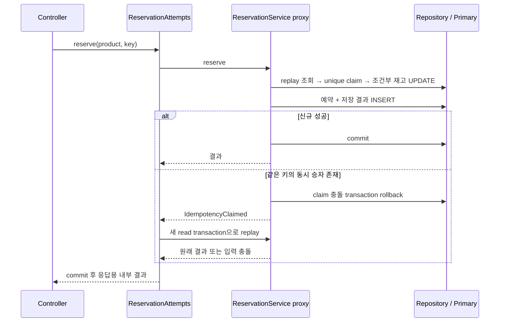

# Java / Spring Boot 구현 설계

Status: Task 1–8 구현·검증 진행 결과 반영 · 2026-09-08

공통 계약은 [Backend](../backend.md), [개발 원칙](../engineering.md),
[관측](../observability.md)이 소유합니다. 실행 명령은 [구현 README](../../java/spring-boot/README.md),
증거·제한은 [검증 기록](spring-boot-verification.md)을 봅니다.

## 선택과 고정

| 항목 | 실제 선택 |
| --- | --- |
| 생성 | Spring Initializr 공식 API, Java 코드·Gradle Kotlin DSL |
| 런타임 | Java major 25, MVC·Tomcat, constructor DI |
| 빌드 | Boot 4.1.1, Wrapper 9.7.1, strict dependency lock |
| 시간 | Clock Bean, 내부 Instant·UTC |
| HTTP | DTO·내부 contract 분리, 명시적 data 응답·Problem Details |
| DB | 선택 활성화되는 단일 Primary H2 2.4.240, JdbcClient·Hikari |
| migration | Boot 관리 Flyway 12.4.0, 공식 Flyway CLI 13.4.0 add로 파일 생성 |
| 관측 | Actuator·Micrometer·SLF4J·Boot ECS JSON |
| 문서 | Springdoc 3.1.1, 실제 OpenAPI HTTP 응답 검증 |

Java major는 `java/spring-boot/.java-version`이 단독 소유합니다.
Gradle toolchain은 그 파일을 읽고 중앙 Compose는 같은 값을 Docker `JAVA_VERSION` arg에 전달합니다.
Docker 빌드도 arg와 파일 값의 일치를 검사합니다. 머신의 기본 JDK는 변경하지 않습니다.
Initializr 최초 생성은 설치되어 있던 Java 21로 검증·commit했고 중앙 결정 후 최신 LTS 25로 올렸습니다.
Boot가 지원하는 Gradle·Java 조합과 Springdoc의 Boot 4 지원을 공식 문서로 확인한 뒤 실제 빌드했습니다.
버전별 실행 증거는 검증 기록이 소유합니다.

## 조립과 수명

Controller·Service·Repository는 명시적 생성자를 사용합니다.
Clock 같은 실제 공유 의존성만 config의 Bean으로 조립하며 interface/Impl·Facade·Base를 기계적으로 만들지 않습니다.
내부 업무는 HTTP DTO·Servlet·환경 변수를 읽지 않습니다.

`DatabaseEnvironment`는 Boot 4의 EnvironmentPostProcessor로 config data를 읽은 뒤 Bean 조립 전에 실행됩니다.
DB URL이 비면 no-db profile·auto-configuration 제외·readiness 구성을 설정합니다.
DB 비활성은 정상 상태이며 인사·health·metrics·docs가 동작하고 예약 Controller·Service·Repository가 없습니다.
DB를 켜면 Flyway가 먼저 schema를 검증·적용하고 Hikari를 통해 Primary에 연결합니다.
잘못된 앱 환경·pool 범위는 시작 실패입니다. 시작 중간 실패와 종료에서 획득한 pool을 닫습니다.
graceful shutdown은 유한 시간이며 테스트에서는 SIGTERM 중 진행 HTTP 요청의 완료와 파일 잠금 해제를 확인합니다.

## HTTP 계약

업무 성공은 Controller가 내부 결과를 DTO와 data envelope로 변환합니다.
자동 wrapping advice가 없으므로 health·metrics·docs·파일·204·stream은 원래 응답을 유지합니다.
공개 경로·필드·status·headers는 FastAPI 코드와 HTTP 시험을 대조했습니다.
루트 인사 문구는 구현 이름인 `Hello, Spring Boot!`입니다.

입력 422에는 잘못된 JSON·타입·누락·빈 값·길이·token pattern·알 수 없는 body 필드가 포함됩니다.
예약의 작은 전용 deserializer가 누락(REQUIRED)과 명시적 null/숫자(INVALID)를 구분합니다.
공개 field location만 노출하고 외부 입력·예외 원문을 오류에 포함하지 않습니다.
404·405·업무 오류·500도 같은 Problem DTO이며 `Allow`, `Retry-After`를 보존합니다.
Spring ProblemDetail의 status/title을 사용하되 요청 URI를 자동 instance에 넣지 않도록 공개 DTO로 제한합니다.
서버 생성 32자리 request ID는 헤더·오류 body·로그에서 일치합니다.

## H2와 transaction

H2 file DB는 JVM 재시작 사이에 예약 결과를 보존합니다. 앱 실행 중 같은 embedded 파일을 다른 JVM에서 열 수 없습니다.
다중 프로세스 시험에만 중앙 승인된 loopback·OS 임시포트·임시파일의 H2 TCP 서버를 사용합니다.
AUTO_SERVER·H2 console·PostgreSQL compatibility mode는 기본 실행에 사용하지 않습니다.
H2 시험은 PostgreSQL 또는 SQLite의 잠금·driver 검증이 아닙니다.

public Service 메서드의 `@Transactional(rollbackFor = Exception.class)`가 업무 경계입니다.
Controller는 생성자에 주입된 proxy를 호출하고 self-invocation이나 직접 new 호출에 의존하지 않습니다.
Repository는 commit하지 않습니다. 기본 REQUIRED·단일 Primary만 사용합니다.

V2 migration은 초기 guard 행을 제거하고 `reservation_claims`의 unique key로 키별 소유권을 보호합니다.
같은 키의 중복 INSERT는 DB에서 경쟁 transaction의 완료를 기다립니다.
충돌이 확정되면 실패한 transaction이 rollback된 뒤 ReservationAttempts가 새로운 Primary 조회를 호출합니다.
이 경계는 실제 unique 충돌 복구만 담당하며 업무 전체의 무제한 자동 재시도가 아닙니다.
다른 상품·다른 키는 전역 잠금 없이 독립 진행합니다.
재고는 조건부 UPDATE와 CHECK 제약으로 음수가 되지 않으며 예약·claim·재생 결과가 같은 transaction에 저장됩니다.
실패한 요청은 claim도 rollback합니다. 멱등 결과에는 만료·인증 scope를 추가하지 않았습니다.

H2 lock timeout은 DATABASE_BUSY 503, Hikari pool 획득 timeout은 DATABASE_POOL_TIMEOUT 503과 Retry-After 1로 번역합니다.
JdbcTransactionManager는 commit 실패 때 rollback하도록 설정했고 실제 JDBC commit 호출 경계의 장애 주입으로
HTTP 500·독립 연결의 전체 rollback·같은 키 재시도를 확인했습니다.
이 시험은 실제 파일시스템 고장이나 H2가 이미 commit한 뒤 결과가 불명인 상황의 자동 복구 보장이 아닙니다.

## 로그·metrics

RequestContextFilter는 동기 Servlet 종료 또는 async 완료에 요청 요약을 한 번 기록합니다.
미처리 chain 실패는 원래 예외를 보존하며 failure로 기록합니다.
HTTP 상태와 response committed 여부는 Servlet 관측값이며 클라이언트 수신 확인이 아닙니다.
MDC는 finally에서 정리하고 async 완료 callback에서도 이전 thread 문맥을 복구합니다.
이미 committed된 stream 실패에는 Problem body를 덧붙이지 않습니다.

Boot의 구조화 출력 확장점으로 예외 메시지·stack trace와 검토되지 않은 framework 메시지를 정제합니다.
raw query·header·body·멱등 키를 기록하지 않으며 정제되지 않은 라이브러리 로그를 안전하다고 가정하지 않습니다.
허용 사건은 http.completed, application.failed이고 나머지는 framework.event로 나타납니다.
이 선택은 원문 진단 정보의 감소를 뜻하며 운영 수집·보존·무손실을 보장하지 않습니다.

TransactionExecutionListener에서 실제 commit/rollback/failed를 기록합니다.
Service return은 계측 시점이 아닙니다. 재생·seed도 transaction 수에 포함하므로 신규 예약 성공 수로 해석하면 안 됩니다.
계측 실패는 업무 결과를 바꾸지 않도록 격리합니다.
표준 HTTP·JVM·pool 지표와 중앙 대시보드의 대응은 검증 기록의 표를 봅니다.

## 공식 근거

모두 2026-09-08 확인했습니다.

- [Initializr](https://start.spring.io), [Boot 시스템 요구사항](https://docs.spring.io/spring-boot/system-requirements.html)
- [Gradle 호환](https://docs.gradle.org/current/userguide/compatibility.html), [dependency locking](https://docs.gradle.org/current/userguide/dependency_locking.html)
- [Springdoc 호환](https://springdoc.org/#what-is-the-compatibility-matrix-of-springdoc-openapi-with-spring-boot)
- [H2 연결 모드](https://www.h2database.com/html/features.html#connection_modes)
- [Spring transaction proxy](https://docs.spring.io/spring-framework/reference/data-access/transaction/declarative/annotations.html)
- [Boot 구조화 로그](https://docs.spring.io/spring-boot/reference/features/logging.html#features.logging.structured)
- [Flyway CLI](https://documentation.red-gate.com/flyway/reference/usage/command-line)
- [Spring 7.0.9 Servlet flush 구현](https://github.com/spring-projects/spring-framework/blob/v7.0.9/spring-web/src/main/java/org/springframework/http/server/ServletServerHttpResponse.java)
