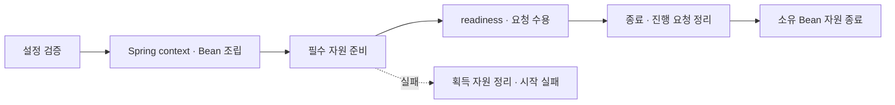
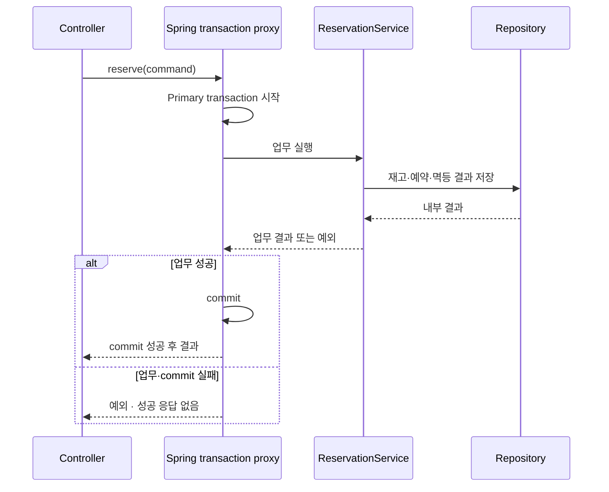

# Java / Spring Boot 구현 설계

Status: 설계안 · 프로젝트 미생성 · 실행·검증 전 · 2026-09-08

Spring Boot에서 공통 계약을 실현하는 선택을 소유합니다.
파일 배치는 [폴더 구조](spring-boot-structure.md), 진행 순서는 [task](spring-boot-tasks.md),
통과 조건은 [검증 계획](spring-boot-verification.md)에서 확인합니다.

## 첫 구현의 선택

| 항목 | 설계안 | 이유·확정 시점 |
| --- | --- | --- |
| 프로젝트 | `java/spring-boot/`, 단일 Gradle 프로젝트 | Spring Initializr로 생성하고 Gradle Wrapper를 함께 관리합니다. |
| 실행 모델 | Spring MVC, 일반 동기 업무 메서드 | JDBC 기반 예약을 이해하는 첫 구현입니다. WebFlux·virtual threads는 실측 필요가 생길 때 검토합니다. |
| 코드 배치 | 역할별 package, 기능별 Java 파일 | Controller·Service·Repository의 경계를 유지합니다. |
| DI | 생성자 주입, 앱 범위 component scan | 단일 구현은 구체 타입으로 주입하고 실제 교체 경계만 interface로 표현합니다. |
| HTTP | 공통 성공 envelope·Problem Details | Spring 기본 오류 응답을 그대로 공통 계약으로 간주하지 않습니다. |
| 관측 | Actuator·Micrometer·Boot 구조화 로깅 | 프레임워크 계측을 사용하고 부족한 업무 의미만 추가합니다. |
| 저장 | DB 없는 앱부터 시작, JDBC/JdbcClient 우선 후보 | DB·driver·migration 조합은 Task 5에서 선택합니다. |

Spring은 blocking 저장 API를 사용하는 일반적인 구성에 MVC를 권합니다.
MVC 선택은 이 템플릿의 설계 판단이며 성능 우위를 검증한 결과가 아닙니다.
[Spring MVC와 WebFlux 선택 기준](https://docs.spring.io/spring-framework/reference/web/webflux/new-framework.html#webflux-framework-choice)

## 생성과 버전 관리

[Spring Initializr](https://docs.spring.io/initializr/docs/current/reference/html/)의 metadata에서
Java·Boot·의존성 지원 조합을 확인한 뒤 공식 생성 API로 프로젝트를 만듭니다.
Java 코드와 Gradle Kotlin DSL을 사용하고, 처음에는 Web MVC·Validation·Actuator·테스트 의존성만 선택합니다.
정확한 dependency ID는 생성 시 metadata를 기준으로 사용합니다.

2026-09-08 확인한 [Boot 시스템 요구사항](https://docs.spring.io/spring-boot/system-requirements.html)은
Boot 4.1.1에 Java 17~26, Gradle 8.14 이상 8.x 또는 9.x를 명시합니다.
이 표는 설치·실행 검증이 아닙니다. Task 1에서 정식 릴리스 조합과 부속 라이브러리 호환성을 확인해 고정합니다.

JDK 선택은 Gradle toolchain 설정, Gradle 버전은 Wrapper, Boot 버전은 plugin 선언이 소유합니다.
빌드·시험은 생성된 `./gradlew`로 수행하며 Wrapper 갱신은 공식 `wrapper` task를 사용합니다.
실행 JDK와 빌드 toolchain의 호환성도 확인하고 이후 Docker 빌드에 같은 선택을 전달합니다.
[Gradle Wrapper](https://docs.gradle.org/current/userguide/gradle_wrapper.html),
[Java toolchain](https://docs.gradle.org/current/userguide/toolchains.html),
[호환 표](https://docs.gradle.org/current/userguide/compatibility.html)

## DI와 설정

`TemplateApplication`은 루트 package `com.example.backendtemplate`에 둡니다.
component scan은 이 하위로 한정하고 서비스가 `ApplicationContext.getBean()`으로 의존성을 찾지 않도록 합니다.
Service·Controller·Repository는 생성자로 의존성을 받고, `Clock`·외부 client 같은 조립은
`config/`의 `@Bean` 메서드에서 설정합니다. 단일 생성자에는 불필요한 `@Autowired`를 붙이지 않습니다.
[Boot DI 권장](https://docs.spring.io/spring-boot/reference/using/spring-beans-and-dependency-injection.html)

같은 interface의 구현이 실제로 둘 이상이면 `@Qualifier`로 선택합니다.
모든 Service에 interface/Impl 쌍을 만들지 않습니다. Controller·Service singleton에는 요청별 가변 상태,
Connection·EntityManager·사용자 문맥을 필드로 저장하지 않습니다. 시간은 `java.time.Clock`으로 주입합니다.

설정은 `application.yaml`과 환경 변수로 전달하고, 앱 고유 값은 검증되는
`@ConfigurationProperties` record로 묶어 `@EnableConfigurationProperties`에서 등록합니다.
Service에서 환경 변수를 직접 읽거나 `@Value`를 흩뿌리지 않습니다.
`env.example`은 입력 예시이며 Boot가 이 파일을 자동으로 읽는다고 가정하지 않습니다.
실제 환경값 전달 방법은 실행 스크립트를 만들 때 함께 검증합니다.
[외부 설정과 constructor binding](https://docs.spring.io/spring-boot/reference/features/external-config.html)

앱 포트·컨테이너 게시 포트는 [중앙 배정표](README.md#로컬-포트-배정)를 사용합니다.
Spring 설정명은 `server.port`이며 환경 변수는 `SERVER_PORT`입니다.

## 앱과 자원의 수명

Spring context 시작은 Bean 생성·필수 자원 준비를 포함합니다. 순수 Service 단위 시험은 context를 띄우지 않습니다.
Bean constructor에는 외부 접속을 숨기지 않고, 자원 Bean의 생성·종료는 Spring 수명에 연결합니다.
자원 여러 개를 만드는 factory에서 중간에 실패하면 아직 context에 등록되지 않은 자원은 factory가 정리합니다.
[Bean 수명](https://docs.spring.io/spring-framework/reference/core/beans/factory-nature.html)

Actuator의 liveness·readiness를 활용하고 DB를 추가하면 readiness의 필수 조건을 별도로 구성합니다.
스키마 적용은 migration 단계가 소유하며 readiness의 연결 성공만으로 완료를 판단하지 않습니다.
graceful shutdown과 유한 종료 시간을 명시하고 SIGTERM 시험으로 실제 순서를 확인합니다.
[Actuator health](https://docs.spring.io/spring-boot/reference/actuator/endpoints.html),
[Graceful shutdown](https://docs.spring.io/spring-boot/reference/web/graceful-shutdown.html)

## HTTP와 예외

[공통 HTTP 계약](../backend.md#http-응답-계약)의 필드·상태를 그대로 적용합니다.
Controller가 내부 결과를 외부 DTO와 `ApiResponse<T>`로 변환합니다.
자동 응답 wrapping advice는 만들지 않으며 health·metrics·문서·파일·stream에는 envelope를 적용하지 않습니다.

`@RestControllerAdvice`와 `ResponseEntityExceptionHandler`를 기반으로 Spring의 `ProblemDetail`을 사용합니다.
업무 예외는 HTTP 상태를 소유하지 않는 `RuntimeException` 하위 타입으로 정의하고 HTTP 경계에서 매핑합니다.
검증 실패는 공통 422로 변환하며 JSON 파싱·타입 변환·필수 값 누락까지 시험합니다.
404·405와 `/error` fallback, filter 단계 실패도 같은 공개 오류 계약을 만족하는지 확인합니다.
`Allow`·`Retry-After` 등 의미 있는 헤더는 보존합니다.
서버 요청 ID는 `X-Request-ID` 헤더·Problem의 `request_id`·로그에 같은 값으로 전달합니다.
[Spring 오류 응답](https://docs.spring.io/spring-framework/reference/web/webmvc/mvc-ann-rest-exceptions.html)

외부 DTO의 JSON 필드는 공통 계약에 맞추고 Java 필드명은 camelCase를 사용합니다.
이름 변환은 HTTP DTO에 한정해 명시하므로 `request_id` 같은 공통 필드나 Actuator 응답을 전역 변환으로 훼손하지 않습니다.
OpenAPI는 Boot 호환성을 확인한 라이브러리로 연결하고, annotation 명세와 실제 응답을 함께 시험합니다.

## 로그와 지표

Actuator·Micrometer가 제공하는 HTTP·JVM·DataSource/Hikari 지표를 우선 사용합니다.
pool 지표는 업무 트랜잭션 완료 수나 요청별 Session 수를 의미하지 않습니다.
필요한 transaction outcome은 실제 commit·rollback 완료 지점에 연결하며 Service 메서드 내부의 정상 return으로 세지 않습니다.
[Boot 지표](https://docs.spring.io/spring-boot/reference/actuator/metrics.html)

Micrometer의 이름·라벨·완료 시점은 FastAPI 자체 계측과 다릅니다.
기존 대시보드와의 대응표를 Task 4에서 만들고, 전송 완료가 확인되지 않는 경우 그 의미를 축소해 기록합니다.
Prometheus 수집 endpoint는 Actuator exporter를 사용하고 별도 metrics 직렬화기를 만들지 않습니다.

로그는 SLF4J와 Boot의 구조화 출력을 사용합니다. HTTP filter가 서버 요청 ID를 만들고 MDC에 넣으며
정상·예외 경로의 `finally`에서 요청 문맥을 정리합니다. thread 재사용과 error dispatch의 중복 기록을 시험합니다.
비동기 처리를 추가하면 MDC와 transaction의 전파를 별도로 설계합니다.
로그 필드·민감정보 기준은 [관측 정본](../observability.md)을 따릅니다.
[Boot 구조화 로깅](https://docs.spring.io/spring-boot/reference/features/logging.html#features.logging.structured)

## DB와 업무 트랜잭션

기본은 단일 Primary입니다. 첫 후보는 `JdbcClient`로 SQL을 Repository 안에 두고
`JdbcTransactionManager`가 관리하는 트랜잭션에 참여하는 구성입니다.
Spring Data JDBC와 JPA는 별도 선택이며 `JdbcClient` 사용 자체에 ORM Entity는 필요하지 않습니다.
[Spring JDBC](https://docs.spring.io/spring-framework/reference/data-access/jdbc/core.html)

| 후보 | 선택 전에 확인할 내용 |
| --- | --- |
| SQLite + JDBC | driver의 transaction 시작 모드·busy timeout·FK 설정, pool 다중 연결, migration 지원, PostgreSQL과의 SQL 차이를 확인합니다. |
| PostgreSQL + JDBC | 사용할 격리 DB와 권한, driver·migration 조합을 정합니다. 공유 DB 변경은 별도 승인 범위입니다. |
| PostgreSQL + JPA | 영속성 context와 flush·조건부 갱신·잠금이 실제로 필요한지 판단합니다. 선택하면 Entity는 저장 경계에 유지하고 OSIV를 끕니다. |

SQLite를 JPA의 기본 DB로 확정하지 않습니다. Hibernate의 SQLite dialect는 추가 artifact의 community 지원 대상입니다.
JDBC 후보도 호환성·동시성 검증 전에는 지원 완료로 표시하지 않습니다.
[Hibernate dialect 지원 범위](https://docs.hibernate.org/stable/orm/dialect/)

업무 단위의 **public Service 메서드**에 `@Transactional(rollbackFor = Exception.class)`를 두는 안을 기본으로 합니다.
Controller가 주입받은 Service proxy를 호출하고 같은 DB의 내부 저장은 기본 `REQUIRED` 범위에 참여합니다.
Repository는 commit하지 않으며 client 연결 종료가 자동 rollback을 뜻하지 않습니다.

proxy를 거치는 호출만 경계를 적용하므로 같은 객체의 self-invocation이나 `new Service(...)` 호출에는 의존하지 않습니다.
transaction 대상 class·메서드를 `final` 또는 `private`로 두지 않습니다.
실패를 메서드 안에서 삼켜 정상 반환하지 않으며 checked exception도 rollback하도록 위 정책을 명시합니다.
[Spring 선언적 transaction](https://docs.spring.io/spring-framework/reference/data-access/transaction/declarative/annotations.html),
[proxy 제약](https://docs.spring.io/spring-framework/reference/core/aop/proxying.html)

같은 transaction의 Connection은 Spring JDBC가 연결합니다. 요청마다 수동 Connection을 필드에 보관하거나
`CompletableFuture`·`@Async`로 넘기지 않습니다. 조합 Service가 바깥 transaction을 소유할 때만 내부 업무가 참여하고,
원자적으로 묶인다고 확인되지 않은 별도 DB·외부 통신은 포함하지 않습니다.
[JDBC transaction 자원 연결](https://docs.spring.io/spring-framework/docs/current/javadoc-api/org/springframework/jdbc/datasource/DataSourceTransactionManager.html)

`readOnly=true`는 Replica 라우팅 명령이 아닙니다. 저장 직후 조회·변경 판단은 같은 Primary transaction을 유지합니다.
`REQUIRES_NEW`·범용 transaction decorator·자동 재시도는 선행 도입하지 않습니다.
경계가 한 메서드보다 좁아야 하는 실제 요구가 생기면 `TransactionTemplate`을 비교합니다.

모든 외부 링크의 확인일은 **2026-09-08**입니다. 공식 문서의 동작 설명과 이 저장소의 미검증 설계안을 구분합니다.
