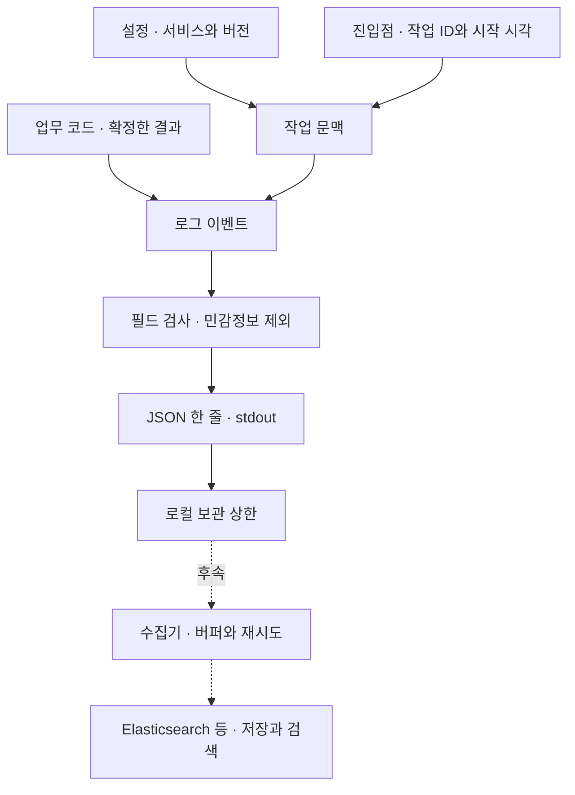

# Backend 로깅과 관측 설계

Status: 공용 범위 합의 · 구현 선택 후보 · 2026-09-07

## 경계와 판단

공용은 구조화 출력·작업 문맥·수준·필드 계약·민감정보 보호·기본 요청 계측까지 제공합니다.
행위자·업무 이벤트·신규 처리/중복/충돌 등 결과는 해당 기능에서 목적·원천·시점·타입·보관 필요성을 정합니다.
로그를 채우기 위해 DB를 다시 조회하지 않으며 인증되지 않은 사용자 주장을 신뢰하지 않습니다.

환경별 선택은 로컬 Prometheus·Grafana, stg·prd Sentry 연동 방향으로 합의했습니다.
공유 수집기의 실행은 [로컬 모니터링](implementations/local-monitoring.md), 지표의 정의와 검증 범위는
[각 구현 문서](implementations/README.md)가 소유합니다.
stg·prd의 Sentry SDK·DSN·샘플링·민감정보 제외·오류 중복 처리는 후속 작업입니다.
Sentry 선택만으로 운영 metrics 보관·대시보드·경보 구성이 완료된 것으로 보지 않습니다.
검색 서버 SDK·직접 전송 코드는 기본 제공하지 않습니다.
수집 연동을 구현할 때는 선택한 언어·실행 환경·수집 대상에 맞는 공식 또는 표준 라이브러리·SDK·exporter가 있으면 사용합니다.
라이브러리가 제공하는 수집·직렬화·전송·재시도 기능을 자체 코드로 다시 만들지 않습니다.
호환성과 관측 계약의 충족 여부를 확인하고, 지원하지 않는 부분만 이유·범위를 정해 보완합니다.
공통 설계는 pull/push나 특정 exporter를 일괄 강제하지 않으며 구체적인 선택·환경 설정은 구현별 문서가 소유합니다.
이 선택 원칙은 외부 수집 서버 구축이나 계정 설정 변경의 승인을 뜻하지 않습니다.
로그는 개별 사건, metrics는 집계 상태, tracing은 호출 경로를 다룹니다. 저장의 진실은 DB가 소유합니다.
필수 보존이 필요한 행위·변경 기록은 감사 이력의 영속성·권한·보관·변조 방지 요구를 별도 설계합니다.

## 기록 단위와 수준

요청/작업 요약 1건과 필요한 업무 결과·오류 상세를 식별자로 연결합니다. 모든 함수 시작·끝을 기록하지 않습니다.
같은 예외를 여러 계층에서 반복 기록하지 않으며, 요청 요약과 오류 상세는 의도적으로 구분합니다.

| 수준 | 사용 범위 |
| --- | --- |
| DEBUG | 제한된 개발 진단이며 기본 OFF입니다. 민감정보 제외 원칙은 동일합니다. |
| INFO | 정상 요약·업무 결과·예상된 입력 거절입니다. |
| WARNING | 조치가 필요한 복구 가능한 이상·재시도·대체 경로입니다. |
| ERROR | 요청·작업의 실패이며 최종 오류 처리 경계가 소유합니다. |
| CRITICAL 또는 동등 수준 | 정상 운영을 지속하기 어려운 상태입니다. 자동 알림을 뜻하지 않습니다. |

## 로그 데이터 계약 후보

중첩 JSON 경로를 아래처럼 통일합니다. ECS 대응을 고려하지만 전체 ECS 준수를 주장하지 않습니다.
정확한 ECS 버전·mapping은 수집 도구를 결정할 때 고정합니다.

| 필드 | 의미 |
| --- | --- |
| `@timestamp`, `log.level`, `log.logger` | UTC 시각, 수준, 기록 위치의 이름입니다. |
| `service.name`, `service.version`, `app.environment` | 서비스·배포 버전·환경입니다. |
| `app.log_schema_version` | 자체 필드 계약의 버전이며 초안은 정수 1입니다. |
| `app.work.id`, `app.work.kind` | 서버 생성 작업 ID와 작업 종류입니다. 재시도 시도와 업무 멱등 키는 다릅니다. |
| `message`, `event.action`, `event.outcome` | 고정 설명·이벤트명·success/failure/unknown입니다. |
| `event.duration` | monotonic clock으로 측정한 정수 나노초입니다. 측정 구간을 이벤트별로 정의합니다. |
| `error.type`, `error.code`, `app.error.frames` | 오류 타입·고정 코드·정제한 파일/함수/행입니다. |

HTTP에는 method·status·route template을 추가하고 request ID는 작업 ID와 대응시킵니다.
WS는 connection ID와 개별 메시지 작업 ID를 구분합니다. GraphQL operation과 Job 실행도 자체 작업 단위를 갖습니다.
실제 tracing을 도입하기 전에는 trace.id·span.id를 꾸며 넣지 않습니다. 작업 ID를 metric label로 사용하지 않습니다.
클라이언트 입력 operation 이름·실제 URL·무제한 문자열은 metric label로 사용하지 않습니다.

| 진입점 | 추가 계측 책임 |
| --- | --- |
| HTTP | 요청별 상태·송신 완료·지연·취소입니다. |
| GraphQL | operation 유형·정제한 이름·오류/부분 결과입니다. HTTP 상태와 별개입니다. |
| WebSocket | 연결 수명과 메시지 처리를 구분합니다. 본문·모든 heartbeat를 기록하지 않습니다. |
| Job | 유형·실행 시도·재시도·결과입니다. |

첫 구현은 HTTP만 제공합니다. 나머지는 각 기능 구현 시 계측하며 빈 모듈을 생성하지 않습니다.

## 안전·운영 비용

허용한 필드만 출력하고 query·header·cookie·본문·토큰·개인정보·예외 메시지 원문·지역변수·소스 줄은 기본 제외합니다.
오류 원문을 제외하면 진단 정보가 줄어드므로 추가 필드는 필요성과 노출 위험을 확인한 뒤 허용합니다.
제3자 라이브러리 로그를 안전하다고 가정하지 않습니다. 허용한 이벤트만 통합합니다.

첫 로컬 구현은 동기 stdout 후보입니다. 느린 출력은 업무 경로를 지연시킬 수 있으며 비차단·무손실 보장이 아닙니다.
bounded queue는 측정 후 도입하고 포화 시 drop/block·종료 flush 정책을 함께 정합니다.
관측 장애는 업무 결과를 바꾸지 않도록 격리하되 누락·수집 단절을 정상으로 보고하지 않습니다.
로그는 rotation·출력 실패·프로세스 종료에서 유실될 수 있습니다.

예산은 요청률 × 요청당 로그 건수 × 평균 크기 × 보관 시간으로 계산합니다.
100 req/s × 1건 × 1 KB이면 하루 원시량 약 8.64 GB입니다. 오류 상세·색인·복제·압축을 제외한 계산 예시이며 실측/요금 견적이 아닙니다.
기존 metrics는 내부로 제한하고 지표 생성과 장기 저장·알림·자동 확장을 혼동하지 않습니다.

## Metrics의 공통 판단 기준

서비스에 존재하는 책임만 관측합니다. 요청/Job 건수·지연·결과, DB/외부 대기·timeout·재시도,
queue 깊이·가장 오래된 대기·활성 연결·복구, 필요한 업무 완료와 자원/runtime 신호를 구분합니다.
없는 의존성·queue를 계측을 위해 만들지 않습니다. 구체적인 이름·단위·타입·증감 시점·라벨·집계 범위는 구현이 소유합니다.
지연은 측정 구간·bucket·표본 수를 함께 정하고 인스턴스별 percentile을 단순 평균하지 않습니다.
재시작 counter reset·다중 worker/Pod 집계·자동/수동 이중 계측을 검증합니다.

수집 endpoint는 내부 접근으로 제한하고 공개 gateway에 기본 노출하지 않습니다. 외부 수집 시 인증·TLS·네트워크 정책,
수집 주기·보관·용량·수집기 자원 예산을 정합니다. 장애를 해결하려고 검증을 임의로 끄지 않습니다.
수집 실패·지표 부재·오래된 표본은 0이나 정상으로 표시하지 않으며 필수 관측의 누락은 검사 실패로 다룹니다.
경보·자동 확장에는 사용자 영향·임계치·지속 시간·대응 주체를 정의하고 metrics 존재와 실제 동작 검증을 구분합니다.
알려진 건수·실패·거절·수집 단절·임계치 위반을 주입해 검사하며 정확성은 DB·업무 계약으로 별도 검증합니다.

## 참고 자료

확인일: 2026-09-07. 공개 당시 사례이며 각 회사의 현재 전체 내부 구현을 뜻하지 않습니다.

| 출처 | 가져오는 관점 |
| --- | --- |
| [Stripe Canonical Log Lines](https://stripe.com/blog/canonical-log-lines) | 요청 종료 요약과 안정적인 필드 계약입니다. 개인 식별 필드는 그대로 복사하지 않습니다. |
| [Elastic ECS](https://www.elastic.co/docs/reference/ecs/logging/intro) | 공통 필드·JSON·별도 수집기입니다. 전체 스택 도입을 의미하지 않습니다. |
| [Google SRE](https://sre.google/workbook/monitoring/) | 로그·metrics·tracing의 역할 구분입니다. |
| [Uber Logging](https://www.uber.com/ie/en/blog/logging/) | 후속 대규모 수집·검색 확장 참고입니다. |

자체 Logger 계층보다 각 언어의 관용적인 logging API를 우선합니다. 구체적인 호출과 문맥 전달은 [구현별 설계](implementations/README.md)가 소유합니다.
