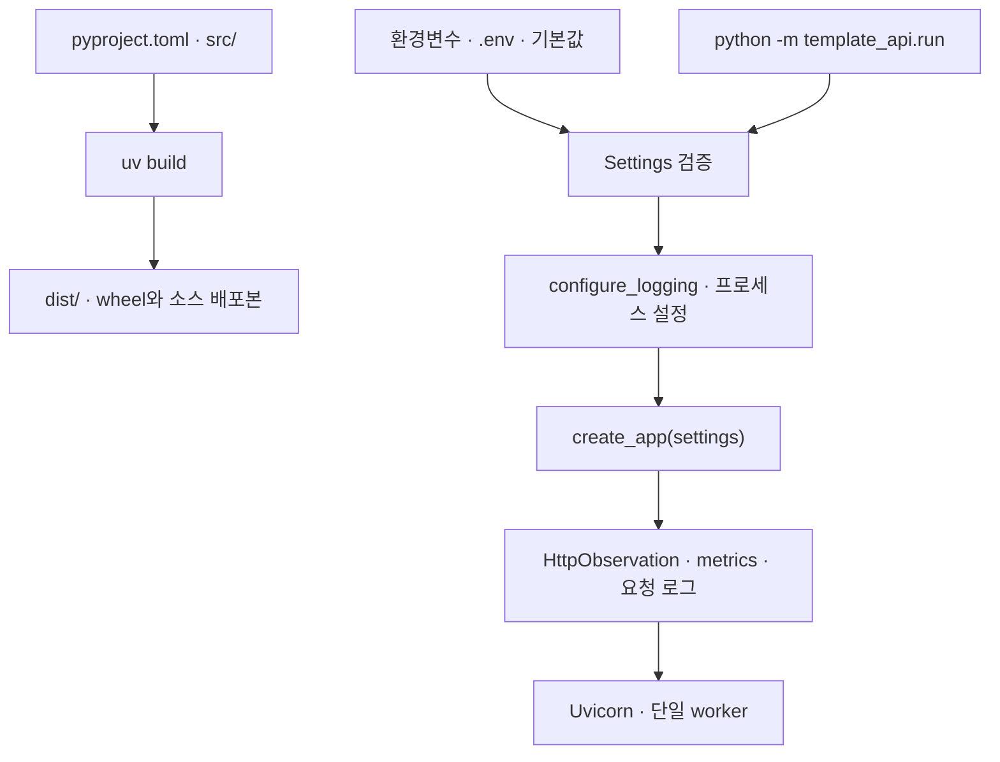
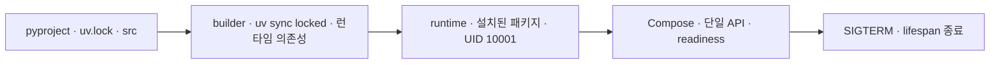
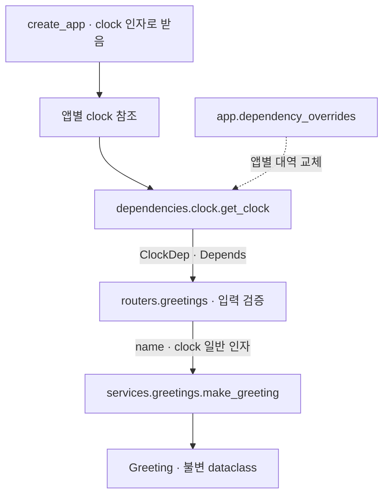

# FastAPI 시작점

Status: SQLite 예약·동시성·멱등성 1차 구현·검증 완료 · 2026-09-08

이 디렉터리는 독립적인 uv 프로젝트입니다. Python 버전은 `.python-version`,
의존성은 `pyproject.toml`과 `uv.lock`에서 관리합니다. Python 3.14.7,
FastAPI 0.141.1, Uvicorn 0.52.4로 최소 실행을 확인했습니다.
`src/template_api/`가 애플리케이션 코드의 시작점입니다.

## 선택 DB 연결

`DB_PRIMARY_URL`을 비우면 DB 없는 앱이며 예약 endpoint를 등록하지 않습니다. 현재 파일 SQLite만 지원합니다.
로컬에서는 `mkdir -p data` 후 `.env`에 `DB_PRIMARY_URL=sqlite+aiosqlite:///./data/reservations.db`를 설정합니다.
Compose에서는 아래 빠른 시작 순서로 migration을 먼저 실행합니다. `/app/data`는 UID 10001이 쓰는 named volume입니다.

pool 크기·overflow·획득 timeout·SQLite 잠금 timeout은 `.env.example`에서 구분합니다.
시작 시 연결을 확인하고 실패하면 ready가 되지 않습니다. 시작 중 schema/migration은 수행하지 않습니다.
DB 계측의 의미와 범위는 [구현 설계](../../design/implementations/fastapi.md#db-계측과-로컬-모니터링-계획)를 참조합니다.

## 예약 예제 빠른 시작

아래 명령은 **저장소 루트**에서 실행합니다. migration을 적용한 뒤 API를 올립니다.
이미 같은 DB로 실행 중이라면 호환되는 migration인지 확인한 뒤 적용합니다. 기존 재고·예약은 초기화하지 않습니다.

```sh
export DB_PRIMARY_URL=sqlite+aiosqlite:////app/data/reservations.db
./scripts/compose.sh fastapi build api
./scripts/compose.sh fastapi run --rm --no-deps api python -m alembic upgrade head
./scripts/compose.sh fastapi run --rm --no-deps api python -m template_api.seed --product-id demo --stock 10
./scripts/compose.sh fastapi --profile monitoring up --wait

curl -i http://127.0.0.1:18081/v1/reservations \
  -H 'Content-Type: application/json' \
  -H 'Idempotency-Key: demo-reservation-001' \
  -d '{"product_id":"demo"}'
```

같은 요청을 반복하면 같은 201·본문과 `Idempotency-Replayed: true`가 반환됩니다. 새 예약은 새 키를 사용합니다.
seed 명령은 상품이 없을 때만 생성하므로 같은 상품에 다시 실행해도 재고를 채우거나 예약을 지우지 않습니다.
다시 실험하려면 새로운 상품 ID를 사용합니다. 키는 이 DB의 예약 API 전체 범위에서 고유합니다.

네이티브 실행은 `python/fastapi/`에서 `mkdir -p data` 후
`DB_PRIMARY_URL=sqlite+aiosqlite:///./data/reservations.db`를 환경변수 또는 `.env`로 설정하고 다음을 실행합니다.

```sh
uv tool run --from uv==0.12.10 uv sync --locked
uv tool run --from uv==0.12.10 uv run --locked alembic upgrade head
uv tool run --from uv==0.12.10 uv run --locked python -m template_api.seed --product-id demo --stock 10
uv tool run --from uv==0.12.10 uv run --locked python -m template_api.run
```

[Swagger](http://127.0.0.1:18081/docs)에서 product_id와 Idempotency-Key를 입력해 실행할 수 있습니다.
[DB 대시보드](http://127.0.0.1:13000/d/backend-db-local?var-job=fastapi)에서 트랜잭션·pool을 확인합니다.
업무 commit 건수에는 재생 요청의 트랜잭션도 포함되며 신규 예약 수와 같지 않습니다.
API·실패·재시도 계약은 [예약 설계](../../design/implementations/fastapi.md#예약-업무-계약),
실제 검증 결과는 [검증 기록](../../design/implementations/fastapi-verification.md#예약-동시성멱등성-실행-결과)에 있습니다.

이 예제는 인증·결제·취소·만료가 없는 로컬 학습 시작점입니다. 실제 서비스에 적용할 때 인증/권한과
사용자별 멱등 키 범위, 보존 정책을 정해야 합니다. PostgreSQL 전환 검증·운영 Sentry·경보는 후속입니다.

## 코드 배치

[폴더 구조와 활용 기준](../../design/implementations/fastapi-structure.md)에서 실제 구조 Mermaid,
파일별 역할, 스키마·업무 타입·ORM 모델의 구분, 소비 프로젝트에서 변경할 수 있는 부분을 확인합니다.

## 빌드와 실행 흐름



공통 설계는 [design](../../design/README.md), 구현 계약은
[FastAPI 설계](../../design/implementations/fastapi.md), 진행 상태는
[단계별 task](../../design/implementations/fastapi-tasks.md)가 소유합니다.
## 설치와 실행

이 디렉터리에서 실행합니다. 기존 전역 uv를 변경하지 않고 uv 0.12.10을 실행합니다.

```sh
uv tool run --from uv==0.12.10 uv sync --locked
cp -n .env.example .env
uv tool run --from uv==0.12.10 uv run --locked python -m template_api.run
```

실행 전 18080 포트 점유를 확인합니다. 종료는 실행 터미널에서 Ctrl+C입니다.

- `GET /`: `{"data":{"message":"Hello, FastAPI!"}}`
- `GET /v1/greetings?name=Marin`: 정규화된 이름의 인사와 UTC `generated_at`; 앞뒤 공백 제거 후 1~80자
- `/docs`: Swagger UI
- `/openapi.json`: OpenAPI 명세
- `/health/live`: 생존 응답 200
- `/health/ready`: 준비 완료 200, 미완료 503

인사 API의 입력 검증·clock DI·lifespan·health·HTTP metrics·구조화 로그를 구현했습니다.
성공·오류 응답 계약과 단일 API 컨테이너도 적용했습니다. 기존 전체 검증 명세의 완료를 뜻하지 않습니다.

## 컨테이너 실행

이 디렉터리에서 Docker Desktop 또는 Docker Engine·Compose가 실행 가능한 상태로 진행합니다.
기존 uv 서버의 18080과 구분해 컨테이너는 **127.0.0.1:18081**로 게시합니다. 포트 점유를 먼저 확인합니다.

```sh
../../scripts/compose.sh fastapi config --quiet
../../scripts/compose.sh fastapi build
../../scripts/compose.sh fastapi up --wait --wait-timeout 60
../../scripts/compose.sh fastapi ps
curl -i 'http://127.0.0.1:18081/v1/greetings?name=Marin'
../../scripts/compose.sh fastapi logs -f api
```

[컨테이너 Swagger](http://127.0.0.1:18081/docs), [readiness](http://127.0.0.1:18081/health/ready),
[metrics](http://127.0.0.1:18081/metrics)에서 확인합니다. 로그 조회만 종료하려면 Ctrl+C입니다.

```sh
../../scripts/compose.sh fastapi stop api
../../scripts/compose.sh fastapi down
```

`stop`은 컨테이너를 남겨두고 종료하며 `down`은 이 Compose 앱의 컨테이너·네트워크를 제거합니다.
서버형 DB는 생성하지 않습니다. 선택 SQLite 파일은 `api-data` volume에 보관하며 `down`만으로 삭제되지 않습니다.
모니터링 수집기는 `monitoring` profile로 선택합니다. 이미지 레지스트리에 push하지 않습니다.

개인 Compose 설정은 `../../scripts/compose.sh fastapi --env-file .env up --wait`처럼 환경 파일을 지정합니다.
Compose는 앱 설정과 `.env.example`의 DB 설정을 명시적으로 컨테이너에 전달합니다.
env 파일 자체를 이미지나 컨테이너에 복사하지 않습니다. 내부 SERVER_HOST/PORT는 0.0.0.0:8000으로 고정하며
host 게시 포트와 종료 예산은 루트 `compose.yaml`에서 함께 관리합니다. 앱 15초·Compose 20초입니다.



`scripts/compose.sh`가 `.python-version`을 읽어 `PYTHON_VERSION` build argument로 전달합니다.
Dockerfile의 공통 base를 빌드·런타임 단계에서 함께 사용합니다.
Python 이미지는 해당 버전의 `slim-trixie` 태그이며 digest를 고정하지 않아 OS 이미지 갱신분은 달라질 수 있습니다.
uv 이미지의 버전·digest는 Dockerfile에서 고정합니다. Python 갱신 시 lock 호환성과 컨테이너를 재검증합니다.
linux/arm64에서 빌드·healthy·API/오류/관측·비 root·dev 도구/env 제외·유휴 종료·재기동을 확인했습니다.
CPU 0.5개·512MiB·로그 10MiB×3개 설정을 확인했습니다. 부하·실제 로그 회전·amd64는 미검증입니다.
상세한 수명·제약은 [컨테이너 설계](../../design/implementations/fastapi.md#로컬-컨테이너-실행)가 소유합니다.

## 응답 포맷

업무 JSON 성공은 `data`에 담으며 인사 결과는 `data.message`·`data.generated_at`으로 읽습니다.
오류는 실제 HTTP 상태와 `application/problem+json`으로 반환합니다.
`code`는 enum 기반 공개 코드이고 `request_id`는 응답의 `X-Request-ID`와 같습니다.
422는 공개 필드 위치·오류 코드만 제공하며 500은 INTERNAL_ERROR로 원문을 숨깁니다.
health·metrics·문서는 기존 형식을 유지합니다.

```sh
curl -i 'http://127.0.0.1:18080/v1/greetings?name=Marin'
curl -i http://127.0.0.1:18080/v1/greetings
```

첫 요청은 200의 data, 두 번째는 422의 INVALID_INPUT·REQUIRED를 반환합니다.
[공통 응답 계약과 Mermaid](../../design/backend.md#http-응답-계약),
[FastAPI 오류 처리](../../design/implementations/fastapi.md#http-응답-포맷)에서 정확한 필드와 범위를 확인합니다.

업무 예외는 `exceptions/application.py`의 `ApplicationError`를 상속하고 HTTP handler를 명시적으로 등록합니다.
등록 예제와 미등록 오류의 500 정책은 [업무 예외 처리](../../design/implementations/fastapi.md#업무-예외-처리)에 있습니다.
현재 실제 업무 예외를 발생시키는 endpoint는 없으며 테스트 대역으로 처리 경로를 검증합니다.

이 디렉터리에서 다음 명령으로 테스트 앱의 `GET /test/resource`를 호출해 확인합니다.
등록 시 404·NOT_FOUND, 미등록 시 500·INTERNAL_ERROR와 오류 로그를 검증합니다.
이 endpoint는 테스트 앱에만 존재합니다.

```sh
uv tool run --from uv==0.12.10 uv run --locked pytest -q tests/test_application_errors.py
```

## Metrics 확인

라이브러리 설치에 더해 요청 계측과 `GET /metrics`를 연결했습니다.
`python -m template_api.run`이 FastAPI 바깥에 관측 wrapper를 연결합니다.
`create_app`만 직접 실행하면 라우트는 있지만 요청 계측 wrapper는 적용되지 않습니다.

1. [Swagger UI](http://127.0.0.1:18080/docs)에서 `GET /v1/greetings`를 실행합니다.
2. 같은 Swagger의 `GET /metrics`를 실행하거나 [metrics](http://127.0.0.1:18080/metrics)를 엽니다.
3. `http_requests_total`과 `http_request_duration_seconds_count`가 요청마다 증가하는지 확인합니다.

```sh
curl -fsS 'http://127.0.0.1:18080/v1/greetings?name=Marin'
curl -fsS http://127.0.0.1:18080/metrics
```

Prometheus 텍스트 형식이며 Swagger는 조회 도구입니다. 시계열 저장·차트는 아래 선택 확장으로 실행합니다.
라벨·지연·실패 정책은 [관측 매핑](../../design/implementations/fastapi.md#로깅과-metrics-매핑)이 소유합니다.
health·metrics·기본 Swagger/OpenAPI/ReDoc 조회는 집계하지 않습니다. 현재 단일 worker·앱별 메모리 registry로,
재시작하면 초기화됩니다. CPU/RSS collector와 다중 worker 집계는 아직 연결하지 않았습니다.
`/metrics`는 API와 같은 listener를 쓰며 기본 loopback입니다. 별도 인증·접근 제한은 없으므로
외부 배포 시 내부 접근 정책을 구성해야 합니다.

## 로컬 모니터링

루트 Compose의 `monitoring` profile을 활성화하면 Prometheus와 Grafana가 실행됩니다.
이 디렉터리에서 실행하며 13000·19090 포트가 비어 있는지 먼저 확인합니다.

```sh
../../scripts/compose.sh fastapi --profile monitoring up --wait --wait-timeout 90
../../scripts/compose.sh fastapi --profile monitoring exec -T prometheus promtool check config /etc/prometheus/prometheus.yml
```

- [Grafana 대시보드](http://127.0.0.1:13000/d/backend-http-local): 로그인 없이 읽기 전용으로 조회합니다.
- [Prometheus 수집 대상](http://127.0.0.1:19090/targets): `fastapi`의 수집 성공 여부를 확인합니다.
- [컨테이너 Swagger](http://127.0.0.1:18081/docs)에서 인사 API를 호출하면 지표가 쌓입니다. 18080의 별도 uv 서버는 수집 대상이 아닙니다.

수집·화면 갱신은 5초 간격입니다. 요청량·지연 계산에는 최소 두 수집 표본이 필요합니다.
시작 직후나 요청이 없는 구간의 비율·p95는 값이 없을 수 있습니다.
수집 실패는 DOWN, 그래프는 해당 구간을 비워 표시하며 과거 표본은 유지합니다.
데이터 소스와 대시보드는 `../../infra/monitoring/`의 provisioning 파일이 자동 등록합니다.

모니터링만 중지하려면 다음 명령을 실행합니다. named volume의 데이터는 유지합니다.

```sh
../../scripts/compose.sh fastapi --profile monitoring stop grafana prometheus
```

모든 게시 포트는 loopback이며 이 익명 Viewer 설정은 로컬 전용입니다.
보관·자원 예산과 검증 한계는 [모니터링 설계](../../design/implementations/fastapi.md#로컬-모니터링)가 소유합니다.
stg·prd는 Sentry 연동 방향만 정했으며 현재 SDK·DSN 연결은 없습니다.

## Logging 확인

실행 터미널 stdout에 JSON 한 줄로 출력합니다. [Swagger](http://127.0.0.1:18080/docs)에서
인사 API를 호출하면 `http.completed` 요청 요약이 생깁니다. 응답 헤더 `X-Request-ID`와
로그의 `app.work.id`가 같으므로 해당 요청을 찾을 수 있습니다.

```sh
curl -i 'http://127.0.0.1:18080/v1/greetings?name=Marin'
```

요약의 `http.response.status_code`는 숫자, `event.duration`은 정수 나노초입니다.
오류 상세 `http.failed`는 같은 ID로 연결되며 예외 메시지·요청 입력 원문을 출력하지 않습니다.
기본 문서·health·metrics의 정상 조회는 요약에서 제외합니다.
표준 `logging`·`json`을 사용하므로 추가 패키지 설치는 없습니다.
구조와 필드·허용 이벤트·실패 정책은 [로깅 설계와 Mermaid](../../design/implementations/fastapi.md#로깅과-metrics-매핑)가 소유합니다.
외부 수집·검색·파일 rotation·queue는 미구현입니다. 동기 stdout이 느리면 요청 처리가 지연될 수 있습니다.

## 명시적 DI



선택 근거와 후속 자원 수명 계약은 [DI 설계](../../design/implementations/fastapi-di-options.md)가 소유합니다.
업무 단위 시험은 `make_greeting(name=..., clock=...)`을 직접 호출합니다.
HTTP 시험은 `app.dependency_overrides[get_clock]`에 clock 함수를 반환하는 provider를 등록합니다.
clock은 timezone-aware UTC datetime을 반환하는 계약입니다.
공통 `Clock`은 `core/contracts.py`, 인사 결과 `Greeting`은 `contracts/greetings.py`,
앱 수명 타입은 `bootstrap/contracts.py`, HTTP provider는 `dependencies/clock.py`가 소유합니다.
업무가 HTTP 조립 타입을 import하지 않습니다.

## 환경 설정

`.env.example`은 공유하는 예시이며 `.env`는 Git에서 제외되는 로컬 설정입니다.
프로젝트 디렉터리에서 실행하면 해당 디렉터리의 `.env`를 읽습니다.
프로세스 환경변수 > `.env` > 코드 기본값 순서로 적용됩니다.

| 설정 | 역할 |
| --- | --- |
| `APP_NAME` | OpenAPI와 로그의 서비스 이름 |
| `SERVICE_VERSION` | OpenAPI와 로그의 서비스 버전; 패키지 빌드 버전과 별개 |
| `APP_ENVIRONMENT` | 로그의 실행 환경 이름; 기본 local |
| `SERVER_HOST` | 서버 바인딩 주소; 기본 loopback |
| `SERVER_PORT` | 서버 포트; 1~65535 |
| `SHUTDOWN_TIMEOUT_SECONDS` | 종료 시 진행 중 요청 대기 시간; 기본 15초, cleanup 전체 제한은 아님 |
| `LOG_LEVEL` | 앱·Uvicorn 로그 수준; 소문자 사용, INFO 요약을 보려면 info 또는 debug |

설정은 시작 시 한 번 검증해 앱에 명시적으로 전달합니다. 잘못된 설정은 입력 원문을 출력하지 않고 종료합니다.
패키지 버전·의존성·Python 버전은 빌드 입력에 남기고 환경변수로 바꾸지 않습니다.

## 빌드와 검증

```sh
uv tool run --from uv==0.12.10 uv build
uv tool run --from uv==0.12.10 uv run --locked ruff check .
uv tool run --from uv==0.12.10 uv run --locked ruff format --check .
uv tool run --from uv==0.12.10 uv run --locked ty check
uv tool run --from uv==0.12.10 uv run --locked pytest -q
```

`dist/`에 wheel과 소스 배포본을 생성합니다. 이 명령은 Python 패키징이며 Docker 이미지 빌드는 위 컨테이너 실행 절차에서 수행합니다.
의존성 고정은 `uv.lock`과 `uv sync --locked`가 담당하며 wheel만으로 의존성 전체가 고정되지는 않습니다.
빌드 산출물에 `.env`·가상환경이 없음을 확인했습니다.
설정 우선순위·앱별 설정 분리·잘못된 설정의 안전한 시작 실패 테스트 3개가 통과했습니다.
lifespan·health·SIGTERM·metrics·logging·응답 계약·업무 예외·SQLite 기반 시험이 통과했습니다.
DB 기반의 최신 검증 결과와 재현 절차는 [검증 기록](../../design/implementations/fastapi-verification.md#db-기반-실행-결과)에 있습니다.
로그는 요청별 ID·서비스 문맥 분리, 취소·전송 오류·원래 예외 보존, 민감정보 제외,
크기 상한·JSON 형식·출력 실패와 실제 Uvicorn 오류 중복 방지를 검증합니다.
시작 실패·취소·정리 오류에서의 cleanup과 앱별 readiness 분리를 확인했습니다.
실제 서버의 SIGTERM 후 진행 요청 완료·자원 정리 순서는 POSIX 환경의 격리 프로세스로 검증합니다.
SIGTERM 시험의 외부 자원은 대역입니다. 실제 SQLite는 별도의 파일 DB·프로세스 강제 종료 시험으로 검증합니다. LB drain은 검증 범위 밖입니다.

수명 흐름과 준비 함수 주입 계약은 [FastAPI 설계](../../design/implementations/fastapi.md#앱-조립-차용안)를 참고합니다.
readiness는 lifespan 준비 성공 상태이며 DB 건강이나 무중단 배포 보장이 아닙니다.

### 개발 검증 기준

검사 기준은 이 프로젝트의 `pyproject.toml`이 소유하며 상위 Ruff 설정을 상속하지 않습니다.
도구 버전은 `uv.lock`으로 고정합니다. 별도 검사 wrapper나 전역 설정은 추가하지 않습니다.

| 도구 | 검사 기준 |
| --- | --- |
| Ruff | Python 3.14, 88자 포맷; 문법·미사용 이름·import 정렬·흔한 버그·현대 Python 문법 |
| ty | `src/`와 `tests/`의 타입 검사, Python 3.14 기준 |
| pytest | `tests/` 수집, importlib 모드, 알 수 없는 설정·marker 오류 처리 |

포맷 수정은 `uv tool run --from uv==0.12.10 uv run --locked ruff format .`으로 수행합니다.
타입 검사는 [ty](https://docs.astral.sh/ty/type-checking/) 하나를 사용합니다.
이는 런타임 입력 검증이나 업무 불변조건 시험을 대신하지 않습니다.

`tests/conftest.py`가 각 테스트의 작업 디렉터리를 임시 디렉터리로 바꾸고,
Settings가 읽는 환경변수를 대소문자와 관계없이 제거한 뒤 테스트 종료 시 복원합니다.
개인 `.env`를 읽지 않으며 dotenv 시험은 임시 파일을 직접 준비합니다.
잘못된 `LOG_LEVEL`·`SERVER_PORT`와 혼합 대소문자 환경변수를 주입한 실행에서도 테스트 3개가 통과했습니다.

경고는 기본적으로 오류로 처리합니다. HTTP 클라이언트는
[Starlette 공식 안내](https://starlette.dev/testclient/)에 따라 `httpx2`를 사용합니다.
현재 Starlette 1.6.0의 `anyio.abc.BlockingPortal` 참조 경고 한 건만 정확한 메시지·모듈에 한정해
표시를 유지하며 실패 대상에서 제외합니다. 수정 릴리스 도입 시 이 예외를 제거하고 재검증합니다.

초기화는 `uv init --app --package --build-backend uv --python 3.14.7` 계열 명령,
의존성 추가는 `uv add fastapi uvicorn`, lock 갱신은 `uv lock`으로 수행했습니다.
생성 후 프로젝트 설명·README 참조·Python 지원 범위를 조정하고 사용하지 않는 기본 CLI entry point를 제거했습니다.
